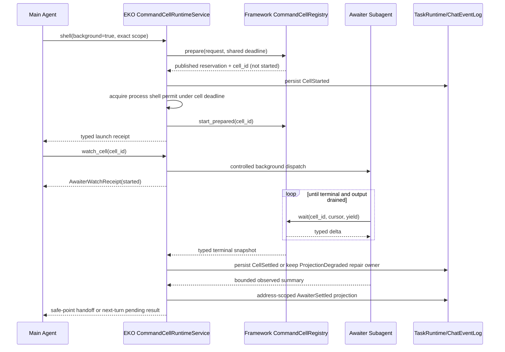

# EKO Long-Horizon Runtime Closure

> Date: 2026-08-22 (recalibrated through framework `3711e90` and application `57be5c5`)
> Status: LH0-LH4 Complete (`4ab7407`, framework `3711e90`, application
> `fff1267`/`ad951b5`/`09b9fc5`/`57be5c5`); LH5-LH6 Pending
> Priority: P0; identity cutover is complete, while final LH6 acceptance still depends on the
> runtime-reliability GUI/soak closeout
> Scope: CommandCell, Awaiter, continuation boot recovery, terminal evidence, hot-state performance,
> and end-to-end long-horizon acceptance

## 1. Decision Summary

EKO already has a substantial long-horizon core: revisioned Goal/Plan binding, finite RunTurns,
provider retry, exact PlanTask Subagent control, Requirement/Evidence completion, command cells,
checkpoint projections, and a retained 12-hour deterministic soak ledger. This specification does
not replace those systems.

The staged closure addresses thirteen gaps confirmed by the 2026-08-22 source review. The list is
the historical baseline; the Stage Ledger is authoritative for which gaps are now closed:

1. ordinary global/workspace conversation TaskRuns do not auto-resume after boot;
2. `watch_cell -> agent_tool -> dispatch_background` serializes a start receipt and drops the
   returned `BackgroundSubagentHandle`;
3. run-owned Awaiter events hit the Tauri predicate that intentionally suppresses formal
   TaskRuntime Subagent events, but Awaiter has no dedicated app-core projection to replace it;
4. terminal cell persistence can give up and leave a durable active cell forever;
5. typed terminal/artifact status is discarded at the EKO projection boundary;
6. `TaskRuntimeStore::get_run_state` still performs full event replay even though
   `FileTaskStore::read_run_state_resilient` already owns the checkpoint/suffix path;
7. CommandCell publication and retention have a launch/settlement race and no total tracked bound;
8. the existing soak validates the store/checkpoint core, not the real Agent/Awaiter/surface path;
9. EKO starts a process before `BackgroundCellStarted` is durable, so a start-append failure can
   leave an unjournaled command with possible side effects;
10. Awaiter dispatch is bounded only by each Agent's framework semaphore and does not hold the
    existing EKO process-wide Subagent permit across workspaces;
11. the raw `EKO_FAST_MODEL` alias can rewrite only a model name on the parent's Provider config,
    producing an invalid cross-Provider/protocol binding;
12. the framework wait lease protects only one `wait` call, so a terminal cell can be pruned between
    multiple output-drain rounds;
13. `CommandCellOwner` drops `ToolContext` conversation/message identity and EKO persists only
    run-owned cells, leaving ordinary Chat cells without an exact durable route.

The target model remains:

```text
TaskRun -> PlanTask -> SubagentRun
```

Awaiter is an ephemeral Subagent role with dedicated instructions and low reasoning. It is not a
new model class, PlanTask kind, task store, executor, or durable completion authority. The runtime
waits; Awaiter only observes, summarizes, and hands the typed result back to the originating
conversation.

## 2. Relationship To Existing Specifications

This file is subordinate to the cross-workspace identity decisions in
[`runtime-reliability.md`](./runtime-reliability.md) and does not duplicate its services.

| Concern                        | Governing specification/authority          | This specification's responsibility                          |
| ------------------------------ | ------------------------------------------ | ------------------------------------------------------------ |
| workspace/conversation address | `AgentAddress` + `WorkspaceExecutionScope` | consume commit `5603958`; do not create another address type |
| foreground queue/steer/cancel  | `ForegroundTurnControl` + `AgentPool`      | deliver Awaiter results through the shared app-core path     |
| boot reconciliation            | host `recover_incomplete` + boot admission | add all-workspace launcher reconstruction and one boot owner |
| event routing                  | `ChatEventLog` + TaskRuntime `ExecEvent`   | add cell/Awaiter lifecycle without a surface-local bridge    |
| process resource governor      | app-core `ProcessExecutionGovernor`        | extract/reuse it for cells/Awaiters; do not add another one  |
| Workflow/extract reachability  | [`surface-parity.md`](./surface-parity.md) | out of scope                                                 |
| DAG/revision/retry/cancel      | framework + existing TaskRuntime           | reuse unchanged                                              |
| Goal/Requirement/Evidence      | existing TaskRuntime store                 | extend only with typed cell evidence where required          |

The M1-M7 identity cutover is present in application commit `5603958`; LH2-LH4 are no longer
blocked on a future resolver. They must extend `AppState::chat_runtime_for_scope`,
`WorkspaceRuntimeHost`, `ScopedChatRuntime`, `ForegroundTurnControl`, and `AgentAddress` exactly as
they now exist. Runtime-reliability M8 remains incomplete until its GUI/soak evidence is recorded,
and LH6 must not silently substitute its own evidence for that dependency.

## 3. Evidence Baseline

### 3.1 Existing authorities that must be reused

| Capability                                              | Current authority                                    |
| ------------------------------------------------------- | ---------------------------------------------------- |
| process execution, wait, cancellation, output retention | framework `BackgroundCommandManager`                 |
| typed cell snapshot/delta                               | framework `CommandCellSnapshot` / `CommandCellDelta` |
| byte cursor and incremental UTF-8 artifact decoding     | framework CommandCell runtime                        |
| low-reasoning Awaiter role                              | `subagents/coding/awaiter.md`                        |
| background Subagent execution                           | framework `SubagentExecutor::dispatch_background*`   |
| exact active-attempt message/interrupt                  | framework `SubagentControlRegistry`                  |
| TaskRun cell lifecycle facts                            | EKO `BackgroundCellStarted/Finished` events          |
| finite-turn continuation                                | EKO `TaskContinuationRuntime`                        |
| provider retry and boot admission policy                | EKO `TaskRuntimeStore`                               |
| completion decision                                     | EKO `completion_gate_report`                         |
| event/checkpoint authority                              | `events.jsonl` + discardable `checkpoint.json`       |
| checkpoint-backed state projection                      | EKO `FileTaskStore::read_run_state_resilient`        |
| conversation event recovery                             | EKO `ChatEventLog`                                   |
| exact active foreground identity                        | EKO `ForegroundTurnControl`                          |
| exact conversation Agent                                | EKO `AgentPool::lease_existing`                      |
| process-wide TaskRuntime resource limits                | EKO `ProcessExecutionGovernor`                       |

### 3.2 Review findings frozen as failing contracts

| ID     | Severity | Reviewed baseline defect                                                     |
| ------ | -------- | ---------------------------------------------------------------------------- |
| LH-F01 | P1       | boot auto-resume production path filters to `background:` conversations      |
| LH-F02 | P1       | `agent_tool` drops the Awaiter `BackgroundSubagentHandle` after start        |
| LH-F03 | P1       | Awaiter is suppressed as run-owned but has no app-core replacement projector |
| LH-F04 | P1       | terminal event persistence stops after three attempts and forgets ownership  |
| LH-F05 | P1       | EKO cell projection omits terminal cause and artifact status/error           |
| LH-F06 | P2       | hot `get_run_state` bypasses the existing checkpoint-backed file read        |
| LH-F07 | P2       | runner can settle/prune before its handle is published in the registry       |
| LH-F08 | P2       | deterministic soak bypasses real Agent, Awaiter, cell, HITL, and surfaces    |
| LH-F09 | P1       | process execution can begin before the durable Started fact                  |
| LH-F10 | P1       | cross-workspace Awaiters bypass EKO's process-wide Subagent permit           |
| LH-F11 | P1       | raw fast-model override can combine a model with the wrong Provider/protocol |
| LH-F12 | P1       | terminal cell can be pruned between multi-round output drains                |
| LH-F13 | P1       | ordinary Chat cell loses conversation/root identity and durable projection   |

### 3.3 Industry reference and evidence status

The design follows the previously captured primary-source patterns and was rechecked against the
current official sources on 2026-08-22:

- OpenAI Codex Goal runtime separates persistent Goal, finite turns, continuation deferral, and
  cumulative budgets:
  <https://github.com/openai/codex/blob/53eaa297e595fc98df0f33d4c63686a7014d7c9a/codex-rs/ext/goal/src/runtime.rs>.
- Current Codex Goal runtime holds its goal-state permit across read/start, uses
  `start_turn_if_idle` for continuation, and treats active-turn injection as a separate best-effort
  operation:
  <https://github.com/openai/codex/blob/main/codex-rs/ext/goal/src/runtime.rs>.
- Current Codex multi-agent handlers keep typed wait timeout, follow-up delivery, and exact target
  interrupt as separate operations:
  <https://github.com/openai/codex/tree/main/codex-rs/core/src/tools/handlers/multi_agents_v2>.
- Claude Code's changelog records a global concurrent-Subagent cap, saved/retried background
  replies, between-turn background notifications, and explicit real-completion reporting:
  <https://github.com/anthropics/claude-code/blob/main/CHANGELOG.md>.
- Tokio's shutdown guidance pairs `CancellationToken` with `TaskTracker::close`/`wait`; cancellation
  alone is not proof that owned tasks have settled:
  <https://tokio.rs/tokio/topics/shutdown>,
  <https://docs.rs/tokio-util/latest/tokio_util/task/task_tracker/struct.TaskTracker.html>.

The supplied local Codex Awaiter inspection remains behavioral evidence, not a public wire
contract. The current official GitHub sources above were fetched successfully; no private or
unverified wire behavior is assumed.

Cross-system consensus used by this specification:

- background work has a stable identity and an owned terminal receipt;
- a model role may decide how to wait, but the runtime owns wait and terminal truth;
- broadcast events are UI notifications, not durable completion authority;
- restart reconstructs from persisted facts and exact ownership, not current UI focus;
- active-turn injection and idle-turn continuation are different operations;
- global concurrency and owned-task shutdown remain bounded across sessions/workspaces;
- completion depends on verified evidence, not a Subagent's final prose.

### 3.4 LH0 frozen implementation baseline

Baseline date: 2026-08-22. Application `5603958`; framework `49db907`; macOS arm64;
`rustc 1.97.1`; `cargo 1.97.1`.

The executable source contracts live in
`echo-agent-app-core/src/tasks/task_runtime/long_horizon_contracts.rs`. All 13 contracts pass by
proving the reviewed defect remains reachable; they are not ignored tests. A repair slice replaces
its matching source contract with a behavioral regression test.

Production call graph frozen by those contracts:

```text
shell(background=true)
  -> EkoCommandCellRegistry::launch
  -> BackgroundCommandManager::launch
  -> spawn runner
  -> publish registry handle
  -> persist BackgroundCellStarted
  -> detached terminal observer
  -> at most 3 terminal append attempts
  -> forget ownership

watch_cell
  -> ToolManager::execute_tool_with_context("agent_tool")
  -> SubagentExecutor::dispatch_background
  -> serialize start receipt and drop BackgroundSubagentHandle
  -> framework event bus
  -> Tauri run_id.is_none projection predicate

boot
  -> direct recover_incomplete in global/AppState/workspace-host paths
  -> BackgroundTaskService::resume_pending
  -> background: conversation filter

TaskRuntimeStore::get_run_state
  -> list_events(run_id, 0)
  -> complete fold

FileTaskStore::read_run_state_resilient
  -> existing checkpoint/suffix projection path (currently bypassed above)
```

Static resource/full-scan baseline:

| Measure                                       | Frozen value/evidence                                      |
| --------------------------------------------- | ---------------------------------------------------------- |
| production `list_events(run_id, 0)` sites     | 18: completion gate 1, Subagent control 2, main store 15   |
| all TaskRuntime source occurrences            | 68 before adding the source-contract module                |
| TaskRun cell observer owners                  | one detached `tokio::spawn` site; no retained join owner   |
| framework cell execution limit                | 4 concurrent processes                                     |
| framework terminal retention                  | 256 entries                                                |
| framework total tracked-cell limit            | none; queued/running registry entries are not permit-bound |
| framework per-`SubagentExecutor` fork limit   | 5; multiplied by Agent/workspace generations               |
| EKO formal TaskRuntime process Subagent limit | 4; current Awaiter route does not acquire it               |

Release fixture command:

```text
cargo test -p echo-agent-app-core --release \
  benchmark_checkpoint_1k_turns_10k_events_100_compactions \
  --locked -- --ignored --nocapture
```

Observed fixture result (one baseline sample, not the LH5 five-sample acceptance):

| Metric                   | Value        |
| ------------------------ | ------------ |
| events                   | 10,001       |
| full rebuild             | 7.961542 ms  |
| warm checkpoint rebuild  | 0.966917 ms  |
| one append + suffix fold | 25.300375 ms |
| public snapshot read     | 1.021542 ms  |
| checkpoint bytes         | 36,416       |
| event log bytes          | 3,680,960    |

Historical soak evidence remains scoped truthfully. `.eko/soak/m5-12h/ledger.json` is `passed` for
43,200,302 active milliseconds on commit `61a3e389`, deterministic local provider, 1,439 ended
turns, 143 compactions, 11 recoveries, and zero failed turns/fingerprints. Its event-log SHA-256 is
`6963144f5714bb164fe4a9e2c9dd9250981d37f6c60a6c1e324ed78835e89ee1`. The 24h/48h ledgers were
still `running` at calibration time and are not accepted as passed evidence. None exercises the
real Agent/Awaiter/surface path, so LH-F08 remains open.

## 4. Implementation Gate: Layering And Duplicate Search

### 4.1 Generic framework mechanisms

The following belong to `echo-agent`:

- bounded CommandCell admission and retention;
- prepare/publish-before-run ordering with an opaque reservation usable by durable consumers;
- launch-time deadline covering queue + execution + drain;
- typed launch errors, wait reason, terminal cause, and artifact fields at the tool boundary;
- opaque conversation/message correlation carried through `CommandCellOwner` without adding an EKO
  workspace type to the framework;
- explicit cancel/close/join shutdown primitives for every accepted cell;
- an owned observation/retention lease spanning multiple wait rounds;
- owned/joinable background Subagent handles and exact controlled-attempt dispatch primitives;
- retry-safe multiple waiters and UTF-8-safe byte cursors.

The framework must not learn EKO workspace IDs, TaskRun pause reasons, GUI events, file layout, or
conversation recovery policy.

### 4.2 EKO product policy

The following remain in `echo-agent-app-core`:

- exact workspace/conversation/run binding for a cell;
- persist-before-side-effect admission for EKO-owned cells;
- TaskRuntime/ChatEventLog terminal projection;
- durable projection repair and continuation wake;
- Awaiter admission, idempotency, handoff, surface projection, and shutdown;
- reuse of the process-wide shell/Subagent governor across all workspace hosts;
- normal workspace conversation boot resume;
- Requirement/Evidence interpretation of a failed cell/artifact;
- EKO performance and real-product soak gates.

### 4.3 Thin adapters

Tauri, TUI, CLI/JSONL, and channel adapters may only submit an exact typed request, render the same
receipt/outcome, replay the same address-scoped journal, and request exact cancel/interrupt. They
must not own a private Awaiter map, terminal retry loop, boot scanner, cell state machine, or result
queue.

### 4.4 Duplicate search requirements

Before every implementation slice, search both repositories for:

```text
CommandCellRegistry / BackgroundCommandManager / CommandCellSnapshot
CommandCellOwner / ToolContext / CommandCell waiter lease
BackgroundSubagentHandle / SubagentControlRegistry / TurnSteerMailbox
TaskContinuationRuntime / RunTurnBinding / boot_auto_resume_decision
ChatEventLog / TaskRuntimeStore / FileTaskStore / EventFoldState
WorkspaceRuntimeRegistry / WorkspaceRuntimeHost / ScopedChatRuntime / AgentAddress
ForegroundTurnControl / AgentPool::lease_existing / ProcessExecutionGovernor
BackgroundCellStarted / BackgroundCellFinished / completion_gate_report
```

Extend those authorities. Do not add `AwaiterStore`, a second CommandCell registry, another
continuation loop, or a new task relation API.

## 5. Invariants

1. Runtime state, not Awaiter prose, is authoritative for cell terminal outcome.
2. A framework cell is validated, reserved, and published before its runner can emit output or
   settle.
3. An EKO-owned cell has a durable Started fact before the prepared runner may start; failure to
   persist Started aborts the reservation and cannot execute the command.
4. Every accepted cell owns one tracked-capacity permit until final retention removal.
5. Queue, process execution, process-group kill, pipe drain, and artifact finalization share one
   launch-time deadline.
6. Every accepted cell has exactly one typed terminal snapshot.
7. Every run-owned cell has one durable Started fact and one terminal fact, or an explicit
   `ProjectionDegraded` repair owner that keeps retrying.
8. An EKO observer holds one retention lease from launch through durable terminal projection and
   settlement of every active Awaiter generation; terminal output cannot disappear between drain
   rounds.
9. Terminal persistence failure never causes ownership to be forgotten.
10. Awaiter dispatch is idempotent per `(scope, cell_id, watch_generation)`.
11. Awaiter is a SubagentRun projection, not a PlanTask or second TaskRun.
12. Every Awaiter holds the EKO process Subagent permit as well as framework-local admission.
13. Dropping a UI subscriber cannot lose the owned Awaiter result.
14. Product projection is exactly-once per receipt. Model handoff is durable at-least-once until a
    safe-point acknowledgement and always carries the stable receipt for deduplication.
15. `current workspace` never routes a cell, Awaiter result, or boot resume.
16. Ordinary Chat does not auto-start a new model turn solely because Awaiter completed.
17. A running TaskRun deferred for cells wakes once after all owned cells settle.
18. Restart never reattaches or replays an old process-scoped command cell.
19. Eligible unattended runs may auto-resume at boot; attended runs remain paused until their exact
    interactive owner registers and admission is re-evaluated.
20. `events.jsonl` remains TaskRuntime authority; checkpoint and run-state are caches.
21. GUI, TUI, CLI/JSONL, and channel expose the same typed lifecycle/control semantics.

## 6. Target Architecture



Framework CommandCell state is the live process authority. EKO TaskRuntime/ChatEventLog is the
durable product authority. Awaiter observes the framework state; its summary cannot override phase,
cause, exit code, output cursor, artifact status, or completion blockers.

## 7. Framework CommandCell Contract

### 7.1 Bounded async launch

Launch admission must wait for total tracked capacity without blocking an executor thread. The
trait-level convenience call follows the repository's boxed-future pattern:

```rust
fn launch(
    &self,
    request: CommandCellRequest,
) -> BoxFuture<'_, Result<CommandCellLaunchReceipt, CommandCellError>>;
```

`CommandCellLaunchReceipt` contains `cell_id`, `accepted_at`, and an absolute deadline.
`CommandCellError` distinguishes validation, duplicate identity, capacity deadline, cancellation,
registry shutdown, and runtime failure. Callers must not classify error text. Remove the concrete
manager's unbounded `timeout_secs = 0` behavior: zero is a typed validation error, so every accepted
cell has a finite total lifetime bounded by the configured maximum.

The concrete `BackgroundCommandManager` also exposes an opaque two-phase reservation used by EKO:

```text
prepare_launch(request) -> published CommandCellReservation (runner cannot start)
start_prepared(reservation) -> CommandCellLaunchReceipt
abort_prepared(reservation, typed cause) -> terminal snapshot without process execution
```

The normal framework `launch` convenience is `prepare_launch + start_prepared`. The reservation is
single-use, keeps the tracked permit, and auto-aborts if dropped. This is a generic durable-consumer
primitive; it contains no EKO workspace, event, or store concept.

Maintain two permits:

- execution permit: bounds concurrently running processes;
- tracked-cell permit: bounds queued + running + waiter-drain + retained terminal entries.

Tracked capacity defaults to checked `max_concurrent + max_terminal_history`; overflow is a typed
configuration error. Before waiting, launch prunes oldest terminal entries with no waiter lease. If
capacity remains full, it waits under the same deadline and cancellation token. A queued timeout
never starts a process.

### 7.2 Publication and settlement order

Required order:

```text
validate request
compute deadline
acquire tracked permit
construct handle
insert handle into registry
return opaque prepared reservation
consumer durable admission hook succeeds
spawn runner
run and settle
publish typed terminal state
notify waiters
prune or migrate terminal history
release tracked permit only when entry is removed
```

No command/sandbox side effect is permitted before `start_prepared`. If the durable consumer cannot
admit the launch, `abort_prepared` settles the published handle without spawning. If runner setup
cannot start, the published handle settles once as `LaunchFailed`; it is not removed before waiters
can observe it.

The absolute deadline also bounds process-group kill, reader-task drain, and artifact finalization.
Synchronous artifact finalization must run on a tracked blocking task or an equivalent cancellable
boundary. If the deadline expires after process exit but before drain/finalization completes, abort
remaining readers, kill the process group if still present, and publish one typed timeout/drain
outcome; never wait unboundedly after terminal process status.

### 7.3 Typed wait result

The existing `CommandCellDelta` remains the in-process type and becomes serializable at the tool
boundary. Model/adapters receive:

```text
cell_id
wait_reason: output | terminal | yield_elapsed
phase
terminal_cause
terminal_message
exit_code
artifact_status
artifact_message
output_artifact
total_output_bytes
next_cursor
new_output
output_truncated
output_elided
```

Extend the phase contract so admission is observable without pretending a process already runs:
`Prepared` (published, runner forbidden), `Queued` (durable/start accepted, waiting for permits),
`Running`, then one existing terminal phase. `Prepared` is diagnostic/internal and is normally not
returned to the launching model before EKO durable admission. Phase transitions are monotonic.

Add an opaque `CommandCellObservationLease` (exact name may follow local style) acquired atomically
with registry lookup. Holding it prevents terminal-history removal across any number of `wait`
rounds; per-call waiter leases still protect ordinary one-shot tool calls. EKO holds the observation
lease while its durable observer or any Awaiter generation still needs the cell. Dropping the last
lease immediately re-runs retention. Shutdown invalidates/settles leases without leaking tracked
capacity.

Human-readable text may accompany it, but consumers cannot parse text for control flow. `wait`
remains exempt from the generic tool batch timeout; per-round yield stays capped while the cell's
absolute deadline controls total lifetime.

### 7.4 Retention and shutdown

- active/queued cells are never pruned;
- terminal cells with waiter leases are not pruned;
- terminal history converges without another launch;
- `CommandCellRegistry`/the concrete manager exposes an async shutdown contract instead of relying
  on `Drop` or a process-global static;
- shutdown closes admission, aborts prepared reservations, cancels queued/running cells, tracks and
  joins runner/reader/blocking-finalizer tasks, and leaves every accepted handle terminal;
- repeated shutdown is idempotent.

Use the existing Tokio `CancellationToken` plus an owned task tracker/join set. A cancelled token
without joined task settlement does not satisfy this contract.

## 8. EKO Scoped CommandCell Runtime

### 8.1 One process service, scoped facades

Introduce one application-owned `CommandCellRuntimeService` wrapping the single framework manager.
It is an ownership/projection service, not a second execution engine.

Delete `SHARED_COMMAND_CELLS`, `TASK_RUNTIME_STORES`, the weak store scan, and the run-ID-only
`cells_by_run` map. `AppState` owns the service and its shutdown; `AgentCreateParams`,
`WorkspaceAgentPoolResources`, and workspace pool construction pass a scoped facade rather than
re-discovering ownership from globals.

Each workspace/global Agent generation receives a facade that captures the immutable
`WorkspaceExecutionScope`. `CommandCellRuntimeService` directly owns `ChatEventLog` and an exact
`workspace_id -> Weak<TaskRuntimeStore>` binding. The explicit binding is necessary because the
primary Agent is constructed before GUI/TUI bootstrap creates its TaskRuntime store; it is not a
run scan or focused-workspace fallback. The per-invocation `ToolContext` supplies conversation,
root message, run, execution, and call identities:

```text
WorkspaceExecutionScope
CommandCellRuntimeService -> exact TaskRuntimeStore binding or owned ChatEventLog
ToolContext -> AgentAddress + root_turn_id + run_id?
```

Extend the framework's opaque `CommandCellOwner` correlation with `conversation_id` and
`message_id` (the chat root) and populate them from `ToolContext`; the facade supplies workspace
scope. Do not infer a conversation from `working_dir`, the focused workspace, or a store scan.

Run control uses `workspace_id + run_id`; non-TaskRun Chat cells use
`workspace_id + conversation_id + root_turn_id`. Missing exact conversation/root identity is a
typed admission error, not a fallback to focused workspace or a run scan.

For EKO-owned launches the facade calls `prepare_launch`, durably appends Started, then calls
`start_prepared`. A Started append failure aborts the prepared reservation, returns a typed launch
failure, and proves that no command process ran. A failure after Started but before runner start is
closed by one durable terminal fact.

The Started write boundary must distinguish `NotCommitted` from the existing
`CommittedProjectionDegraded` outcome. On an ambiguous `ChatEventLog` I/O result, repair/replay the
stream under its existing lock before classifying the append. In every error case the prepared
reservation is aborted first: if Started was durable, append/repair its terminal fact; if it was not
durable, no product cell exists. Never start the process while commit state is unknown.

### 8.2 Durable cell projection

Extend existing `BackgroundCellState`; do not create a parallel cell type. Replace stringly typed
phase with stable application projection enums and persist:

```text
phase
terminal_cause
terminal_message
exit_code
artifact_status
artifact_message
artifact_path
artifact_sha256
total_output_bytes
output_truncated
finished_at
```

Terminal event idempotency is keyed by exact `(scope, cell_id)`. Identical duplicate settlement is
a no-op. Conflicting terminal content fails closed and creates a diagnostic blocker.

Ordinary Chat uses the same typed cell lifecycle encoded as `ChatDriverEvent` facts in
`ChatEventLog`; TaskRuns continue to use `BackgroundCellStarted/Finished`. Broadcast/Tauri events
are projections of those authorities, never the only copy.

### 8.3 Projection-degraded repair

The service owns observer tasks in one closeable task tracker/join set. On terminal persistence
failure:

1. retain exact cell ownership;
2. publish an in-memory typed `ProjectionDegraded` diagnostic;
3. retry with capped exponential backoff while the process lives;
4. expose degraded state through a typed app-core diagnostic query; LH4 projects that one query
   consistently across product surfaces;
5. do not wake continuation or release ownership until terminal fact is durable;
6. on shutdown, perform a bounded final flush and leave Started for boot recovery if persistence
   remains impossible.

A fixed retry count is insufficient. Disk pressure lasting longer than one second must not create a
permanent active zombie.

### 8.4 Process-wide admission

Move the existing private `ProcessExecutionGovernor` into an app-core shared dependency without
changing its EKO-specific policy. Do not put its write/shell/LLM fields into the framework. A cell
holds the process shell permit from prepared-start through terminal drain; an Awaiter holds the
process Subagent permit from dispatch admission through joined settlement. Framework manager and
executor limits remain local safety bounds, so accepted work must satisfy both layers.

The cell deadline is computed by `prepare_launch`; Started is persisted before waiting for the EKO
shell permit. Permit timeout/cancel aborts the prepared cell and persists that terminal outcome. All
paths acquire the EKO permit before the framework execution permit, preventing cross-cell lock-order
cycles.

Admission is FIFO/cancel-aware and uses the cell/Awaiter deadline. Workspace count must not multiply
the effective limits. Export content-free active/queued counters for diagnostics and soak evidence.

### 8.5 Completion semantics

- active cell always blocks completion;
- terminal success with required artifact status `Available`/`BelowThreshold` as applicable is
  eligible evidence;
- failure/timeout/cancel is visible evidence and blocks until the PlanTask handles or accepts it;
- artifact `Failed` never becomes success evidence;
- Awaiter summary is diagnostic only.

## 9. Awaiter Runtime Contract

### 9.1 Role definition

Keep the current role model: readonly, `thinking: low` where supported, optional configured fast
profile, wait/list/stop tools only, bounded turns/timeout, and no mutation/task/delegation tools.

Resolve the effective model and thinking through the configured Provider/model authority.
`EKO_FAST_MODEL`, if retained, must name a configured model profile/id whose Provider, protocol,
auth, base URL, capabilities, and thinking support are resolved together. It must not reinterpret a
raw model from another Provider/protocol as a name on the parent connection. Missing/invalid fast
profile falls back to the complete parent generation, not a partially rewritten `LlmConfig`.

### 9.2 Owned watch receipt

`watch_cell` delegates to app-core and returns:

```text
AwaiterWatchReceipt
  execution_id
  control_task_id
  attempt
  watch_generation
  cell_id
  workspace_id
  conversation_id
  run_id?
  root_turn_id
  state: started | settled | cancelled | failed
  started_at
  settled_at?
```

`watch_cell` must not delegate through `agent_tool`: that tool intentionally returns only a model
receipt and drops its handle. The scoped tool captures the existing `SubagentExecutor` and app-core
service, constructs the Awaiter `DispatchRequest`, and calls `dispatch_background_attempt` directly.
The synthetic framework `control_task_id` is only a process control identity
(`awaiter:{cell_id}:{watch_generation}`); it is never persisted as a PlanTask.

The service retains `BackgroundSubagentHandle`, `SubagentAttemptIdentity`, process-governor permit,
and join task until settlement. Repeated watch for the same active generation returns the existing
receipt. A requested new generation is legal only after the previous generation settled and
increments `watch_generation`; the receipt carries `attempt` so exact message/interrupt never
guesses. Active entries are capacity-bounded. Settled in-memory receipts use bounded retention;
durable journals remain the replay authority. No second mailbox is added.

The application implementation stores only active/latest receipt metadata in the scoped
`CommandCellRuntimeService`; `ChatEventLog` remains the sole durable result authority. The primary
or pooled conversation Agent is held weakly for one exact active-turn steer attempt, so Awaiter
ownership cannot keep an evicted Agent alive.

### 9.3 Result handoff

Merge runtime-derived cell snapshot with bounded Awaiter observation:

```text
AwaiterResult
  receipt identity
  runtime terminal fields
  last output excerpt
  Awaiter summary/status
```

Delivery rules:

- append one idempotent address-scoped `AwaiterResultReady` fact before attempting delivery;
- active originating turn: call one shared app-core exact-steer operation built from
  `ForegroundTurnControl`, its bound active `AgentHandle`, and the expected active turn id;
  pool-backed paths may use `AgentPool::lease_existing`, while non-pool TUI/CLI paths use the handle
  already bound by their foreground lease; app-core must not reach into private `TurnSteerMailbox`
  internals;
- settled TaskRun turn: persist cell terminal, clear deferral, let `TaskContinuationRuntime` start
  the next finite turn, and carry truth in Recovery Capsule;
- settled ordinary Chat turn: persist address-scoped result in `ChatEventLog`, render immediately,
  and include every still-pending receipt in the next turn for that conversation;
- append `AwaiterResultAcknowledged` only at the accepted active-turn or next-turn safe point;
- never auto-start ordinary Chat solely because a cell finished;
- remount/subscriber loss replays from journal.

Extend `ChatDriverEvent`/`ChatEventLog`; do not add `AwaiterStore`. `ChatEventLog` currently derives
`event_id` from stream sequence, so retrying the same result would create a different event. Add an
idempotent append/fold keyed by receipt identity under the existing per-stream lock. Ready and
Acknowledged facts form the pending-result projection. Product rendering is exactly-once per
receipt; model delivery is at-least-once until acknowledgement and always includes the stable
receipt so restart ambiguity cannot become an unidentifiable duplicate action.

Retention cannot prune an unacknowledged Ready fact. Before a normal segment cap would remove one,
fold pending receipts into a bounded, hash/cursor-validated stream checkpoint and retain the
contiguous suffix, or keep the containing segment pinned. The pending count/result size is bounded
by Awaiter admission. This remains part of `ChatEventLog`; it is not an independent result store.

The selected implementation pins the contiguous suffix beginning with the earliest unacknowledged
Ready segment. Active-turn delivery is attempted once through exact steer; otherwise the existing
`EkoContextProjector` injects every pending result at the next model-input safe point and appends
Acknowledged. Ordinary Chat is never auto-started solely for Awaiter delivery.

### 9.4 Stop and failure

- `stop_cell` stops the command; Awaiter observes cancelled and settles;
- `interrupt_awaiter(execution_id, expected_attempt)` stops only the observer;
- stopping Awaiter does not stop cell unless explicitly requested;
- Awaiter timeout/failure cannot change cell truth or TaskRun completion;
- shutdown closes watch admission, exact-interrupts/cancels active Awaiters, closes the task tracker,
  and joins them before releasing AgentPool/framework resources.

## 10. Boot Recovery For All TaskRuns

Extend the existing `WorkspaceRuntimeRegistry`/host opening path governed by
`runtime-reliability.md`; do not add another process-global store scanner.

Consolidate the direct recovery entry points now split across `src/main.rs`, `AppState` startup,
`WorkspaceRuntimeHost::get_or_open_execution`, and `BackgroundTaskService::resume_pending` into one
app-core `TaskRunBootReconciler` (name may follow local style). GUI supplies the exact AppState/host
resolver; TUI/CLI/channel supply their already-built global/scoped runtime. The old direct loops are
deleted as each adapter switches, so this is one replacement authority rather than an additional
scanner.

At application boot, enumerate the global host plus every workspace from `WorkspaceRegistry`. Do
not eagerly construct every AgentPool/plugin/MCP generation just to inspect files. Move the
host-owned `TaskRuntimeStore` behind its own `OnceCell` if necessary so recovery/listing and later
execution reuse the same instance. For each address domain independently:

1. open exact host resources and its one TaskRuntimeStore; run `recover_incomplete` exactly once;
2. isolate host-open, corrupt workspace, and per-run failures without blocking healthy hosts;
3. enumerate the host store's `Paused/BootRecovery` continuation runs;
4. only for a candidate requiring a launcher, resolve `ScopedChatRuntime` through
   `AppState::chat_runtime_for_scope` and reuse the exact host AgentPool/model/plugin/MCP/review/HITL
   generation;
5. reconstruct the existing `TaskContinuationRuntime` launcher for the run's exact
   `AgentAddress`/root message and an app-core journal-only sink; do not retain a stale GUI/TUI
   renderer across restart;
6. re-run `boot_auto_resume_decision` under run lock;
7. honor provider retry deadline;
8. auto-resume only eligible unattended runs;
9. leave attended runs paused until exact owner registration, then re-run admission; leave
   unsafe/budget-exhausted/Goal-mismatched runs paused with typed reasons.

`BackgroundTaskService` becomes one adapter using this reconciler. Remove the special claim that
only `background:` conversations are auto-resumable. Global TUI/CLI/channel startup and GUI
workspace startup call the same service and differ only in runtime/sink adapters.

The selected implementation stores one `TaskRunBootReconciler` per `TaskRuntimeStore`; its
`OnceCell` makes crash recovery stable across AppState and BackgroundTaskService adapters.
`WorkspaceRuntimeHost` owns a separate lazy TaskRuntime `OnceCell`, so boot inspection does not
construct AgentPool/plugin/MCP/review generations. AppState enumerates global plus registered
workspace scopes, isolates scope failures, constructs an exact runtime only after an unattended
candidate passes policy, registers a journal-only continuation sink, and uses the conversation id
as the resumed pool key. Attended runs remain Paused without an exact interactive owner.

Recovery rules:

- process cells become `interrupted`; never replay commands;
- process Awaiters are not restored;
- terminal cell fact written before crash remains terminal;
- Started-only cell closes exactly once;
- unsafe tool/Subagent boundaries remain blockers;
- after user resolution, resume without duplicating completed PlanTasks.

## 11. Checkpoint-Backed Hot State

### 11.1 Canonical read path

Do not implement another checkpoint reader. `FileTaskStore::read_run_state_resilient` already calls
`FileTaskShadow::ensure_projections_current`, validates the checkpoint/suffix, repairs an invalid or
stale projection, and reads `run-state.json`. Expose/reuse that exact path from
`TaskRuntimeStore::get_run_state`:

```text
TaskRuntimeStore::get_run_state
  -> FileTaskStore::get_run_state (new thin public wrapper)
  -> existing read_run_state_resilient
  -> existing ensure_projections_current/checkpoint+suffix fold
  -> existing run-state projection read
```

On invalid checkpoint, the existing shadow path falls back to complete events once, rewrites the
cache, and returns rebuilt state. Reuse `EventFoldState`; do not add another fold function or a
second checkpoint schema.

### 11.2 Full-scan audit

Audit every production `list_events(run_id, 0)` call. Route `list_background_cells` directly through
`get_run_state.background_cells`. Extend the existing TaskRuntime `EventFoldState` only where
operational state is not yet represented: unresolved tool/Subagent/recovery boundaries and cell
terminal idempotency. Ordinary Chat pending delivery remains in the separate existing
`ChatEventLog` fold described above. Keep full scans only on a reviewed allowlist for explicit
audit, export, or complete evidence-history APIs. LH0 records that allowlist and the before/after
scan counts; a comment at each retained full scan states why a checkpoint projection is
insufficient.

### 11.3 Performance gates

Release fixtures must exercise public production APIs, not internal checkpoint helpers only.

| Fixture                                      | Gate                                |
| -------------------------------------------- | ----------------------------------- |
| `get_run_state`, 10k events, empty suffix    | median <= 2 ms on baseline host     |
| `get_run_state`, 100k events, empty suffix   | median <= 2 ms and <= 2x 10k median |
| one append + state read, 100k history        | median <= 50 ms                     |
| corrupt checkpoint full rebuild, 100k events | bounded, then warm read <= 2 ms     |
| checkpoint size, 100k events                 | <= 256 KiB and < 5% event log       |

The existing ignored 10k checkpoint fixture already gates `snapshot_read_ms < 2`; LH0 must capture
its actual release-mode value before code changes. Thresholds may be tightened. Widening requires a
new measured baseline and explicit review.

## 12. Implementation Milestones

### LH0: Failing contracts and baseline freeze

Deliverables:

- deterministic failing tests or static reachability contracts for LH-F01 through LH-F13;
- current production call graph and duplicate-search record;
- baseline counts for full event scans, live observers, per-workspace Awaiter permits, and
  tracked-cell capacity;
- release-mode output from the existing ignored 10k checkpoint fixture;
- retain the 12-hour ledger as historical store/checkpoint evidence without relabeling it.

Completion gate:

- every defect has a failing test or static reachability assertion;
- no production behavior changes;
- this file and `MASTER-PLAN` identify the same first implementation slice.

### LH1: Framework CommandCell correctness

Deliverables:

- bounded async launch and typed launch errors;
- tracked-cell and execution permits;
- prepared reservation, publish-before-spawn, and auto-abort ordering;
- typed structured wait result;
- deadline-bounded pipe/artifact finalization and deterministic task-tracked shutdown;
- deletion of superseded sync launch/text-classification paths.

Completion gate:

- queue/timeout/cancel/settle/prune interleavings pass under barriers;
- total tracked entries never exceed configured capacity;
- no accepted cell disappears before terminal observation;
- an aborted prepared cell proves that no command process/sandbox execution started;
- framework submission gate and feature matrix pass.

### LH2: Scoped EKO projection and terminal repair

Deliverables:

- one process CommandCellRuntimeService with exact scoped facades;
- delete `SHARED_COMMAND_CELLS`, weak global store scan, and run-ID-only routing;
- carry ToolContext conversation/root identity into ordinary Chat cell projection;
- durable Started-before-run admission and exact start-failure closure;
- complete typed `BackgroundCellState`;
- owned observer joins and capped-backoff terminal persistence repair;
- shared process shell/Subagent governor extracted and injected across hosts;
- typed degraded diagnostics and exact continuation wake.

Completion gate:

- duplicate run IDs in two workspaces cannot cross-write;
- a Started append failure executes no process and leaves no durable active cell;
- disk failure longer than old retry window recovers in-process;
- completion never sees false active zombie or false successful artifact;
- application Rust/GUI/frontend gates pass.

### LH3: Owned Awaiter receipt and handoff

Deliverables:

- direct controlled Awaiter dispatch with retained handle/join/governor permit;
- idempotent watch receipt carrying generation/attempt and exact observer interrupt;
- complete Provider/model profile resolution for the fast role;
- runtime-derived terminal result plus bounded Awaiter summary;
- active-turn safe-point delivery plus Ready/Acknowledged journal projection;
- elimination of dropped-handle and broadcast-only completion.

Completion gate:

- main Agent continues other work while Awaiter waits;
- result projects once and remains pending for model delivery until safe-point acknowledgement;
- stopping Awaiter and cell have distinct tested semantics;
- Awaiter failure cannot change TaskRun truth;
- no PlanTask/TaskRun is created for Awaiter.

### LH4: Surface parity and normal-conversation boot resume

Deliverables:

- shared app-core projection for GUI/TUI/CLI/JSONL/channel;
- make the dedicated app-core path the only Awaiter projector for both ordinary Chat and TaskRun;
  the generic Tauri bridge excludes role `awaiter` regardless of `run_id`, while the formal
  TaskRuntime `ExecEvent` projector remains the only PlanTask Subagent authority;
- one app-core boot reconciler replacing GUI/headless/host/background direct loops;
- lazy per-workspace recovery and journal-only launcher reconstruction;
- BackgroundTaskService delegates to same boot service;
- exact attended/unattended/HITL policy.

Completion gate:

- all surfaces receive identical typed Awaiter/cell outcomes;
- ordinary unattended conversation TaskRun auto-resumes after restart;
- attended runs wait for owner;
- corrupt workspace does not block healthy workspace;
- focus switching cannot reroute resumed work.

### LH5: Hot-state convergence and performance

Deliverables:

- `TaskRuntimeStore::get_run_state` delegates to the existing checkpoint-backed file projection;
- full-scan audit and dedupe migration;
- 10k/100k public-API benchmarks;
- crash-window/corrupt-checkpoint equivalence tests.

Completion gate:

- hot state read no longer scales linearly with history;
- full replay and checkpoint/suffix state are canonical-byte equivalent;
- fixed gates pass five consecutive release samples.

### LH6: Fault matrix and real-product soak

Deliverables:

- complete automated fault matrix;
- real Tauri/TUI/CLI/channel integration gate;
- deterministic multi-workspace concurrency soak;
- bounded real-provider soak using actual Agent, cell, Awaiter, restart, HITL, and completion report;
- final ledger and deletion of superseded completion claims.

Completion gate:

- automated/manual acceptance below passes;
- no open P0/P1 finding in this specification;
- `runtime-reliability.md` dependencies are Complete;
- project status may then call long-horizon product acceptance Complete.

## 13. Test Specification

### 13.1 Framework unit tests

Required deterministic tests:

```text
launch_publishes_handle_before_fast_terminal_settlement
prepared_launch_cannot_execute_before_start
dropping_prepared_launch_aborts_without_process_side_effect
zero_timeout_is_rejected_before_reservation
concurrent_fast_launches_respect_total_tracked_capacity
queued_launch_timeout_never_spawns_process
queued_launch_cancel_releases_tracked_permit
terminal_waiter_lease_prevents_prune_until_delta_returned
observer_lease_prevents_prune_across_multi_round_terminal_drain
terminal_retention_converges_without_another_launch
shutdown_terminalizes_and_joins_every_accepted_cell
shutdown_aborts_blocking_artifact_finalizer_at_deadline
wait_result_preserves_typed_timeout_wait_and_drain_failures
wait_result_preserves_artifact_failure_when_process_exit_is_zero
unicode_cursor_round_trip_survives_pipe_and_retention_boundaries
```

Use `Barrier`, `Notify`, controlled executors, and test hooks. Do not use random sleep as race
oracle.

### 13.2 App-core unit tests

```text
scoped_cell_projection_never_scans_another_workspace_store
same_run_id_in_two_workspaces_keeps_cell_events_isolated
ordinary_chat_cell_uses_exact_conversation_and_root_message_journal
started_append_failure_aborts_prepared_cell_before_process_start
committed_start_with_degraded_projection_aborts_and_repairs_terminal
terminal_persistence_failure_retains_owner_and_retries_until_success
terminal_projection_round_trips_all_typed_framework_fields
artifact_failure_is_not_completion_success
watch_cell_is_idempotent_for_one_active_generation
watch_cell_new_generation_increments_receipt_and_attempt
awaiter_dispatch_holds_process_subagent_permit_across_workspaces
fast_awaiter_profile_resolves_provider_protocol_and_auth_together
awaiter_result_uses_runtime_terminal_truth
awaiter_interrupt_does_not_stop_cell
cell_stop_settles_awaiter_as_observed_cancel
background_result_survives_broadcast_lag
chat_result_ready_append_is_idempotent_by_receipt
chat_result_remains_pending_until_safe_point_acknowledgement
pending_chat_result_survives_segment_retention_rollover
non_pool_foreground_turn_uses_the_bound_exact_agent_for_handoff
taskrun_result_wakes_exactly_one_continuation
```

### 13.3 Boot recovery tests

Cover:

1. global unattended normal conversation run;
2. workspace unattended normal conversation run;
3. background-service run;
4. attended run without owner;
5. attended run after owner registration;
6. provider retry deadline in future;
7. Goal/Plan mismatch;
8. token/time budget exhausted;
9. Started-only cell at crash;
10. terminal cell committed before crash;
11. unsafe tool/Subagent boundary;
12. corrupt workspace beside healthy workspace;
13. two launchers racing same run;
14. focus changes during boot resume;
15. registered workspace with no resumable run does not construct an AgentPool/plugin/MCP runtime.

Every accepted resume has one run-driver claim and one terminal settlement.

### 13.4 Surface contract tests

Execute the same scenario through GUI, TUI, CLI/JSONL, and channel adapters:

```text
launch background cell
dispatch Awaiter
continue unrelated Agent work
receive incremental status
settle success/fail/timeout/cancel
receive exact Awaiter/cell result
restart and replay visible state
```

Compare identity and terminal fields, not renderer text.

### 13.5 Frontend tests

- Awaiter events use the shared app-core projection while neither ordinary Awaiter nor formal
  TaskRuntime Subagent events are duplicated by the generic framework bridge;
- result buckets by exact workspace/conversation;
- remount replay does not duplicate toast/card/chat projection;
- stale workspace generation cannot overwrite active view;
- terminal cause and artifact failure render distinctly;
- projection retry does not display a false running process;
- long output remains cursor-paged without layout shift.

### 13.6 Fault-injection matrix

| Fault                                     | Injection point       | Required outcome                                |
| ----------------------------------------- | --------------------- | ----------------------------------------------- |
| process exits before registry publication | framework launch hook | impossible after LH1; waiter observes terminal  |
| Started append fails                      | EKO prepared launch   | no process start; reservation aborts terminally |
| Started commits but projection fails      | EKO file shadow       | no process start; terminal repair stays owned   |
| tracked capacity exhausted                | launch admission      | bounded wait/reject under shared deadline       |
| stdout UTF-8 split                        | pipe reader           | no panic/replacement for valid sequence         |
| artifact writer fails                     | writer push/finalize  | typed failure persisted/visible                 |
| artifact finalizer hangs past deadline    | blocking finalizer    | task joined/aborted; one typed terminal result  |
| terminal append fails for 30s             | EKO store             | owner retained; eventual one terminal event     |
| UI receiver lags > broadcast capacity     | event bridge          | durable result replayed                         |
| Awaiter provider fails                    | Subagent dispatch     | cell truth preserved; observer failure visible  |
| fast profile names another Provider       | model resolution      | full profile used or complete parent fallback   |
| 3 workspaces saturate Awaiter admission   | process governor      | one global bound; FIFO/cancel safe              |
| main turn settles before Awaiter          | handoff boundary      | journal result; no automatic Chat turn          |
| app killed with cell/Awaiter              | boot recovery         | cell interrupted once; Awaiter not resurrected  |
| provider 5xx during continuation          | RunTurn finish        | durable retry deadline; one later claim         |
| checkpoint corrupt                        | state read            | full rebuild once; warm cache repaired          |
| one workspace log corrupt                 | boot scan             | only that workspace blocked                     |
| disk full during projection               | append/rewrite        | committed/degraded distinction preserved        |

### 13.7 Performance tests

Run release fixtures with fixed histories and five consecutive samples. Record host, toolchain,
commit, median, worst, event/checkpoint sizes, and peak RSS. Tests fail on threshold regression;
results are not edited afterward.

### 13.8 Soak tests

Two gates are required.

**Automated concurrency soak**

- 3 workspaces x 3 conversations;
- at least 10 minutes;
- deterministic provider allowed;
- seeded launch/wait/output/cancel/restart/focus-switch schedule;
- assert global permits, exact routing, no lost terminal, no busy loop.

**Real-product soak**

- minimum 2 active hours;
- real configured provider and actual `drive_chat`/TaskContinuationRuntime;
- at least one long cell and Awaiter per hour;
- at least two controlled app restarts;
- one HITL, one provider retry, one Subagent control, one compaction;
- GUI plus one headless surface active;
- content-free metrics only; no secrets in ledger.

Failure requires repair and a fresh run. Historical deterministic store soaks cannot replace this
gate because they exercise a different path.

## 14. Repair Completion Standard

### 14.1 Awaiter

- [ ] remains configured Subagent role, not special model/runtime state;
- [ ] fast profile resolves Provider/protocol/auth/model/thinking as one generation;
- [ ] `watch_cell` returns owned idempotent receipt with generation and attempt;
- [ ] app-core retains and joins background handle;
- [ ] process-wide Subagent permit is retained through settlement;
- [ ] exact message/interrupt works for active Awaiter attempt;
- [ ] runtime terminal fields override conflicting prose;
- [ ] result projects once and remains deliverable until safe-point acknowledgement after remount/lag;
- [ ] stopping Awaiter and cell are distinct.

### 14.2 CommandCell

- [ ] queue + running + drain + retained history is bounded;
- [ ] handle publication precedes settlement;
- [ ] durable Started precedes process/sandbox side effects for EKO cells;
- [ ] queue time is included in deadline;
- [ ] pipe drain and artifact finalization cannot outlive the absolute deadline;
- [ ] typed cause/artifact state round-trips framework -> EKO -> surface;
- [ ] terminal persistence never gives up while process lives;
- [ ] shutdown leaves no cell or detached observer.

### 14.3 Continuation and recovery

- [ ] all eligible unattended TaskRuns auto-resume, not only `background:` runs;
- [ ] attended runs require interactive owner;
- [ ] exact workspace/conversation/run survives restart;
- [ ] process commands are never blindly replayed;
- [ ] provider/budget/Goal/HITL/blockers recheck atomically;
- [ ] one boot claim starts one driver.

### 14.4 Completion and evidence

- [ ] active cell/Awaiter facts block only when semantically required;
- [ ] failed/timed-out/cancelled cell is explicit evidence, never hidden success;
- [ ] artifact write failure cannot satisfy required artifact;
- [ ] Awaiter output alone cannot complete Requirement;
- [ ] full replay and live completion report agree.

### 14.5 Performance and operations

- [ ] production `get_run_state` passes 10k/100k gates;
- [ ] no retry/Awaiter wait tight-loop;
- [ ] resource peaks stay within shared governor;
- [ ] concurrency soak and real-product soak pass;
- [ ] soak launcher self-retires and does not restart completed binary;
- [ ] ledgers retain truthful passed/failed/waived status and hashes.

### 14.6 Surface parity

- [ ] GUI, TUI, CLI/JSONL, channel use same app-core services;
- [ ] all expose same typed terminal/control outcomes;
- [ ] no surface-local Awaiter owner/result queue/recovery logic remains.

Only after every applicable item, LH0-LH6 gate, and repository submission gate passes may this file
and `MASTER-PLAN` mark long-horizon product acceptance Complete.

## 15. Submission Gates

Each slice runs smallest relevant tests during development. Before repository commits, run the full
commands required by root `AGENTS.md`. Framework public API changes also run every independent
feature. Tauri/frontend changes run GUI and frontend matrices.

Static audits prove:

```text
no CLI SQLite feature/dependency
no legacy execution-role terminology
no second Task/Plan/Awaiter store or executor
no run-ID-only workspace routing
no process-global weak TaskRuntime store/cell registry
no second TaskRuntime checkpoint reader/fold
no unreviewed production list_events(run_id, 0) full scan
no duplicate formal TaskRuntime Subagent surface projection
no panic-prone production API
no byte-index string truncation
no absolute worktree Cargo path
```

Do not commit with a failing/skipped applicable gate.

## 16. Commit Slices And Rollback Boundaries

| Slice | Repository            | Content                                     | Rollback boundary              |
| ----- | --------------------- | ------------------------------------------- | ------------------------------ |
| LH0   | app                   | failing contracts + governing spec          | tests/docs only                |
| LH1a  | framework             | async bounded prepare/start + publication   | trait and callers together     |
| LH1b  | framework             | typed wait + tracked shutdown/retention     | runtime/tool surface together  |
| LH2a  | app                   | scoped cell service + shared governor       | runtime resolver adapter only  |
| LH2b  | app                   | pre-start durability + typed repair         | events/types/readers together  |
| LH3   | app/framework adapter | controlled Awaiter receipt/handoff          | `watch_cell` as one unit       |
| LH4   | app                   | surface projection + all-run boot reconcile | boot service/adapters together |
| LH5   | app                   | checkpoint hot state + benchmark            | one fold/read authority        |
| LH6   | app                   | fault matrix, integration, soak, closeout   | tests/evidence only            |

Framework merges before application. Every slice switches a production path and deletes replaced
logic; no two authorities remain active.

## 17. Risks And Controls

| Risk                                        | Control                                                                |
| ------------------------------------------- | ---------------------------------------------------------------------- |
| async launch broadens framework API         | migrate callers atomically; feature matrix                             |
| prepared cell is persisted but never starts | abort to one terminal fact; boot closes Started-only                   |
| Awaiter becomes second task model           | no PlanTask/TaskRun creation; cell remains authority                   |
| duplicate result enters model               | stable receipt + pending/ack journal; idempotent prompt                |
| formal Subagent is projected twice          | keep TaskRuntime ExecEvent authority; Awaiter has dedicated projection |
| auto-resume replays side effects            | boot blockers and no process reattachment                              |
| disk outage creates retry load              | capped backoff, one owner/cell, shutdown deadline                      |
| checkpoint becomes authority                | validate event tail before trusted warm read                           |
| multi-workspace recovery exhausts resources | shared governor + bounded boot admission                               |
| real-provider soak costs grow               | fixed 2-hour gate and explicit budget                                  |

## 18. Stage Ledger

| Stage | Status   | Framework commit | Application commit | Tests/evidence                               | Remaining                    |
| ----- | -------- | ---------------- | ------------------ | -------------------------------------------- | ---------------------------- |
| LH0   | Complete | N/A              | `4ab7407`          | 13 contracts; release fixture; full gate     | N/A                          |
| LH1   | Complete | `3711e90`        | `fff1267`          | 31 cell tests; full gates; 12-feature matrix | N/A                          |
| LH2   | Complete | N/A              | `ad951b5`          | 6 runtime + 13 contracts; all app gates      | N/A                          |
| LH3   | Complete | N/A              | `09b9fc5`          | 11 runtime + 13 contracts; all app gates     | N/A                          |
| LH4   | Complete | N/A              | `57be5c5`          | 5 boot/parity tests; all app gates           | N/A                          |
| LH5   | Pending  | N/A              | N/A                | pending                                      | hot-state performance        |
| LH6   | Pending  | N/A              | N/A                | pending                                      | fault matrix + real soak     |

Allowed status: `Pending`, `In progress`, `Blocked`, `Complete`. Complete requires the stage gate and
all applicable repository gates.

## 19. Final Acceptance Record Template

```text
Date:
Framework commit (or N/A):
Application commit:
Runtime-reliability dependency commits:
Authority/duplicate-search results:
Framework gate results:
Application Rust gate results:
GUI/frontend gate results:
Fault-matrix artifact:
Concurrency-soak artifact:
Real-provider soak artifact:
Performance samples:
Manual GUI/TUI/CLI/channel evidence:
Remaining P0/P1 findings: none
Accepted by:
```

## 20. Primary Code Locations

Framework:

```text
echo-core/src/tools/cell.rs
echo-orchestration/src/tasks/command_cell.rs
src/tools/builtin/cell_tools.rs
src/tools/builtin/agent_dispatch.rs
src/agent/subagent/control.rs
src/agent/subagent/executor.rs
```

Application:

```text
echo-agent-app-core/src/subagents/coding/awaiter.md
echo-agent-app-core/src/infra.rs
echo-agent-app-core/src/state.rs
echo-agent-app-core/src/agent_pool.rs
echo-agent-app-core/src/foreground_turn.rs
echo-agent-app-core/src/chat_resources.rs
echo-agent-app-core/src/chat_driver.rs
echo-agent-app-core/src/tasks/task_runtime/command_cells.rs
echo-agent-app-core/src/tasks/task_runtime/continuation.rs
echo-agent-app-core/src/tasks/task_runtime/store.rs
echo-agent-app-core/src/tasks/task_runtime/event_rebuild.rs
echo-agent-app-core/src/tasks/task_runtime/file_store.rs
echo-agent-app-core/src/tasks/task_runtime/file_shadow.rs
echo-agent-app-core/src/tasks/task_runtime/completion_gate.rs
echo-agent-app-core/src/tasks/service.rs
echo-agent-app-core/src/workspace/runtime.rs
echo-agent-app-core/src/chat_event_log.rs
src/tauri/mod.rs
src/tui/events.rs
src/cli/repl.rs
src/cli/channels.rs
web-frontend/src/stores/subagentRunStore.ts
```
