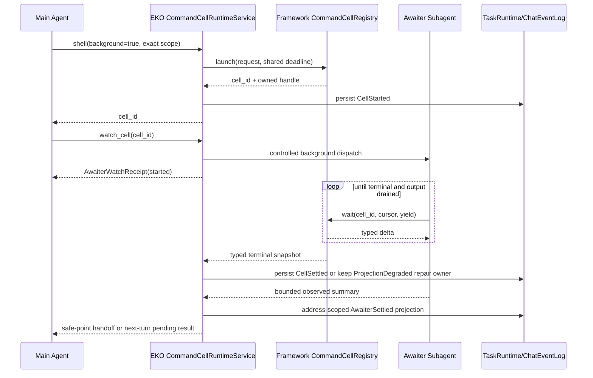

# EKO Long-Horizon Runtime Closure

> Date: 2026-08-21
> Status: Pending
> Priority: P0 after the current runtime-reliability identity cutover
> Scope: CommandCell, Awaiter, continuation boot recovery, terminal evidence, hot-state performance,
> and end-to-end long-horizon acceptance

## 1. Decision Summary

EKO already has a substantial long-horizon core: revisioned Goal/Plan binding, finite RunTurns,
provider retry, exact PlanTask Subagent control, Requirement/Evidence completion, command cells,
checkpoint projections, and a retained 12-hour deterministic soak ledger. This specification does
not replace those systems.

The remaining work closes eight gaps found by the 2026-08-21 source review:

1. normal workspace conversation TaskRuns do not auto-resume after boot;
2. Awaiter background dispatch has no retained result/control owner;
3. run-owned Awaiter events are dropped by the GUI projection boundary;
4. terminal cell persistence can give up and leave a durable active cell forever;
5. typed terminal/artifact status is discarded at the EKO projection boundary;
6. `get_run_state` still performs full event replay on hot paths;
7. CommandCell publication and retention have a launch/settlement race and no total tracked bound;
8. the existing soak validates the store/checkpoint core, not the real Agent/Awaiter/surface path.

The target model remains:

```text
TaskRun -> PlanTask -> SubagentRun
```

Awaiter is an ephemeral Subagent role with dedicated instructions and low reasoning. It is not a
new model class, PlanTask kind, task store, executor, or durable completion authority. The runtime
waits; Awaiter only observes, summarizes, and hands the typed result back to the originating
conversation.

## 2. Relationship To Existing Specifications

This file is subordinate to the cross-workspace identity decisions in
[`runtime-reliability.md`](./runtime-reliability.md) and does not duplicate its services.

| Concern                        | Governing specification/authority          | This specification's responsibility                            |
| ------------------------------ | ------------------------------------------ | -------------------------------------------------------------- |
| workspace/conversation address | `runtime-reliability.md` M1-M2             | consume the exact resolver; do not create another address type |
| foreground queue/steer/cancel  | `runtime-reliability.md` M3                | deliver Awaiter results through the shared app-core path       |
| boot reconciler                | `runtime-reliability.md` M5                | add long-horizon admission and launcher reconstruction         |
| event routing                  | `runtime-reliability.md` M2/M4             | include cell/Awaiter lifecycle without a surface-local bridge  |
| process resource governor      | `runtime-reliability.md` M8                | place cell/Subagent permits under the same governor            |
| Workflow/extract reachability  | [`surface-parity.md`](./surface-parity.md) | out of scope                                                   |
| DAG/revision/retry/cancel      | framework + existing TaskRuntime           | reuse unchanged                                                |
| Goal/Requirement/Evidence      | existing TaskRuntime store                 | extend only with typed cell evidence where required            |

Framework CommandCell fixes may proceed before the application identity cutover. Scoped EKO
projection, Awaiter handoff, and normal-conversation boot resume must consume the exact resolver
from `runtime-reliability.md` rather than creating a temporary parallel implementation.

## 3. Evidence Baseline

### 3.1 Existing authorities that must be reused

| Capability                                              | Current authority                                    |
| ------------------------------------------------------- | ---------------------------------------------------- |
| process execution, wait, cancellation, output retention | framework `BackgroundCommandManager`                 |
| typed cell snapshot/delta                               | framework `CommandCellSnapshot` / `CommandCellDelta` |
| byte cursor and incremental UTF-8 artifact decoding     | framework CommandCell runtime                        |
| low-reasoning Awaiter role                              | `subagents/coding/awaiter.md`                        |
| background Subagent execution                           | framework `SubagentExecutor::dispatch_background*`   |
| exact active-attempt message/interrupt                  | framework `SubagentControlRegistry`                  |
| TaskRun cell lifecycle facts                            | EKO `BackgroundCellStarted/Finished` events          |
| finite-turn continuation                                | EKO `TaskContinuationRuntime`                        |
| provider retry and boot admission policy                | EKO `TaskRuntimeStore`                               |
| completion decision                                     | EKO `completion_gate_report`                         |
| event/checkpoint authority                              | `events.jsonl` + discardable `checkpoint.json`       |
| conversation event recovery                             | EKO `ChatEventLog`                                   |

### 3.2 Review findings frozen as failing contracts

| ID     | Severity | Current defect                                                              |
| ------ | -------- | --------------------------------------------------------------------------- |
| LH-F01 | P1       | boot auto-resume production path filters to `background:` conversations     |
| LH-F02 | P1       | `watch_cell` drops the returned `BackgroundSubagentHandle`                  |
| LH-F03 | P1       | run-owned framework Awaiter events are excluded from Tauri projection       |
| LH-F04 | P1       | terminal event persistence stops after three attempts and forgets ownership |
| LH-F05 | P1       | EKO cell projection omits terminal cause and artifact status/error          |
| LH-F06 | P2       | hot `get_run_state` reads/folds the complete event log                      |
| LH-F07 | P2       | runner can settle/prune before its handle is published in the registry      |
| LH-F08 | P2       | deterministic soak bypasses real Agent, Awaiter, cell, HITL, and surfaces   |

### 3.3 Industry reference and evidence status

The design follows the previously captured primary-source patterns used by the original M0-M5
plan:

- OpenAI Codex Goal runtime separates persistent Goal, finite turns, continuation deferral, and
  cumulative budgets:
  <https://github.com/openai/codex/blob/53eaa297e595fc98df0f33d4c63686a7014d7c9a/codex-rs/ext/goal/src/runtime.rs>.
- Codex separates live message, queued follow-up, and exact interrupt instead of collapsing them
  into one cancel action:
  <https://github.com/openai/codex/tree/9ded177ce7c1c0bd2047f902936c177612ab3434/codex-rs/core/src/tools/handlers/multi_agents_v2>.
- Claude Code's changelog records independent background execution, prompt queueing, steering,
  resume, and compaction behavior:
  <https://github.com/anthropics/claude-code/blob/main/CHANGELOG.md>.
- Tokio documents bounded channels/backpressure and broadcast lag as distinct semantics; durable
  product delivery cannot use broadcast as its sole authority:
  <https://docs.rs/tokio/latest/tokio/sync/index.html>.

The supplied local Codex Awaiter inspection is behavioral evidence, not a public wire contract.
During this review, official OpenAI documentation search returned HTTP 404 and direct
`developers.openai.com` access returned 403; pinned GitHub re-fetches also timed out. No unverified
new Codex behavior is introduced here.

Cross-system consensus used by this specification:

- background work has a stable identity and an owned terminal receipt;
- a model role may decide how to wait, but the runtime owns wait and terminal truth;
- broadcast events are UI notifications, not durable completion authority;
- restart reconstructs from persisted facts and exact ownership, not current UI focus;
- completion depends on verified evidence, not a Subagent's final prose.

## 4. Implementation Gate: Layering And Duplicate Search

### 4.1 Generic framework mechanisms

The following belong to `echo-agent`:

- bounded CommandCell admission and retention;
- publish-before-run ordering;
- launch-time deadline covering queue + execution + drain;
- typed terminal and artifact fields in the wait tool result;
- owned/joinable background Subagent handles and exact controlled-attempt dispatch primitives;
- retry-safe multiple waiters and UTF-8-safe byte cursors.

The framework must not learn EKO workspace IDs, TaskRun pause reasons, GUI events, file layout, or
conversation recovery policy.

### 4.2 EKO product policy

The following remain in `echo-agent-app-core`:

- exact workspace/conversation/run binding for a cell;
- TaskRuntime/ChatEventLog terminal projection;
- durable projection repair and continuation wake;
- Awaiter admission, idempotency, handoff, surface projection, and shutdown;
- normal workspace conversation boot resume;
- Requirement/Evidence interpretation of a failed cell/artifact;
- EKO performance and real-product soak gates.

### 4.3 Thin adapters

Tauri, TUI, CLI/JSONL, and channel adapters may only submit an exact typed request, render the same
receipt/outcome, replay the same address-scoped journal, and request exact cancel/interrupt. They
must not own a private Awaiter map, terminal retry loop, boot scanner, cell state machine, or result
queue.

### 4.4 Duplicate search requirements

Before every implementation slice, search both repositories for:

```text
CommandCellRegistry / BackgroundCommandManager / CommandCellSnapshot
BackgroundSubagentHandle / SubagentControlRegistry / TurnSteerMailbox
TaskContinuationRuntime / RunTurnBinding / boot_auto_resume_decision
ChatEventLog / TaskRuntimeStore / WorkspaceRuntimeRegistry
BackgroundCellStarted / BackgroundCellFinished / completion_gate_report
```

Extend those authorities. Do not add `AwaiterStore`, a second CommandCell registry, another
continuation loop, or a new task relation API.

## 5. Invariants

1. Runtime state, not Awaiter prose, is authoritative for cell terminal outcome.
2. A cell is published before its runner can emit output or settle.
3. Every accepted cell owns one tracked-capacity permit until final retention removal.
4. Queue, process execution, process-group kill, pipe drain, and artifact finalization share one
   launch-time deadline.
5. Every accepted cell has exactly one typed terminal snapshot.
6. Every run-owned cell has one durable Started fact and one terminal fact, or an explicit
   `ProjectionDegraded` repair owner that keeps retrying.
7. Terminal persistence failure never causes ownership to be forgotten.
8. Awaiter dispatch is idempotent per `(scope, cell_id, watch_generation)`.
9. Awaiter is a SubagentRun projection, not a PlanTask or second TaskRun.
10. Dropping a UI subscriber cannot lose the owned Awaiter result.
11. `current workspace` never routes a cell, Awaiter result, or boot resume.
12. Ordinary Chat does not auto-start a new model turn solely because Awaiter completed.
13. A running TaskRun deferred for cells wakes once after all owned cells settle.
14. Restart never reattaches or replays an old process-scoped command cell.
15. Only unattended runs with successful exact boot admission auto-resume.
16. `events.jsonl` remains TaskRuntime authority; checkpoint and run-state are caches.
17. GUI, TUI, CLI/JSONL, and channel expose the same typed lifecycle/control semantics.

## 6. Target Architecture



Framework CommandCell state is the live process authority. EKO TaskRuntime/ChatEventLog is the
durable product authority. Awaiter observes the framework state; its summary cannot override phase,
cause, exit code, output cursor, artifact status, or completion blockers.

## 7. Framework CommandCell Contract

### 7.1 Bounded async launch

Launch admission must wait for total tracked capacity without blocking an executor thread. The
exact Rust shape should follow the repository's boxed-future pattern:

```rust
fn launch(
    &self,
    request: CommandCellRequest,
) -> BoxFuture<'_, Result<CommandCellLaunchReceipt, CommandCellError>>;
```

`CommandCellLaunchReceipt` contains `cell_id` and accepted deadline. `CommandCellError`
distinguishes validation, capacity deadline, cancellation, registry shutdown, and runtime failure.
Callers must not classify error text.

Maintain two permits:

- execution permit: bounds concurrently running processes;
- tracked-cell permit: bounds queued + running + waiter-drain + retained terminal entries.

Tracked capacity defaults to `max_concurrent + max_terminal_history`. Before waiting, launch prunes
oldest terminal entries with no waiter lease. If capacity remains full, it waits under the same
deadline and cancellation token. A queued timeout never starts a process.

### 7.2 Publication and settlement order

Required order:

```text
validate request
compute deadline
acquire tracked permit
construct handle
insert handle into registry
spawn runner
run and settle
publish typed terminal state
notify waiters
prune or migrate terminal history
release tracked permit only when entry is removed
```

If runner setup cannot start, the published handle settles once as `LaunchFailed`; it is not
removed before waiters can observe it.

### 7.3 Typed wait result

The existing `CommandCellDelta` remains the in-process type and becomes serializable at the tool
boundary. Model/adapters receive:

```text
cell_id
phase
terminal_cause
terminal_message
exit_code
artifact_status
artifact_message
output_artifact
total_output_bytes
next_cursor
new_output
output_truncated
output_elided
```

Human-readable text may accompany it, but consumers cannot parse text for control flow. `wait`
remains exempt from the generic tool batch timeout; per-round yield stays capped while the cell's
absolute deadline controls total lifetime.

### 7.4 Retention and shutdown

- active/queued cells are never pruned;
- terminal cells with waiter leases are not pruned;
- terminal history converges without another launch;
- shutdown rejects launch, cancels queued/running cells, drains observers, and leaves every
  accepted handle terminal;
- repeated shutdown is idempotent.

## 8. EKO Scoped CommandCell Runtime

### 8.1 One process service, scoped facades

Introduce one application-owned `CommandCellRuntimeService` wrapping the single framework manager.
It is an ownership/projection service, not a second execution engine.

Each Agent generation receives a scoped facade from one immutable runtime snapshot:

```text
WorkspaceExecutionScope
AgentAddress
Arc<TaskRuntimeStore> or Arc<ChatEventLog>
conversation_id
```

Delete the process-global weak store list, run-ID-only store scan, and
`stop_cells_for_run(run_id)` routing. Run control uses `workspace_id + run_id`; non-TaskRun Chat
cells use `workspace_id + conversation_id + root_turn_id`.

### 8.2 Durable cell projection

Extend existing `BackgroundCellState`; do not create a parallel cell type. Persist:

```text
phase
terminal_cause
terminal_message
exit_code
artifact_status
artifact_message
artifact_path
artifact_sha256
total_output_bytes
output_truncated
finished_at
```

Terminal event idempotency is keyed by exact `(scope, cell_id)`. Identical duplicate settlement is
a no-op. Conflicting terminal content fails closed and creates a diagnostic blocker.

### 8.3 Projection-degraded repair

The service owns observer tasks and join handles. On terminal persistence failure:

1. retain exact cell ownership;
2. publish an in-memory typed `ProjectionDegraded` diagnostic;
3. retry with capped exponential backoff while the process lives;
4. expose degraded state to diagnostics/surfaces;
5. do not wake continuation or release ownership until terminal fact is durable;
6. on shutdown, perform a bounded final flush and leave Started for boot recovery if persistence
   remains impossible.

A fixed retry count is insufficient. Disk pressure lasting longer than one second must not create a
permanent active zombie.

### 8.4 Completion semantics

- active cell always blocks completion;
- terminal success with required artifact status `Available`/`BelowThreshold` as applicable is
  eligible evidence;
- failure/timeout/cancel is visible evidence and blocks until the PlanTask handles or accepts it;
- artifact `Failed` never becomes success evidence;
- Awaiter summary is diagnostic only.

## 9. Awaiter Runtime Contract

### 9.1 Role definition

Keep the current role model: readonly, `thinking: low` where supported, optional `fast` model alias,
wait/list/stop tools only, bounded turns/timeout, and no mutation/task/delegation tools.

Resolve the effective model and thinking through the configured Provider/model authority.
`EKO_FAST_MODEL` must not reinterpret a model from another Provider/protocol as a name on the
parent connection.

### 9.2 Owned watch receipt

`watch_cell` delegates to app-core and returns:

```text
AwaiterWatchReceipt
  execution_id
  cell_id
  workspace_id
  conversation_id
  run_id?
  root_turn_id
  state: started | settled | cancelled | failed
  started_at
```

The service retains `BackgroundSubagentHandle`, exact control identity, and join task until
settlement. Repeated watch for the same active cell returns the existing receipt unless an explicit
new generation is requested. Dispatch uses the existing controlled background-attempt path so
message and exact interrupt work; no second mailbox is added.

### 9.3 Result handoff

Merge runtime-derived cell snapshot with bounded Awaiter observation:

```text
AwaiterResult
  receipt identity
  runtime terminal fields
  last output excerpt
  Awaiter summary/status
```

Delivery rules:

- active originating turn: inject once through exact `TurnSteerMailbox` safe point;
- settled TaskRun turn: persist cell terminal, clear deferral, let `TaskContinuationRuntime` start
  the next finite turn, and carry truth in Recovery Capsule;
- settled ordinary Chat turn: persist address-scoped result in `ChatEventLog`, render immediately,
  and inject once into the next turn for that conversation;
- never auto-start ordinary Chat solely because a cell finished;
- remount/subscriber loss replays from journal.

### 9.4 Stop and failure

- `stop_cell` stops the command; Awaiter observes cancelled and settles;
- `interrupt_awaiter(execution_id, expected_attempt)` stops only the observer;
- stopping Awaiter does not stop cell unless explicitly requested;
- Awaiter timeout/failure cannot change cell truth or TaskRun completion;
- shutdown cancels and joins all Awaiters before releasing Agent resources.

## 10. Boot Recovery For All TaskRuns

Extend the boot reconciler governed by `runtime-reliability.md`; do not add another scanner.

For each registered workspace independently:

1. resolve/open exact `WorkspaceRuntimeHost`;
2. run `recover_incomplete` on that host store;
3. isolate corrupt workspace/run data;
4. enumerate `Paused/BootRecovery` continuation runs;
5. rebuild exact AgentPool/model/plugin/MCP/review/HITL generation;
6. register launcher for exact conversation;
7. re-run `boot_auto_resume_decision` under run lock;
8. honor provider retry deadline;
9. auto-resume only eligible unattended runs;
10. leave attended/unsafe/budget-exhausted/Goal-mismatched runs paused with typed reasons.

`BackgroundTaskService` becomes one adapter using this reconciler. Remove the special claim that
only `background:` conversations are auto-resumable.

Recovery rules:

- process cells become `interrupted`; never replay commands;
- process Awaiters are not restored;
- terminal cell fact written before crash remains terminal;
- Started-only cell closes exactly once;
- unsafe tool/Subagent boundaries remain blockers;
- after user resolution, resume without duplicating completed PlanTasks.

## 11. Checkpoint-Backed Hot State

### 11.1 Canonical read path

Replace full replay in `TaskRuntimeStore::get_run_state` with one canonical checkpoint/suffix read:

```text
validate checkpoint schema/hash/run/seq/offset
read contiguous durable suffix
apply suffix through EventFoldState::apply_event
repair checkpoint/run-state projection if suffix or corruption was found
return RunStateSnapshot
```

On invalid checkpoint, fall back to complete events once, rewrite cache, and return rebuilt state.
Reuse `EventFoldState`; do not add another fold function.

### 11.2 Full-scan audit

Audit every `list_events(run_id, 0)` call. Move idempotency checks already represented by
`EventFoldState` into checkpoint-backed state. Keep full scans only for explicit audit, export, or
complete evidence-history APIs.

### 11.3 Performance gates

Release fixtures must exercise public production APIs, not internal checkpoint helpers only.

| Fixture                                      | Gate                            |
| -------------------------------------------- | ------------------------------- |
| `get_run_state`, 10k events, empty suffix    | median <= 2 ms on baseline host |
| `get_run_state`, 100k events, empty suffix   | <= 2x 10k median                |
| one append + state read, 100k history        | median <= 50 ms                 |
| corrupt checkpoint full rebuild, 100k events | bounded, then warm read <= 2 ms |
| checkpoint size, 100k events                 | <= 256 KiB and < 5% event log   |

Thresholds may be tightened. Widening requires a new measured baseline and explicit review.

## 12. Implementation Milestones

### LH0: Failing contracts and baseline freeze

Deliverables:

- deterministic failing tests for LH-F01 through LH-F08;
- current production call graph and duplicate-search record;
- baseline counts for full event scans, live observers, and tracked-cell capacity;
- retain the 12-hour ledger as historical store/checkpoint evidence without relabeling it.

Completion gate:

- every defect has a failing test or static reachability assertion;
- no production behavior changes;
- this file and `MASTER-PLAN` identify the same first implementation slice.

### LH1: Framework CommandCell correctness

Deliverables:

- bounded async launch and typed launch errors;
- tracked-cell and execution permits;
- publish-before-spawn ordering;
- typed structured wait result;
- deterministic shutdown and retention convergence;
- deletion of superseded sync launch/text-classification paths.

Completion gate:

- queue/timeout/cancel/settle/prune interleavings pass under barriers;
- total tracked entries never exceed configured capacity;
- no accepted cell disappears before terminal observation;
- framework submission gate and feature matrix pass.

### LH2: Scoped EKO projection and terminal repair

Deliverables:

- one process CommandCellRuntimeService with exact scoped facades;
- delete weak global store scan and run-ID-only routing;
- complete typed `BackgroundCellState`;
- owned observer joins and capped terminal persistence repair;
- typed degraded diagnostics and exact continuation wake.

Completion gate:

- duplicate run IDs in two workspaces cannot cross-write;
- disk failure longer than old retry window recovers in-process;
- completion never sees false active zombie or false successful artifact;
- application Rust/GUI/frontend gates pass.

### LH3: Owned Awaiter receipt and handoff

Deliverables:

- controlled Awaiter dispatch with retained handle/join;
- idempotent watch receipt and exact observer interrupt;
- runtime-derived terminal result plus bounded Awaiter summary;
- active-turn safe-point delivery and settled-turn journal projection;
- elimination of dropped-handle and broadcast-only completion.

Completion gate:

- main Agent continues other work while Awaiter waits;
- result reaches exact conversation once despite remount/receiver lag;
- stopping Awaiter and cell have distinct tested semantics;
- Awaiter failure cannot change TaskRun truth;
- no PlanTask/TaskRun is created for Awaiter.

### LH4: Surface parity and normal-conversation boot resume

Deliverables:

- shared app-core projection for GUI/TUI/CLI/JSONL/channel;
- remove Tauri `run_id.is_none()` suppression shortcut;
- per-workspace boot reconciliation and launcher reconstruction;
- BackgroundTaskService delegates to same boot service;
- exact attended/unattended/HITL policy.

Completion gate:

- all surfaces receive identical typed Awaiter/cell outcomes;
- ordinary unattended conversation TaskRun auto-resumes after restart;
- attended runs wait for owner;
- corrupt workspace does not block healthy workspace;
- focus switching cannot reroute resumed work.

### LH5: Hot-state convergence and performance

Deliverables:

- checkpoint-backed `get_run_state`;
- full-scan audit and dedupe migration;
- 10k/100k public-API benchmarks;
- crash-window/corrupt-checkpoint equivalence tests.

Completion gate:

- hot state read no longer scales linearly with history;
- full replay and checkpoint/suffix state are canonical-byte equivalent;
- fixed gates pass five consecutive release samples.

### LH6: Fault matrix and real-product soak

Deliverables:

- complete automated fault matrix;
- real Tauri/TUI/CLI/channel integration gate;
- deterministic multi-workspace concurrency soak;
- bounded real-provider soak using actual Agent, cell, Awaiter, restart, HITL, and completion report;
- final ledger and deletion of superseded completion claims.

Completion gate:

- automated/manual acceptance below passes;
- no open P0/P1 finding in this specification;
- `runtime-reliability.md` dependencies are Complete;
- project status may then call long-horizon product acceptance Complete.

## 13. Test Specification

### 13.1 Framework unit tests

Required deterministic tests:

```text
launch_publishes_handle_before_fast_terminal_settlement
concurrent_fast_launches_respect_total_tracked_capacity
queued_launch_timeout_never_spawns_process
queued_launch_cancel_releases_tracked_permit
terminal_waiter_lease_prevents_prune_until_delta_returned
terminal_retention_converges_without_another_launch
shutdown_terminalizes_and_joins_every_accepted_cell
wait_result_preserves_typed_timeout_wait_and_drain_failures
wait_result_preserves_artifact_failure_when_process_exit_is_zero
unicode_cursor_round_trip_survives_pipe_and_retention_boundaries
```

Use `Barrier`, `Notify`, controlled executors, and test hooks. Do not use random sleep as race
oracle.

### 13.2 App-core unit tests

```text
scoped_cell_projection_never_scans_another_workspace_store
same_run_id_in_two_workspaces_keeps_cell_events_isolated
terminal_persistence_failure_retains_owner_and_retries_until_success
terminal_projection_round_trips_all_typed_framework_fields
artifact_failure_is_not_completion_success
watch_cell_is_idempotent_for_one_active_generation
awaiter_result_uses_runtime_terminal_truth
awaiter_interrupt_does_not_stop_cell
cell_stop_settles_awaiter_as_observed_cancel
background_result_survives_broadcast_lag
chat_result_is_injected_once_on_the_next_turn
taskrun_result_wakes_exactly_one_continuation
```

### 13.3 Boot recovery tests

Cover:

1. global unattended normal conversation run;
2. workspace unattended normal conversation run;
3. background-service run;
4. attended run without owner;
5. attended run after owner registration;
6. provider retry deadline in future;
7. Goal/Plan mismatch;
8. token/time budget exhausted;
9. Started-only cell at crash;
10. terminal cell committed before crash;
11. unsafe tool/Subagent boundary;
12. corrupt workspace beside healthy workspace;
13. two launchers racing same run;
14. focus changes during boot resume.

Every accepted resume has one run-driver claim and one terminal settlement.

### 13.4 Surface contract tests

Execute the same scenario through GUI, TUI, CLI/JSONL, and channel adapters:

```text
launch background cell
dispatch Awaiter
continue unrelated Agent work
receive incremental status
settle success/fail/timeout/cancel
receive exact Awaiter/cell result
restart and replay visible state
```

Compare identity and terminal fields, not renderer text.

### 13.5 Frontend tests

- run-owned Awaiter events are not filtered;
- result buckets by exact workspace/conversation;
- remount replay does not duplicate toast/card/chat projection;
- stale workspace generation cannot overwrite active view;
- terminal cause and artifact failure render distinctly;
- projection retry does not display a false running process;
- long output remains cursor-paged without layout shift.

### 13.6 Fault-injection matrix

| Fault                                     | Injection point       | Required outcome                               |
| ----------------------------------------- | --------------------- | ---------------------------------------------- |
| process exits before registry publication | framework launch hook | impossible after LH1; waiter observes terminal |
| tracked capacity exhausted                | launch admission      | bounded wait/reject under shared deadline      |
| stdout UTF-8 split                        | pipe reader           | no panic/replacement for valid sequence        |
| artifact writer fails                     | writer push/finalize  | typed failure persisted/visible                |
| terminal append fails for 30s             | EKO store             | owner retained; eventual one terminal event    |
| UI receiver lags > broadcast capacity     | event bridge          | durable result replayed                        |
| Awaiter provider fails                    | Subagent dispatch     | cell truth preserved; observer failure visible |
| main turn settles before Awaiter          | handoff boundary      | journal result; no automatic Chat turn         |
| app killed with cell/Awaiter              | boot recovery         | cell interrupted once; Awaiter not resurrected |
| provider 5xx during continuation          | RunTurn finish        | durable retry deadline; one later claim        |
| checkpoint corrupt                        | state read            | full rebuild once; warm cache repaired         |
| one workspace log corrupt                 | boot scan             | only that workspace blocked                    |
| disk full during projection               | append/rewrite        | committed/degraded distinction preserved       |

### 13.7 Performance tests

Run release fixtures with fixed histories and five consecutive samples. Record host, toolchain,
commit, median, worst, event/checkpoint sizes, and peak RSS. Tests fail on threshold regression;
results are not edited afterward.

### 13.8 Soak tests

Two gates are required.

**Automated concurrency soak**

- 3 workspaces x 3 conversations;
- at least 10 minutes;
- deterministic provider allowed;
- seeded launch/wait/output/cancel/restart/focus-switch schedule;
- assert global permits, exact routing, no lost terminal, no busy loop.

**Real-product soak**

- minimum 2 active hours;
- real configured provider and actual `drive_chat`/TaskContinuationRuntime;
- at least one long cell and Awaiter per hour;
- at least two controlled app restarts;
- one HITL, one provider retry, one Subagent control, one compaction;
- GUI plus one headless surface active;
- content-free metrics only; no secrets in ledger.

Failure requires repair and a fresh run. Historical deterministic store soaks cannot replace this
gate because they exercise a different path.

## 14. Repair Completion Standard

### 14.1 Awaiter

- [ ] remains configured Subagent role, not special model/runtime state;
- [ ] `watch_cell` returns owned idempotent receipt;
- [ ] app-core retains and joins background handle;
- [ ] exact message/interrupt works for active Awaiter attempt;
- [ ] runtime terminal fields override conflicting prose;
- [ ] result reaches exact conversation once after remount/lag;
- [ ] stopping Awaiter and cell are distinct.

### 14.2 CommandCell

- [ ] queue + running + drain + retained history is bounded;
- [ ] handle publication precedes settlement;
- [ ] queue time is included in deadline;
- [ ] typed cause/artifact state round-trips framework -> EKO -> surface;
- [ ] terminal persistence never gives up while process lives;
- [ ] shutdown leaves no cell or detached observer.

### 14.3 Continuation and recovery

- [ ] all eligible unattended TaskRuns auto-resume, not only `background:` runs;
- [ ] attended runs require interactive owner;
- [ ] exact workspace/conversation/run survives restart;
- [ ] process commands are never blindly replayed;
- [ ] provider/budget/Goal/HITL/blockers recheck atomically;
- [ ] one boot claim starts one driver.

### 14.4 Completion and evidence

- [ ] active cell/Awaiter facts block only when semantically required;
- [ ] failed/timed-out/cancelled cell is explicit evidence, never hidden success;
- [ ] artifact write failure cannot satisfy required artifact;
- [ ] Awaiter output alone cannot complete Requirement;
- [ ] full replay and live completion report agree.

### 14.5 Performance and operations

- [ ] production `get_run_state` passes 10k/100k gates;
- [ ] no retry/Awaiter wait tight-loop;
- [ ] resource peaks stay within shared governor;
- [ ] concurrency soak and real-product soak pass;
- [ ] soak launcher self-retires and does not restart completed binary;
- [ ] ledgers retain truthful passed/failed/waived status and hashes.

### 14.6 Surface parity

- [ ] GUI, TUI, CLI/JSONL, channel use same app-core services;
- [ ] all expose same typed terminal/control outcomes;
- [ ] no surface-local Awaiter owner/result queue/recovery logic remains.

Only after every applicable item, LH0-LH6 gate, and repository submission gate passes may this file
and `MASTER-PLAN` mark long-horizon product acceptance Complete.

## 15. Submission Gates

Each slice runs smallest relevant tests during development. Before repository commits, run the full
commands required by root `AGENTS.md`. Framework public API changes also run every independent
feature. Tauri/frontend changes run GUI and frontend matrices.

Static audits prove:

```text
no CLI SQLite feature/dependency
no legacy execution-role terminology
no second Task/Plan/Awaiter store or executor
no run-ID-only workspace routing
no panic-prone production API
no byte-index string truncation
no absolute worktree Cargo path
```

Do not commit with a failing/skipped applicable gate.

## 16. Commit Slices And Rollback Boundaries

| Slice | Repository            | Content                                     | Rollback boundary              |
| ----- | --------------------- | ------------------------------------------- | ------------------------------ |
| LH0   | app                   | failing contracts + governing spec          | tests/docs only                |
| LH1a  | framework             | async bounded launch + publication order    | trait and callers together     |
| LH1b  | framework             | typed wait + shutdown/retention             | runtime/tool surface together  |
| LH2a  | app                   | scoped CommandCellRuntimeService            | runtime resolver adapter only  |
| LH2b  | app                   | typed terminal projection + repair          | events/types/readers together  |
| LH3   | app/framework adapter | controlled Awaiter receipt/handoff          | `watch_cell` as one unit       |
| LH4   | app                   | surface projection + all-run boot reconcile | boot service/adapters together |
| LH5   | app                   | checkpoint hot state + benchmark            | one fold/read authority        |
| LH6   | app                   | fault matrix, integration, soak, closeout   | tests/evidence only            |

Framework merges before application. Every slice switches a production path and deletes replaced
logic; no two authorities remain active.

## 17. Risks And Controls

| Risk                                        | Control                                              |
| ------------------------------------------- | ---------------------------------------------------- |
| async launch broadens framework API         | migrate callers atomically; feature matrix           |
| Awaiter becomes second task model           | no PlanTask/TaskRun creation; cell remains authority |
| duplicate result enters model               | stable receipt + journal dedupe + safe-point ack     |
| auto-resume replays side effects            | boot blockers and no process reattachment            |
| disk outage creates retry load              | capped backoff, one owner/cell, shutdown deadline    |
| checkpoint becomes authority                | validate event tail before trusted warm read         |
| multi-workspace recovery exhausts resources | shared governor + bounded boot admission             |
| real-provider soak costs grow               | fixed 2-hour gate and explicit budget                |

## 18. Stage Ledger

| Stage | Status  | Framework commit | Application commit | Tests/evidence            | Remaining                    |
| ----- | ------- | ---------------- | ------------------ | ------------------------- | ---------------------------- |
| LH0   | Pending | N/A              | N/A                | failing contracts pending | freeze LH-F01..LH-F08        |
| LH1   | Pending | N/A              | N/A                | pending                   | framework cell correctness   |
| LH2   | Pending | N/A              | N/A                | pending                   | scoped projection/repair     |
| LH3   | Pending | N/A              | N/A                | pending                   | owned Awaiter handoff        |
| LH4   | Pending | N/A              | N/A                | pending                   | parity + all-run boot resume |
| LH5   | Pending | N/A              | N/A                | pending                   | hot-state performance        |
| LH6   | Pending | N/A              | N/A                | pending                   | fault matrix + real soak     |

Allowed status: `Pending`, `In progress`, `Blocked`, `Complete`. Complete requires the stage gate and
all applicable repository gates.

## 19. Final Acceptance Record Template

```text
Date:
Framework commit (or N/A):
Application commit:
Runtime-reliability dependency commits:
Authority/duplicate-search results:
Framework gate results:
Application Rust gate results:
GUI/frontend gate results:
Fault-matrix artifact:
Concurrency-soak artifact:
Real-provider soak artifact:
Performance samples:
Manual GUI/TUI/CLI/channel evidence:
Remaining P0/P1 findings: none
Accepted by:
```

## 20. Primary Code Locations

Framework:

```text
echo-core/src/tools/cell.rs
echo-orchestration/src/tasks/command_cell.rs
src/tools/builtin/cell_tools.rs
src/tools/builtin/agent_dispatch.rs
src/agent/subagent/control.rs
src/agent/subagent/executor.rs
```

Application:

```text
echo-agent-app-core/src/subagents/coding/awaiter.md
echo-agent-app-core/src/infra.rs
echo-agent-app-core/src/tasks/task_runtime/command_cells.rs
echo-agent-app-core/src/tasks/task_runtime/continuation.rs
echo-agent-app-core/src/tasks/task_runtime/store.rs
echo-agent-app-core/src/tasks/task_runtime/event_rebuild.rs
echo-agent-app-core/src/tasks/task_runtime/file_shadow.rs
echo-agent-app-core/src/tasks/task_runtime/completion_gate.rs
echo-agent-app-core/src/tasks/service.rs
echo-agent-app-core/src/workspace/runtime.rs
echo-agent-app-core/src/chat_event_log.rs
src/tauri/mod.rs
src/tui/events.rs
src/cli/repl.rs
src/cli/channels.rs
web-frontend/src/stores/subagentRunStore.ts
```
