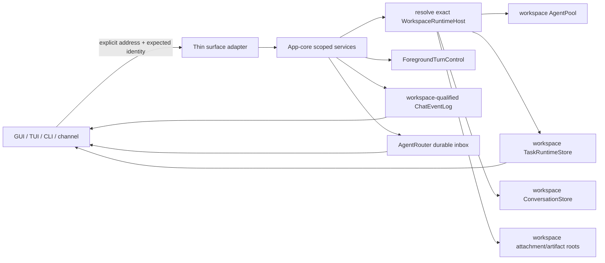

# EKO 多项目与多会话运行时可靠性修复规格

> 日期：2026-08-21  
> 状态：M0-M8 implementation in progress；最终 acceptance pending
> 优先级：P0 可靠性修复  
> 整合范围：workspace/conversation runtime、foreground input/interrupt、本地恢复、
> AgentRouter live/cold delivery 与 groups
> 跨会话状态：[`docs/MASTER-PLAN.md`](../../docs/MASTER-PLAN.md)

本文是上述未完成工作的唯一活跃规格。原有 cross-workspace Agent group 设计、运行中
补充输入设计和 runtime recovery 审计中的未完成项均已合并到 F01-F18、M0-M8 和本页
验收矩阵；已实现部分由代码与项目文档记录，不再保留独立历史规格。

## 1. 决策摘要

本轮故障不是“新建会话按钮失效”或某个 React effect 的局部问题，而是
workspace-scoped runtime 迁移只切换了聊天执行主路径，GUI 查询、控制、恢复、事件、
删除和部分投递路径仍使用进程级全局状态。修复必须端到端收敛身份和所有权，不能继续
在前端增加清空、过滤或重试补丁。

本规格作出以下决定：

1. 复用现有 `AgentAddress { workspace_id, conversation_id }` 作为已注册 workspace
   conversation 的唯一稳定地址；不新增 `ConversationAddress` 平行类型。
2. 复用现有 `WorkspaceExecutionScope`、`WorkspaceRuntimeHost`、`ScopedChatRuntime`、
   `ForegroundTurnControl`、`TaskRuntimeStore`、`TurnSteerMailbox` 和 `AgentRouter`；不新增
   第二套 runtime、AgentPool、DAG、mailbox、conversation store 或 executor。
3. 所有已接受命令都绑定显式 workspace/conversation/turn/run 身份。`current workspace`
   只决定 GUI 焦点，不能决定命令执行目标。
4. 同一 `AgentAddress` 同时最多一个用户 foreground turn；surface 是来源/投影元数据，
   不是并发隔离维度。不同 conversation、不同 workspace 可以真正并发。
5. TaskRuntime、Agent、ConversationStore、附件根、事件流和工具投影必须来自同一个
   `WorkspaceRuntimeHost` 快照，不能在一次请求中多次读取可变 focus。
6. 已被应用接受的普通用户输入必须有 backend durable receipt。前端只渲染按地址分桶
   的投影，不再拥有 hook-local 权威 FIFO。
7. `Delivered` 必须表示目标已在 transcript safe point 持久完成；仅将消息注入 live
   steer mailbox 不构成投递完成。需要回复时，reply 也必须先持久接受。
8. 历史会话选择不得覆盖正在执行的 Agent 上下文。冷 Agent 使用框架 checkpoint-first
   恢复；仅在没有 checkpoint 的 branch/import 场景执行一次 transcript fallback。
9. workspace/conversation 删除必须先证明对应 runtime idle，或显式 cancel、等待 settle、
   shutdown、evict 后再删除文件。
10. GUI、TUI、CLI、channel 使用同一 app-core 服务和身份合同；本修复不接受 GUI-only
    的生命周期语义。

## 2. 问题定义

### 2.1 用户要求覆盖的五类场景

| 场景                 | 当前判断                                                 | 本规格目标                                                        |
| -------------------- | -------------------------------------------------------- | ----------------------------------------------------------------- |
| 多项目同时执行       | core host 隔离存在，但 GUI 控制/事件仍可串项目           | A/B 项目并发且查询、控制、事件、资源完全隔离                      |
| 单项目多会话同时执行 | AgentPool 支持，但切换、队列、restore、右栏不可靠        | A/B 会话独立运行、切换、排队、终结和恢复                          |
| 打断、错误、恢复     | interrupt 会制造幽灵 turn；部分恢复只恢复 UI             | 每个 accepted input/turn/run 有且仅有一个可解释终态               |
| 历史未完成会话继续   | TaskRuntime 查错 store，Agent restore 错 pool            | 精确 host 恢复；可续跑则续跑，不可安全续跑则显式 RecoveryRequired |
| 跨会话/项目投递      | cold path 基础正确；live path 提前 Delivered、无回复结算 | durable accept、精确消费、terminal receipt、correlated reply 闭环 |

### 2.2 目标

- 修复所有 workspace/global runtime 混用，使每条命令只能访问请求指定的 runtime。
- 建立统一的命令、事件、快照、队列和投递身份合同。
- 保证 focus 切换不改变任何已接受工作的执行归属。
- 保证同一 conversation 不会因 GUI/TUI/Agent surface 切换出现并发 transcript writer。
- 保证切走再返回运行会话时能够重建 live projection 并继续接收事件。
- 保证崩溃、HITL、Paused TaskRun、provider 错误和 delivery retry 有明确恢复语义。
- 修复删除生命周期，禁止后台工作继续访问已删除 workspace。
- 建立可复现的故障矩阵和提交完成门，不再以局部单测通过声明系统完成。

### 2.3 非目标

- 不增加 SQLite；文件和 JSONL 仍是 EKO 权威持久化。
- 不增加多租户鉴权、workspace 权限门或用户交互式工具权限门。
- 不增加 TaskRun 状态来表达 GUI dialog、queue 或 plan approval。
- 不新建 AgentRouter 之外的跨 Agent inbox。
- 不新建 TurnSteerMailbox 之外的 same-turn steer 机制。
- 不把 EKO workspace、GUI 投影、删除策略或资源预算下沉到 `echo-agent`。
- 不承诺外部工具副作用在进程崩溃下 exactly-once；必须明确保持 at-least-once
  边界并依赖稳定 identity/dedup 缩小重复窗口。

## 3. 业界实现调研与 EKO 取舍

仓库既有设计在实现前已经核对以下官方源码和官方 changelog。本轮外部官方站点访问
被 403/超时阻断，因此不增加未经读取验证的新产品细节，继续采用这些已记录的一手资料：

- Claude Code 把 queued prompt、interrupt、session resume、background resume 和
  Agent message delivery 作为相互独立的控制面，而不是一个 cancel flag：
  <https://github.com/anthropics/claude-code/blob/main/CHANGELOG.md>。
- Codex app-server 将 `turn/start`、`turn/steer`、`turn/interrupt` 分开，steer 使用
  `expectedTurnId` 防止向过期 turn 误投；TUI 对 rejected steer 保留 FIFO fallback：
  <https://github.com/openai/codex/blob/main/codex-rs/app-server-protocol/src/protocol/v2/turn.rs>、
  <https://github.com/openai/codex/blob/main/codex-rs/tui/src/chatwidget/input_flow.rs>。
- Codex app-server 为 thread 保留独立 cwd、加载多个 thread，并公开 active-turn/mailbox
  诊断；workspace/thread 执行不依赖进程当前焦点：
  <https://github.com/openai/codex/blob/main/codex-rs/app-server/README.md>。
- Cursor 长程 Agent 公开材料强调 durable execution、环境一致性和 harness 边界：
  <https://cursor.com/blog/long-running-agents>、
  <https://cursor.com/blog/cloud-agent-lessons>。

跨系统共性及 EKO 取舍：

| 共性                                      | EKO 取舍                                                                     |
| ----------------------------------------- | ---------------------------------------------------------------------------- |
| session/thread 有稳定身份，focus 只是视图 | 使用 `AgentAddress` 和 immutable `WorkspaceExecutionScope`                   |
| start、steer、interrupt 是不同命令        | 保留现有 `TurnSteerMailbox`，新增 EKO typed admission/decision orchestration |
| accepted queue 不能因切换 UI 丢失         | 用现有 chat journal 持久 queue 事件，前端只做投影                            |
| background work 不依赖当前页面            | 所有命令按显式 address resolve `WorkspaceRuntimeHost`                        |
| recovery 依赖持久事实而非 loading 状态    | TaskRuntime events、chat journal、AgentRouter inbox 分别保持唯一权威         |
| delivery receipt 与目标消费分离           | `Queued/Claimed/Injected/Delivered/Failed` 明确 safe point                   |

本设计不照搬任何产品 UI，也不增加审批状态机。只采用稳定身份、精确前置条件、持久
receipt、焦点与执行分离、恢复可证明这五个成熟共识。

## 4. 实现前门禁

### 4.1 已存在且必须复用

| 能力                            | 当前权威                                                        | 结论                                  |
| ------------------------------- | --------------------------------------------------------------- | ------------------------------------- |
| workspace ID 和不可变执行根     | `workspace/mod.rs` 的 `WorkspaceId` / `WorkspaceExecutionScope` | 不新增 scope                          |
| workspace conversation 地址     | `agent_router.rs::AgentAddress`                                 | workspace 路径统一复用                |
| active turn 完整身份            | `ForegroundTurnSnapshot`                                        | IPC 直接携带，不由 focus 反推         |
| workspace runtime owner         | `WorkspaceRuntimeHost` / `WorkspaceRuntimeRegistry`             | 增加按地址解析与 idle eviction        |
| workspace AgentPool/TaskRuntime | `WorkspaceExecutionRuntime`                                     | GUI adapter 必须切入现有实例          |
| TaskRun workspace/conversation  | `TaskRun.workspace_id/conversation_id`                          | 事件直接投影，不建第二索引            |
| checkpoint-first Agent 恢复     | framework ReAct run context                                     | 删除 GUI 无条件 `load_messages`       |
| foreground admission/cancel     | `ForegroundTurnControl`                                         | 收紧为每个 AgentAddress 一个用户 turn |
| same-turn steer                 | framework `TurnSteerMailbox`                                    | 保持唯一 mailbox                      |
| durable Agent inbox             | `AgentRouter` inbox journal                                     | 扩展结算/退避，不新增 router          |
| task DAG/retry/cancel           | framework DAG + EKO TaskRuntime                                 | 不新增 task state machine             |
| retry delay 计算                | `echo_core::retry::RetryPolicy`                                 | delivery 复用计算并持久实际 deadline  |

### 4.2 已确认的重复或错误旁路

1. `AppState.tasks.runtime` 和 workspace `TaskRuntimeStore` 都是合法实例，分别服务 global
   和 workspace；错误是 Tauri `task_runtime.rs::store()` 无条件选择 global。
2. framework 已有冷 Agent checkpoint 恢复，GUI 又通过 global pool 主动
   `load_messages`，形成第二恢复权威且可覆盖 live context。
3. `ChatEventEnvelope`、`ExecEvent`、`ToolExecutionSummary` 在 app 投影边界丢失
   workspace identity。
4. 普通用户 FIFO 只存在于 React hook；它不是 durable receipt，也没有 address。
5. AgentRouter journal 已存在，但 live steer acceptance 被错误当成 terminal Delivered。
6. `WorkspaceRuntimeRegistry` 有 get/open、activity snapshot、全量 shutdown，没有单 host
   idle eviction；workspace 删除因此绕过 runtime lifetime。

### 4.3 分层结论

**通用机制：`echo-agent`**

- 保留 ReAct、execution mutex、checkpoint restore、`TurnSteerMailbox`、Task DAG、
  cancellation 和 `RetryPolicy`。
- 本轮原则上不新增 framework 状态或 workspace 类型。
- 若实施中发现 framework 自身无法暴露已有 checkpoint 恢复结果，只允许补通用、
  product-neutral 的查询/typed outcome；不得把 EKO address 或 GUI policy 下沉。

**EKO 产品策略：`echo-agent-app-core`**

- 精确 workspace runtime resolve、foreground product admission、普通输入 receipt、
  TaskRuntime/Agent/ConversationStore 绑定、事件投影、boot reconciliation、删除、
  AgentRouter settlement、资源总量治理。
- 这些都依赖 EKO 本地多项目产品形态，必须留应用层。

**Tauri/前端适配边界**

- Tauri 只解析 typed request、调用 app-core service、emit typed projection。
- 前端只提交显式身份、管理当前视图和乐观草稿；不拥有执行、恢复、重试或 durable queue。
- adapter 不得重新实现 runtime resolve、DAG、delivery retry、interrupt 状态机或 transcript
  写入。

## 5. 当前故障基线

以下故障在 2026-08-21 审查中确认，M0 必须先写失败合同测试：

| ID  | 严重度 | 故障                                                             | 当前证据                                                     |
| --- | ------ | ---------------------------------------------------------------- | ------------------------------------------------------------ |
| F01 | P0     | GUI TaskRuntime 查询/暂停/取消/resume 操作 global store          | `src/tauri/commands/task_runtime.rs::store`                  |
| F02 | P0     | send 使用 workspace runtime，但 interrupt 检测使用 global store  | `src/tauri/commands/chat.rs`                                 |
| F03 | P0     | restore/branch transcript 加载到 global AgentPool                | `src/tauri/commands/conversations.rs::load_agent_transcript` |
| F04 | P0     | 切回 active conversation 可覆盖 live Agent context               | `ReactAgent::load_messages` 无 execution guard               |
| F05 | P0     | GUI FIFO 无 address；切换时丢失或跨会话派发                      | `useTauriChat.ts::queuedInputsRef`                           |
| F06 | P0     | interrupt 先建 placeholder，backend 只 emit prompt 后返回        | `useTauriChat.ts` + `chat.rs`                                |
| F07 | P0     | send/steer/cancel/replay/save 从 mutable focus 推导目标          | 多个 Tauri commands                                          |
| F08 | P0     | live Agent delivery 在 steer accepted 时提前 Delivered           | `state.rs::deliver_agent_message_live`                       |
| F09 | P0     | conversation 删除用 workspace transcript + global pool/runtime   | `AppState::delete_conversation_owned`                        |
| F10 | P0     | workspace 删除未 shutdown/evict host                             | `workspace.rs::delete_workspace`                             |
| F11 | P1     | chat/execution/tool event 缺 workspace identity                  | app-core event types                                         |
| F12 | P1     | 返回 active conversation 无法重建 streaming placeholder          | transcript/event projection split                            |
| F13 | P1     | restore 失败被前端吞掉并标记 ready                               | `conversationStore.ts`                                       |
| F14 | P1     | startNew/switch workspace 保留旧 TaskRuntime polling/projection  | frontend stores                                              |
| F15 | P1     | ordinary stream/HITL crash 后 UI 可复活但 response waiter 不存在 | Tauri memory-only pending map                                |
| F16 | P1     | delivery retry 紧循环耗尽；一个坏 workspace 中止全局 recovery    | delivery supervisor                                          |
| F17 | P1     | per-workspace/per-run semaphore 使全局并发上限成倍放大           | pool/executor limits                                         |
| F18 | P1     | frontend overlapping workspace switch 无 generation 防旧响应覆盖 | `workspaceStore.switchTo`                                    |

## 6. 权威身份模型

### 6.1 身份层级

```text
WorkspaceExecutionScope
  workspace_id
  immutable root

AgentAddress                    # 已注册 workspace conversation
  workspace_id
  conversation_id

ForegroundTurnSnapshot
  workspace_id
  surface                      # owner metadata，不是并发 key
  conversation_id
  root_turn_id                 # surface/user turn correlation
  active_turn_id               # framework exact steer precondition

TaskRun identity
  workspace_id
  conversation_id
  run_id
  root_message_id

Agent delivery identity
  message_id
  from/to AgentAddress
  correlation_id
  causation_id
  attempt_id
```

global 非 workspace 模式继续使用现有 `WorkspaceExecutionScope::global`。调用方必须显式
携带 backend 返回的 scope identity；不得以“workspace_id 缺失”表示“使用当前 focus”。
`AgentRouter` 是否支持 global endpoint 与本轮 GUI 项目修复解耦，不得为了 global 模式
再造第二种 workspace conversation 地址。

### 6.2 核心不变量

1. 一个 accepted operation 在生命周期内只绑定一个 `WorkspaceExecutionScope`。
2. 一个 `AgentAddress` 同时最多一个用户 foreground turn，GUI/TUI/CLI/channel 互斥；
   Agent delivery 只能 exact-steer 该 turn 或等待，不能成为第二 transcript writer。
3. 不同 `AgentAddress` 可并发，包括同 workspace 的不同 conversation，或不同 workspace
   中相同 `conversation_id`。
4. `run.workspace_id` 必须等于 resolved TaskRuntimeStore 的 active workspace；不相等时
   fail closed，不能回退 global。
5. conversation store、AgentPool、TaskRuntimeStore、attachments/spill root、review
   integration 必须来自同一个 runtime snapshot。
6. `current workspace` 只控制可见 UI；focus 切换不能取消、重绑定或重路由后台工作。
7. 每个 accepted user input 始终处于以下一个且仅一个位置：durable queued、pending
   steer、committed user turn、returned-for-edit 或 terminal removed。
8. cancel 不删除 queue；只有 typed queue command 可以 remove accepted input。
9. 只有 exact terminal settlement 可以释放 foreground ownership、推进 FIFO 或结算 UI。
10. transcript 只有 Agent/chat driver 写；GUI、queue service 和 AgentRouter 都不能侧写。
11. `Delivered` 只在目标 transcript safe point 后成立；expects-reply 时 reply 必须已 durable
    accepted，receipt 必须包含稳定 `reply_message_id`。
12. 删除文件前，对应 host/conversation 的 foreground、TaskRun、delivery、HITL、pool
    execution 和 runtime resources 必须全部 settled。

## 7. 目标架构



### 7.1 唯一 runtime resolver

在 app-core 提供一个按显式 scope/address 解析现有 `ScopedChatRuntime` 的公共服务。它必须：

1. 对 registered workspace，从 `WorkspaceRegistry` 查 workspace，再通过唯一
   `WorkspaceRuntimeRegistry::get_or_open` 获取 host。
2. 对 global scope，显式返回现有 global runtime；不能通过缺参或当前焦点隐式选择。
3. 初始化 workspace execution 时复用现有 seed pool，只创建 host 自己的 execution。
4. 返回同一快照中的 scope、primary Agent、pool、TaskRuntimeStore、ConversationStore、
   deletion service、review integration。
5. 可选校验 conversation 存在，并在所有写操作前校验 request address 与存储对象一致。

现有 `chat_runtime_for_agent`、`current_chat_runtime_inner` 中的共同逻辑应收敛到该 resolver。
迁移结束后，Tauri workspace-sensitive command 不得直接读
`app_state.tasks.runtime`、`connection.agent_for` 或二次读取 `current_workspace()`。

### 7.2 Tauri IPC 合同

所有 workspace-sensitive 请求至少携带：

```text
workspace_id
conversation_id
```

控制 active turn 的请求额外携带：

```text
expected_root_turn_id
expected_active_turn_id          # steer 时必须
```

控制 TaskRuntime 的请求额外携带：

```text
run_id
```

后端 resolve 后必须校验：

- foreground snapshot 的 workspace/conversation/root 与 expected identity 完全一致；
- TaskRun 的 workspace/conversation/run 与 request 完全一致；
- attachment/spill root 来自 resolved scope；
- mismatch 返回 typed conflict，不尝试当前 focus 或 global fallback。

适用命令包括但不限于：

- chat：send、steer、cancel、get-active、replay、HITL response；
- conversation：get、save、restore/open、branch、delete、export；
- TaskRuntime：latest/get/list/resume/retry/pause/cancel/patch/progress；
- tool/worktree/panel projection；
- Agent delivery status 和 group target projection。

### 7.3 事件合同

`ChatEventEnvelope` schema 升级，最少包含：

```text
schema_version
workspace_id                  # required
conversation_id               # accepted turn 后 required
root_turn_id
active_turn_id                # 有 framework turn 时 required
message_id
sequence
stream_id                     # workspace-qualified
payload
```

`stream_id` 和 cursor 至少按 `(workspace_id, conversation_id, root_turn_id)` 隔离。旧 schema
是可丢弃 GUI projection，可在升级时清理或从 canonical transcript 重建；不得改写 transcript。

`ExecEvent` 至少增加 `workspace_id`、`conversation_id`；从对应 `TaskRun` 投影，不由 GUI
补齐。`ToolExecutionSummary/detail_ref` 的 key 也必须加入 workspace identity。

前端处理规则：

- 所有事件先按完整 address 入库；背景事件可以更新自己的 bucket，但不能切换当前视图。
- 当前页面只 select 当前 address 的 chat/task/tool/subagent projection。
- 任何缺 workspace identity 的 workspace event 视为 contract violation，记录错误并忽略，
  不回退到 active workspace。
- event replay 只能读取请求 address 的 stream。

### 7.4 前端状态模型

前端 store 使用统一 address-key helper；禁止每个 store 自行拼接不同 key。至少维护：

```text
currentViewAddress
workspaceGeneration
conversationProjection[address]
taskRuntimeProjection[address]
toolProjection[address]
subagentProjection[address]
queuedInputProjection[address]
eventCursor[address, root_turn_id]
```

`switchTo`、conversation init、run load 都捕获 generation；异步返回时 generation/address
不匹配则丢弃结果。`startNew` 必须立即解绑当前 view projection 和 polling，但不能删除后台
bucket 或取消后台 run。

空白会话在首条输入被接受前只是 draft。首条发送由 backend 原子完成
`ensure conversation -> durable input accept -> turn admission/queue`，返回真实 address 后前端
才绑定事件；不再使用 `activeId = null` + 旧 ref fallback 路由事件。

## 8. 普通输入、steer 与 interrupt 协议

### 8.1 Durable ordinary-input receipt

不新增独立文件 store。扩展现有 workspace-qualified chat journal，记录普通输入控制事件，
并由 app-core service 折叠出 queue snapshot：

```text
InputAccepted
InputQueued
SteerPending
SteerAccepted
SteerRejected
InputClaimed
InputReturnedForEdit
InputRemoved
InputCommitted
InputSettled
```

queue item 至少冻结：

```text
input_id                    # idempotency key，亦可作为新 root_turn_id
workspace_id
conversation_id
text
attachment refs            # 已按 exact workspace staged
interaction_mode
submitted_at
position/revision
```

app-core service 只拥有 receipt、FIFO 和 dispatch orchestration，不执行 ReAct、不写 transcript、
不复制 `TurnSteerMailbox`。真正执行仍通过 shared `drive_chat`。

### 8.2 Send admission 顺序

1. 前端提交 draft 和显式 workspace identity，不先创建 streaming assistant。
2. backend 原子 resolve runtime、确保 conversation、stage attachments、持久 InputAccepted。
3. 若 conversation idle，取得 exact foreground lease，持久 InputClaimed，再返回 `Started`。
4. 若 active turn steerable，按用户选择或明确 command 进入 `SteerPending`，携带
   `expected_active_turn_id`。
5. 若 busy/not-steerable，持久 `Queued`，返回 queue receipt。
6. 前端只在收到 `Started` 后创建/绑定 streaming placeholder；`Queued` 渲染 queue item；
   conflict 保持可重试 draft。
7. terminal settlement 后 backend 原子结算当前 input，再 claim 一个 FIFO head；前端 terminal
   event 不直接调用本地 `dispatchNextQueued()`。

### 8.3 TaskRuntime interrupt decision

running/paused TaskRun 收到新输入时，不创建伪 foreground turn。backend 返回 typed conflict：

```text
TaskRunConflict {
  address,
  run_id,
  run_status,
  input_receipt,
  allowed_actions,
}
```

dialog 操作是 app-core 命令，不是前端拼接多个竞态 IPC：

| 操作                | 精确语义                                                                        |
| ------------------- | ------------------------------------------------------------------------------- |
| Guide current       | exact steer 当前 turn；不可 steer 时保持 durable queued，不丢输入               |
| Queue after current | 保持 FIFO，当前 run terminal 后启动新 turn                                      |
| Edit                | 标记 ReturnedForEdit；server 保留 receipt，直到 replacement/remove              |
| Cancel and start    | cancel 精确旧 run/turn，await exact settlement，再以同一 input_id admit 新 turn |

每个 action 必须幂等。重复点击或响应重放不能启动两个 turn。任何 action 完成后，原
placeholder、queue item、foreground lease 和 TaskRun 都必须处于可解释状态。

## 9. 会话打开、历史恢复与 live rebind

### 9.1 打开会话是只读选择

选择侧栏会话不得无条件调用 `load_messages`。backend 返回一个聚合 snapshot：

```text
ConversationOpenSnapshot {
  address,
  transcript,
  active_foreground_turn,
  latest_task_run,
  queued_inputs,
  chat_replay_cursor,
  readiness,
}
```

`readiness` 至少区分：`Ready`、`Active`、`HistoryOnly`、`RecoveryRequired`。restore 失败时
不得吞错并标记 Ready。

### 9.2 Agent context 恢复

- active foreground turn：只 rebind GUI；绝不调用 `load_messages`。
- idle pooled Agent 已有内存 context：复用，不覆盖。
- cold Agent 有 framework checkpoint：沿用 framework checkpoint-first restore。
- branch/import 没有 checkpoint：在新 Agent 对外发布和取得执行资格前，一次性从该
  address 的 ConversationStore transcript fallback。
- fallback 失败：保持 HistoryOnly/RecoveryRequired，阻止无上下文发送并展示 typed error。

迁移完成后删除 GUI `load_agent_transcript` 旁路及其 global pool 调用。

### 9.3 运行中会话 rebind

canonical transcript 继续只保存已完成事实；live UI 从 exact foreground snapshot + exact
chat journal replay 重建：

1. 读取 `root_turn_id/active_turn_id`。
2. replay 对应 workspace/conversation/root stream。
3. 若 transcript 尚无当前 user turn，根据 `InputClaimed` 重建 user projection。
4. 根据 running status 创建一个稳定 ID 的 assistant placeholder。
5. 从最后 cursor 接收 live token/tool/terminal。
6. terminal 后以 canonical transcript 对账并移除临时 projection，不产生重复消息。

不能依赖 fallback message ID 或 `isStreaming` 扫描猜测 active assistant。

## 10. 崩溃、错误与历史未完成恢复

### 10.1 Boot reconciliation

启动按 workspace 隔离恢复；一个损坏 workspace/inbox/run 只能生成该 scope 的 blocker，
不能 `?` 终止其他 workspace 扫描。

恢复顺序：

1. 打开 workspace registry 和 immutable hosts。
2. 隔离校验 ConversationStore、TaskRuntime events/checkpoint、chat journal、Agent inbox。
3. 恢复 TaskRuntime run driver/continuation 的既有 boot admission。
4. 折叠普通 input receipt，重新 claim 尚未开始的队列头。
5. 对 nonterminal chat stream 检查是否存在 live lease、TaskRuntime binding 或 safe checkpoint。
6. 恢复 Agent delivery claim/backoff deadline。
7. 发布 per-address recovery snapshot，最后开放 surface interaction。

### 10.2 普通 turn 的恢复分类

| 情况                                             | 行为                                                       |
| ------------------------------------------------ | ---------------------------------------------------------- |
| durable accepted，但尚未 claim                   | 自动重新排队/claim                                         |
| claim 已写，但尚未开始 ReAct                     | 使用稳定 input/root id 安全重试                            |
| 有可证明 framework safe checkpoint               | 从 checkpoint 恢复                                         |
| 正在 tool/外部副作用且无 safe checkpoint         | `RecoveryRequired`，用户选择 retry/discard，不伪装 Running |
| terminal transcript 已提交但 terminal event 未写 | 从 transcript marker 修复 terminal，不重跑                 |

### 10.3 HITL

Tauri memory-only `PENDING_RESPONSES` 不能作为恢复权威。pending request 至少持久化 request
identity、address、turn/run binding、prompt/options、deadline 和 response status。

- live waiter 存在时，response 交给现有 provider。
- 重启后可恢复的 TaskRuntime/HITL 重新建立 waiter 并重放同一个 request。
- 无法恢复执行时，将 request 连同 turn 置为 RecoveryRequired；按钮不能继续调用不存在
  的 sender。
- stop/discard 必须持久 terminal；下次启动不能再次复活相同等待框。

## 11. TaskRuntime 控制面收敛

所有 TaskRuntime Tauri command 使用 request workspace resolve host store，并校验 run：

- latest/list/get by conversation；
- resume/retry/pause/cancel；
- plan/task patch、review、progress、worktree panel；
- continuation resume 和 foreground binding；
- interrupt detection。

resume 必须使用 resolved runtime 的 primary Agent、pool、TaskRuntimeStore、execution scope、
review integration 和 event sink。不得混用 current execution scope 与 global primary Agent。

全局 `AppState.tasks.runtime` 保留给明确 global scope；不因为 workspace GUI 不再使用就删除
合法 global 能力。删除的是“workspace command 无条件走 global”的 adapter。

## 12. 删除与 runtime eviction

### 12.1 Conversation 删除

删除以 exact workspace/conversation 为单位：

1. 使用 workspace-qualified foreground suspension；修复当前仅按 conversation_id 的
   suspension set。
2. 查询同 host 的 pool lease、TaskRun、delivery、HITL 和 queue。
3. 默认 busy 时返回 typed `ConversationBusy`，列出活动 identity，不删除任何文件。
4. 显式 force delete 时，cancel exact work、等待 terminal、关闭/失败化 delivery 和 input
   receipts、retire exact pool Agent、删除 exact TaskRuntime records，再提交 transcript 删除。
5. 同 conversation ID 的其他 workspace 不受影响。

### 12.2 Workspace 删除

给现有 `WorkspaceRuntimeRegistry` 增加单 host `shutdown_and_evict_if_idle`，而不是新 registry。

默认删除流程：

1. registry resolve workspace 和 host。
2. activity snapshot 必须覆盖 foreground、TaskRun driver/receipt、pool execution、delivery、
   HITL、command cell、review/plugin resources。
3. busy 则拒绝并保留目录。
4. idle 则 shutdown host owners、从 registry evict、关闭 file handles。
5. 再删除 managed root 或 `.eko` 数据。

force delete 必须显式 cancel 并等待上述顺序，不能在后台任务仍运行时先删目录。

## 13. AgentRouter live/cold delivery

### 13.1 Receipt 语义

扩展现有 journal，不新增 inbox：

```text
Queued -> Claimed -> Injected/Executing -> Delivered
                             \-> Deferred(next_attempt_at)
                             \-> Failed
```

- `Injected` 表示消息已进入 exact live turn mailbox，但尚未消费完成，不是 terminal。
- cold delivery 使用稳定 `message_id` 派生 turn identity，继续走 shared `drive_chat`。
- live delivery 注册 exact foreground settlement waiter，并将 delivery marker 绑定该 turn。
- cancelled/failed before transcript safe point：不得 Delivered；按 error class defer/retry 或 fail。
- transcript terminal marker 已存在：重启后直接修复 receipt，不重跑模型。
- expects-reply：稳定 reply ID 必须先成功 enqueue 到 source，再写 Delivered；receipt 必须带
  `reply_message_id`。

### 13.2 Retry 与恢复

- 复用 framework `RetryPolicy` 的 delay 计算，不复制退避算法。
- EKO journal 持久化实际 `next_attempt_at`、`error_class`、attempt 和 jitter 后 deadline；重启
  不重新抽 jitter。
- retryable：provider 502/429、暂时 pool full、target active but not steerable、临时 I/O。
- non-retryable：地址不存在、payload invalid、id collision、明确删除。
- supervisor 到 deadline 才重试，禁止一个循环内瞬间耗尽三次。
- discovery/recovery 对每个 workspace/inbox 独立 catch/log/continue。
- FIFO head deferred 时保持目标队列顺序；不同 target address 可并发。

## 14. 进程级资源治理

现有 per-run DAG/ownership 限制继续存在；它们控制单个 run 的结构并发。新增的仅是 EKO
进程级总量 governor，用来防止 N workspace 把同一配置乘 N：

```text
max_active_agent_executions
max_parallel_llm_calls
max_concurrent_shells
max_concurrent_writes
max_concurrent_subagents
```

governor 是 app-owned shared dependency，注入每个 `WorkspaceExecutionRuntime` 和现有
executor；不新增 executor，不下沉 workspace policy 到 framework。permit 必须取消安全、
FIFO 公平，指标按 workspace/run 标注。per-run limit 与 process limit 都必须满足，取更严格
者；不以无限 queue 掩盖 provider overload。

## 15. 修复里程碑

### M0：失败合同测试与基线冻结

**实现**

- 为 F01-F18 建立 deterministic failing tests；并发测试使用 barrier/channel，不使用固定
  sleep 猜时序。
- 本文和 `MASTER-PLAN` 成为新 governing record；旧 M8 的完成声明标记 reopened。
- 保存当前正向测试，证明 core host、cold delivery 和现有 transcript 不被破坏。

**完成门**

- 每个 P0 至少一个测试在旧实现上稳定失败，并附失败原因。
- 测试能区分“错误 global store”和“正确 workspace store”，不是只断言 UI 文案。
- 无产品代码变更也不得将 M0 标为 Complete，直到失败基线已记录。

### M1：统一 runtime resolver 与 TaskRuntime 控制面

**实现**

- 提取 app-core exact scoped runtime resolver。
- 切换全部 TaskRuntime query/control/resume/retry/panel/interrupt 路径。
- request 加 workspace/conversation/run identity 并校验。
- 删除 Tauri workspace command 的 global `store()` helper 和 global primary Agent 旁路。

**完成门**

- workspace run 可被 latest/get/pause/cancel/resume/retry 精确控制。
- A/B 使用相同 conversation/run 测试夹具时互不影响。
- grep 证明 workspace-sensitive Tauri path 零处直接选择 global store/Agent。

### M2：IPC 与事件 identity 完整化

**实现**

- chat/conversation/task/tool commands 全部携带 exact identity。
- ChatEvent schema bump；execution/tool projection 加 workspace。
- chat replay/remove/cursor key workspace-qualified。
- frontend stores 按 address 分桶；workspace switch generation 防 stale writeback。

**完成门**

- A/B 同 conversation ID 的 chat/task/tool/subagent 事件完全隔离。
- 背景 A 事件不会改变 B 当前右栏或焦点。
- 附件 staging、spill、execution 始终落同一 workspace。

### M3：foreground admission、durable FIFO 与 interrupt 闭环

**实现**

- foreground 用户 turn 从 `(workspace,surface,conversation)` 收敛为每个 address 一个；
  surface 保留 owner metadata。
- input receipt/FIFO 迁到 app-core chat journal fold。
- send 先 admission response，前端后建 placeholder。
- typed TaskRun conflict 和四种幂等 decision action。
- `cancel-and-start` 在 app-core 完成 cancel -> await -> admit 原子编排。

**完成门**

- 同 workspace 多 conversation 可并发；同 address 跨 GUI/TUI 第二个 turn typed Busy。
- 切换/重载不丢 accepted input；A terminal 不派发 B queue。
- interrupt 任一 action 后零幽灵 streaming、零悬空 lease，新输入恰好处理一次。

### M4：历史打开、Agent restore 与 live projection rebind

**实现**

- conversation open 返回聚合 snapshot。
- 删除选择即 `load_messages`；实现 checkpoint-first/transcript-fallback。
- exact active snapshot + journal replay 重建 running placeholder/cursor。
- restore error 进入 HistoryOnly/RecoveryRequired，不允许空上下文继续。

**完成门**

- active A -> B -> A 时 context 不变，token/tool/final 连续投影。
- completed history、branch、import、cold checkpoint 四类恢复均有真实测试。
- live Agent 在任何恢复路径上都不会被 `load_messages` 覆盖。

### M5：崩溃/HITL/TaskRuntime boot recovery

**实现**

- per-workspace boot reconciler，坏 scope 不阻塞健康 scope。
- 普通 input/turn 分类恢复和 durable terminal repair。
- HITL pending identity/status 持久化并可重建 waiter，或显式 RecoveryRequired。
- 历史 TaskRun panel 自动加载 exact run，resume 使用 exact host runtime。

**完成门**

- 在 streaming、tool、HITL、Paused TaskRun 四个时点 kill/restart 均无假 Running。
- 可恢复项继续，不可安全恢复项有可操作的 retry/discard 且不会下次再次复活。
- 本机历史中 non-contiguous/corrupt event 只隔离单 run，并给出 blocker，不中止其他恢复。

### M6：删除生命周期与 host eviction

**实现**

- conversation suspension workspace-qualified。
- conversation delete 使用 exact pool/runtime/store。
- registry 增加 idle proof shutdown/evict。
- workspace delete 默认 busy reject，force 路径 cancel/settle/shutdown/evict/delete。

**完成门**

- 运行 A -> 切 B -> 删除 A：默认拒绝且目录保留；force 后后台全部终结再删。
- 同 conversation ID 的 B 不受 A 删除影响。
- 删除完成后 registry 无 host、无 driver、无 file handle、无继续写入。

### M7：Agent delivery settlement、backoff 与 reply

**实现**

- live steer acceptance 改为 Injected 非终态，等待 exact settlement/transcript marker。
- expects-reply 先 enqueue stable correlated reply 再 Delivered。
- 持久 next_attempt_at/error class，复用 RetryPolicy。
- startup discovery/recovery 按 endpoint 隔离错误。

**完成门**

- live inject 后 cancel/crash 不会 Delivered，且可恢复/重试。
- success 后 Delivered，expects-reply receipt 必有稳定 reply ID。
- provider 502 不会毫秒三连；重启保持原 deadline/FIFO。
- 一个损坏 workspace 不阻止其他 inbox 恢复。

### M8：资源治理、surface parity、旧路径删除与 soak

**实现**

- process-level EKO resource governor 注入所有 hosts/runs。
- GUI/TUI/CLI/channel 使用相同 identity、queue、interrupt、restore、TaskRuntime 控制服务。
- 删除 frontend hook-local queue authority、global GUI adapters、重复 restore、旧 event schema、
  focus-routing fallback 和过时测试。
- 完成多 workspace/conversation fault matrix 和 soak。

**完成门**

- 不存在第二 runtime/router/mailbox/DAG/store；迁移 adapter 全部删除。
- 所有 surface 功能合同一致，仅渲染不同。
- 至少 3 workspace x 3 conversation 并发 soak 2 小时，交叉完成/失败/cancel/retry/HITL，
  零身份串扰、零丢 receipt、零 stuck lease、资源峰值不超过配置。
- 全部提交门和本规格验收矩阵通过后，才可把 M8 和主计划恢复为 Complete。

## 16. 建议提交切片与回滚边界

每个切片必须切换真实主路径并删除被替代逻辑，禁止只新增 abstraction：

| Slice | 内容                                                      | 回滚边界                                  |
| ----- | --------------------------------------------------------- | ----------------------------------------- |
| S0    | failing contract tests + docs                             | 纯测试/文档                               |
| S1    | app-core resolver + TaskRuntime commands                  | 可整体回滚，不改 event schema             |
| S2    | identity schema + generated TS + frontend address buckets | schema 一次切换，无兼容双写               |
| S3    | durable input receipt/FIFO + interrupt service            | 以 backend receipt 为开关，不保留双 queue |
| S4    | open snapshot + restore/rebind                            | 删除 GUI `load_messages` 同 commit        |
| S5    | boot/HITL recovery                                        | 以 per-address reconciler 为单位          |
| S6    | scoped delete + registry eviction                         | 删除命令一起切换，不保留危险旧入口        |
| S7    | delivery Injected/settlement/backoff/reply                | inbox schema 一次切换，测试先行           |
| S8    | governor + surface parity + dead path cleanup + soak      | 最终 convergence                          |

如果一次只能完成阶段迁移，必须在本文账本记录仍存在哪条旧主路径、由哪个下一阶段删除；
复杂度不能成为长期双实现理由。

## 17. 测试规格

### 17.1 Rust 单元测试

**ForegroundTurnControl**

- `same_address_is_exclusive_across_user_surfaces`
- `different_conversations_in_one_workspace_run_concurrently`
- `same_conversation_id_in_different_workspaces_isolated`
- `cancel_requires_exact_root_turn_id`
- `scoped_conversation_suspension_does_not_block_other_workspace`

**ChatEventLog / projection**

- 同 conversation ID 跨 workspace 有独立 stream/cursor/remove。
- event schema 拒绝缺 workspace 的 workspace event。
- InputAccepted/Queued/Claimed/Settled fold 幂等。
- terminal transcript marker 修复缺失 terminal event，不重复 assistant。

**WorkspaceRuntimeRegistry**

- exact resolver 支持 registered/global/missing/root drift。
- idle host shutdown+evict；busy host 拒绝。
- force shutdown 等待 driver receipts 和 pool execution。

**Agent restore**

- checkpoint 优先于 transcript fallback。
- branch/import 无 checkpoint 时 fallback 一次。
- active Agent context 永不被选择/restore 覆盖。
- fallback 失败不发布 Ready Agent。

**AgentRouter**

- live Injected + cancel => 非 Delivered。
- live terminal transcript commit => Delivered。
- expects-reply => reply accepted before Delivered。
- crash at claim/inject/transcript/reply/receipt 每个窗口均可恢复。
- retry deadline/backoff/max attempts/non-retryable/restart 不重抽 jitter。
- 一个 corrupt endpoint 不阻塞其他 endpoints。

### 17.2 app-core 多 host 集成测试

使用真实 file stores 和三个 `WorkspaceRuntimeHost`：

1. A/B 使用相同 conversation ID，各自创建 TaskRun，查询/暂停/恢复/取消互不影响。
2. A1/A2 同 workspace 并发，反序完成，transcript/event/tool/run 各归原 address。
3. A 运行时 focus 快速 A -> B -> C，A root/Agent/store/attachments 不变。
4. A active 时打开历史 A 只 rebind，不修改 Agent context。
5. cold branch 无 checkpoint，第一次执行看见 branch transcript。
6. background A event 在 B focus 时只更新 A bucket。
7. 删除 busy A 拒绝；settle 后 shutdown/evict/delete。
8. 三 inbox 各 32 条，含 deferred/restart/reply，FIFO 和 address 隔离。

### 17.3 Tauri command 合同测试

- 所有 workspace-sensitive command 缺 workspace/address 时 validation fail，不用 current focus。
- backend focus 已切 B，携带 A address 的 cancel/steer/pause 仍只控制 A。
- request run.workspace 与 resolved store 不一致时 fail closed。
- send attachment staging 和 runtime root 来自同一 resolved scope。
- save/branch/delete 中途切 focus，所有读写仍在原 address。
- interrupt 四 action 幂等，每个 accepted input 恰好一个 terminal。
- HITL response 使用 exact request/address/turn，过期 waiter typed conflict。

### 17.4 Frontend Vitest

- A/B 相同 conversation ID 的 chat/execution/tool event 不串。
- A running -> B -> A -> replay/live token -> terminal 正确重建。
- queue 按 address 保留、重排、删除；切 workspace/WebView remount 不丢 accepted receipt。
- A terminal 不 dispatch B queue；frontend 不再直接 dispatch backend queue。
- `startNew` 清当前 view/polling，不清后台 buckets、不取消后台 run。
- 快速 A -> B -> C，A/B 的旧 async response 不覆盖 C。
- conflict response 前无 assistant placeholder；IPC failure 保留可重试 draft。
- restore HistoryOnly/RecoveryRequired 阻止发送并显示可恢复错误。
- background `run_started` 不切 current task panel。

### 17.5 故障注入矩阵

| 断点                                    | 预期                                                   |
| --------------------------------------- | ------------------------------------------------------ |
| InputAccepted 后、claim 前 kill         | 重启后仍在 queue，只启动一次                           |
| lease 后、ReAct 前 kill                 | stable input/root id 恢复，不重复 user message         |
| streaming 中 kill                       | checkpoint resume 或 RecoveryRequired，无假 live lease |
| tool side effect 后、transcript 前 kill | 明确 at-least-once blocker，不宣称 exactly-once        |
| transcript terminal 后、event 前 kill   | 修复 terminal，不重跑                                  |
| HITL request persist 后 kill            | 重建 waiter 或 RecoveryRequired，按钮不 NotFound       |
| TaskRun pause persist、driver 未退场    | resume 等待旧 driver settle                            |
| delivery claim 后 kill                  | attempt 递增，stale attempt 不可 settle                |
| live inject 后 target cancel            | 不 Delivered；按 policy defer/fail                     |
| reply enqueue 后、Delivered 前 kill     | stable reply id 去重，修复 receipt                     |
| provider 502/429                        | 按持久 deadline 重试，无 tight loop                    |
| 一个 workspace event log 损坏           | 仅该 workspace blocker，其他 workspace 正常恢复        |
| 删除 workspace 与后台 run 竞态          | 删除拒绝或先完整 shutdown，绝不先删目录                |

### 17.6 GUI 验收场景

必须使用真实 Tauri app，不只 jsdom：

1. 建立项目 A/B，每个项目建立会话 1/2，同时启动四个长任务。
2. 连续切换侧栏，确认每个会话各自 streaming、TaskRuntime、工具和 Subagent 状态。
3. 对四个 turn 分别执行 steer、queue、stop、TaskRun interrupt decision。
4. 在 tool/HITL/Paused 状态强制退出 app，重启后继续或显示 RecoveryRequired。
5. 向 background conversation 和另一个 workspace 投递消息并等待 correlated reply。
6. 尝试删除 busy conversation/workspace，确认拒绝且目录存在；settle 后再删。
7. 在 1280x800 与 390x844 检查 queue、recovery、conflict 状态无重叠/截断。

### 17.7 并发与 soak

- 最小自动并发门：3 workspace x 3 conversation，持续 10 分钟，注入随机
  complete/fail/cancel/pause/resume/steer/delivery/restart。
- 最终门：同规模 2 小时真实 provider/工具 soak。
- 每轮记录 address、root turn、active turn、run、delivery attempt、cursor 和资源 permit。
- 失败条件：任何跨 address event/store/root 命中、accepted input 丢失、duplicate terminal、
  stuck lease、无界 retry、目录删除后写入、资源峰值越界。

### 17.8 提交门禁

每个实现切片先跑最小相关测试。最终必须执行仓库 `AGENTS.md` 的完整门禁：

```bash
cd echo-agent-cli
cargo fmt --all
cargo fmt --all -- --check
cargo clippy --workspace --all-targets --all-features --locked -- -D warnings
cargo clippy --workspace --lib --bins --all-features --locked -- \
  -D clippy::unwrap_used \
  -D clippy::expect_used \
  -D clippy::panic \
  -D clippy::unreachable
cargo test --workspace --all-features --locked
cargo check -p echo-agent-app-core --no-default-features --locked
cargo check --no-default-features --features gui --bin echo-agent-tauri
cargo test --no-default-features --features gui

cd web-frontend
npx prettier --check "src/**/*.{ts,tsx}"
npm test
npm run build
```

若实际修改 `echo-agent` 公共 API/feature，必须额外执行该仓库所有适用门禁和 feature
矩阵。任何失败都必须修复，不得以“预先存在”或“与本次无关”跳过。

## 18. 修复完成标准

### 18.1 五类用户场景

- [ ] 多项目同时执行：至少三个 workspace 可并发，focus 切换不改变执行归属。
- [ ] 单项目多会话：至少三个 conversation 可并发，各自 queue、stream、run、tool 独立。
- [ ] 打断/错误/恢复：所有 accepted input/turn/run 有一个明确终态，无幽灵 streaming。
- [ ] 历史未完成继续：TaskRuntime 精确续跑；普通 turn 可安全恢复或明确 RecoveryRequired。
- [ ] 跨会话/项目投递：live/cold 均在 transcript safe point 后 Delivered，reply 闭环。

### 18.2 权威路径

- [ ] workspace Tauri commands 零处直接选择 global TaskRuntime/AgentPool。
- [ ] 执行、控制、恢复、事件、删除都可追溯 exact workspace/conversation；turn/run 控制
      还有 exact expected identity。
- [ ] current workspace 只用于 UI focus，不用于已接受 operation 路由。
- [ ] conversation selection 不修改 live Agent。
- [ ] frontend 不拥有 durable FIFO、interrupt state machine 或 runtime settlement。
- [ ] 只有 Agent/chat driver 写 transcript。
- [ ] 只有一个 AgentRouter、TurnSteerMailbox、TaskRuntime/DAG、AgentPool per host。
- [ ] 不新增 SQLite、线上权限门或旧的并行执行角色术语。

### 18.3 数据与生命周期

- [ ] accepted input 在切换、remount、restart 后不丢失、不跨 address。
- [ ] 每个 foreground turn 恰好一个 terminal settlement。
- [ ] every TaskRun control 校验 run.workspace 与 resolved store。
- [ ] chat/execution/tool event 均含 workspace identity。
- [ ] delivery receipt/reply 和 retry deadline 可从 journal 重建。
- [ ] 删除完成后没有后台 owner 继续访问已删除路径。
- [ ] corrupt workspace/run/inbox 只隔离自身，不阻止健康 scope。

### 18.4 Surface 对等

- [ ] GUI/TUI/CLI/channel 使用同一 app-core send/steer/queue/cancel/restore service。
- [ ] 相同输入在各 surface 获得相同 typed outcome 和 terminal semantics。
- [ ] surface 只保留渲染差异，不保留私有生命周期队列或恢复逻辑。

### 18.5 性能与资源

- [ ] 进程级 LLM/shell/write/Subagent/Agent execution 峰值不超过配置。
- [ ] 背景 address 事件不会触发当前 address 的无关全量 reload。
- [ ] retry 不 tight-loop；deadline 到达前 CPU/日志无忙等。
- [ ] 2 小时 soak 全部 failure counters 为零。

只有以上全部完成、M0-M8 账本有提交和测试证据、所有适用门禁全绿，本文状态和
`MASTER-PLAN` 才能改为 Complete。

## 19. 风险与控制

| 风险                                 | 控制                                                                          |
| ------------------------------------ | ----------------------------------------------------------------------------- |
| identity schema 改动面广             | S1 先统一 resolver，S2 一次 schema 切换；不双写旧/新 identity                 |
| durable FIFO 与 AgentRouter 被误合并 | 明确普通 user input 与跨 Agent inbox 是不同产品语义，只共享已有日志原语       |
| restore 改动导致历史丢失             | transcript 只读、checkpoint-first、branch fallback 真实测试                   |
| crash 后外部副作用重复               | stable identity、transcript marker、RecoveryRequired；不虚假承诺 exactly-once |
| force delete 造成数据丢失            | 默认 busy reject；force 明示活动项并严格 cancel/settle/shutdown 顺序          |
| 全局 governor 导致 starvation        | FIFO permit、按 address/run 指标、取消安全测试                                |
| 迁移期间双路径                       | 每个 slice 必须删除旧主路径，账本记录唯一 authority                           |

## 20. 阶段账本

每个阶段必须填写以下字段：

| 阶段 | 状态        | 权威路径 | 应用提交 | 框架提交 | 测试命令/结果                                     | 失败与修复 | 剩余事项                    |
| ---- | ----------- | -------- | -------- | -------- | ------------------------------------------------- | ---------- | --------------------------- |
| M0   | In progress | N/A      | N/A      | N/A      | contract tests 已在当前工作树建立；完整门禁待执行 | N/A        | 提交并冻结 F01-F18 baseline |
| M1   | Pending     | 待切换   | N/A      | N/A      | 待执行                                            | N/A        | exact runtime resolver      |
| M2   | Pending     | 待切换   | N/A      | N/A      | 待执行                                            | N/A        | IPC/event identity          |
| M3   | Pending     | 待切换   | N/A      | N/A      | 待执行                                            | N/A        | durable FIFO/interrupt      |
| M4   | Pending     | 待切换   | N/A      | N/A      | 待执行                                            | N/A        | restore/rebind              |
| M5   | Pending     | 待切换   | N/A      | N/A      | 待执行                                            | N/A        | crash/HITL recovery         |
| M6   | Pending     | 待切换   | N/A      | N/A      | 待执行                                            | N/A        | delete/evict                |
| M7   | Pending     | 待切换   | N/A      | N/A      | 待执行                                            | N/A        | delivery settlement         |
| M8   | Pending     | 待切换   | N/A      | N/A      | 待执行                                            | N/A        | governor/parity/soak        |

状态只能是 `Pending`、`In progress`、`Blocked`、`Complete`。只有本阶段验收和所有适用
门禁全绿才能标 Complete。框架无改动必须明确写 `N/A`，不能把应用 commit 误记为框架
变更。

## 21. 最终验收记录模板

```text
Date:
Application commit:
Framework commit (or N/A):
Authority grep results:
Rust gate results:
GUI feature gate results:
Frontend gate results:
Fault matrix artifact:
2-hour soak artifact:
Manual GUI evidence:
Known at-least-once boundaries:
Remaining blockers: none
Accepted by:
```

## 22. 参考代码位置

- `echo-agent-app-core/src/workspace/runtime.rs`
- `echo-agent-app-core/src/workspace/mod.rs`
- `echo-agent-app-core/src/state.rs`
- `echo-agent-app-core/src/foreground_turn.rs`
- `echo-agent-app-core/src/chat_event_log.rs`
- `echo-agent-app-core/src/agent_router.rs`
- `echo-agent-app-core/src/tasks/task_runtime/`
- `src/tauri/commands/chat.rs`
- `src/tauri/commands/task_runtime.rs`
- `src/tauri/commands/conversations.rs`
- `src/tauri/commands/workspace.rs`
- `web-frontend/src/hooks/useTauriChat.ts`
- `web-frontend/src/stores/conversationStore.ts`
- `web-frontend/src/stores/taskRuntimeStore.ts`
- `web-frontend/src/stores/workspaceStore.ts`
