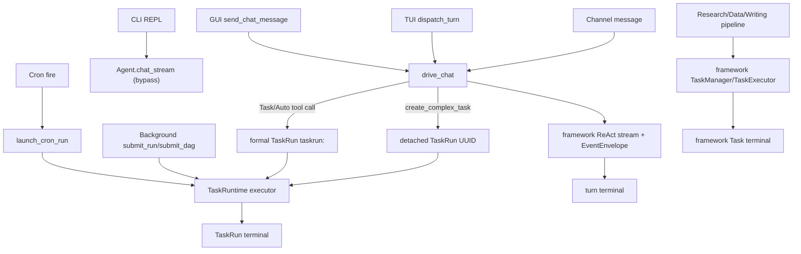

# EKO Agent 生命周期审计

> 日期：2026-07-16
> 阶段：M1 审计基线 + M2 完成归档
> 范围：GUI、TUI、CLI REPL、channel、cron、background、TaskRuntime、Subagent 和前端投影
> 状态：M2 已于 2026-07-16 落地；第 3-9 节保留为改造前基线与实施计划。

## 1. 结论

EKO 已有正确的基础原语，但产品层还没有形成单一生命周期：

- `TaskRunStatus` 已收敛为 `pending/running/paused/completed/failed/cancelled` 六态，不需要继续扩张状态机。
- GUI、TUI 和 channel 已进入共享 `drive_chat`；CLI REPL 仍直接调用 `chat_stream`，绕过共享资源、TaskRuntime 上下文和一致 identity。
- 普通 GUI 对话会以 `message_key` 伪造 `execution://event kind=run`，随后尝试结束一个并不存在的 TaskRun；真正的 formal run ID 是 `taskrun:<turn_id>`。turn 生命周期与 TaskRun 生命周期被混在一起。
- 产品层同时运行 framework `Task` 和应用层 `TaskRun` 两套后台生命周期，再在列表层合并；cron 已经完成 TaskRuntime 收敛，pipeline 后台任务尚未收敛。
- run 取消令牌至少存在 `TaskRuntimeStore` 和 `AppState.tasks.run_cancel_tokens` 两套 registry；部分取消路径只改持久化状态，不会停止真实执行。
- 进程重启会把所有 `Running` run 改成 `Failed`，但已有 executor 实际具备重读 plan、跳过 completed task 的能力；当前启动恢复策略阻断了准确续跑。
- plan 审批仍借用 `Paused` 并依赖进程内 `Notify`。这让“用户暂停”“执行失败后暂停”“等待 plan 批准”三个概念共享同一状态，恢复入口必须猜原因。
- 前端是投影层，但当前 `chat://event run_status` 会直接覆写 `taskRuntimeStore.activeRun.status`，导致聊天 turn 状态污染 TaskRun 状态。

M2 已按该结论实施：没有扩张六态，也没有修改 `echo-agent` 的通用 Task API；收敛发生在 `echo-agent-cli` 应用层。

## 2. 业界依据与本项目取舍

本审计沿用总纲中的调研结论：

- [OpenAI Codex app-server](https://github.com/openai/codex/blob/main/codex-rs/app-server/README.md) 使用 `Thread -> Turn -> Item`，turn 的 start/interrupt/completed 与 item 的 started/completed 分层，不把普通 turn 伪装成后台 task run。
- [OpenAI Codex exec JSONL](https://github.com/openai/codex/blob/main/codex-rs/exec/src/exec_events.rs) 让非交互端消费稳定事件，而不是由 UI 猜测终态。
- [Claude Code common workflows](https://code.claude.com/docs/en/common-workflows) 将 plan mode 作为行为与权限约束；plan 是可审阅内容，不扩张任务运行状态机。
- [Claude Code checkpointing](https://code.claude.com/docs/en/checkpointing) 将 checkpoint 用于恢复已完成事实；恢复不应无条件把中断工作判为失败。
- [Claude Code subagents](https://code.claude.com/docs/en/sub-agents) 将 Subagent 作为独立执行单元，并把结果汇总给父会话。

EKO 的取舍：普通短对话可以只有 turn；一旦进入 formal task、background 或 cron，必须只有一个 TaskRun。plan approval 是 interaction/artifact 事件，TaskRun 仍保持六态。所有收敛工作先放 `echo-agent-cli`；`echo-agent` 的通用 framework `Task`、EventEnvelope 和 checkpoint 能力不因 EKO 产品层未使用而删除。

## 3. 当前调用图



### 3.1 入口矩阵

| 入口 | 当前驱动 | identity | TaskRuntime | 主要差异 |
|---|---|---|---|---|
| GUI chat | `drive_chat` | conversation + `turn_id=message_key` | 懒创建 formal/complex run | Tauri sink 额外伪造 message-scoped run |
| TUI chat | `drive_chat` | conversation + UUID turn | 懒创建 formal/complex run | 同时消费 framework task/subagent bus |
| channel | `drive_chat` | sender conversation + turn | Auto 模式，懒创建 | 无 GUI 会话投影，终态文本化 |
| CLI REPL | `Agent::chat_stream` | 新 turn，缺少完整 conversation/runtime context | 主聊天路径不接 TaskRuntime | 绕过统一驱动 |
| cron | `launch_cron_run` | cron task + fire + run UUID | 始终 TaskRuntime | 已收敛；旧 task service 参数未使用 |
| background run/DAG | `submit_run/submit_dag` | source + run UUID | TaskRuntime | cancel token 未进入统一 registry |
| background pipeline | `submit` | framework task UUID | framework `Task` | 独立状态、存储、恢复、终态 |

构造与调用依据：

- 共享 chat 入口及 formal ID：`echo-agent-app-core/src/chat_driver.rs:77-109`。
- GUI 调用：`src/tauri/commands/chat.rs:678`；TUI 调用：`src/tui/events.rs:1971`；channel 调用：`src/cli/channels.rs:162`。
- CLI bypass：`src/cli/repl.rs:430-436`。
- cron 已统一：`echo-agent-app-core/src/scheduler/runner.rs:32-119`。
- pipeline/framework Task 与 run 双路径：`echo-agent-app-core/src/tasks/service.rs:383-472`、`641-832`。

## 4. Identity 合同

| identity | 权威含义 | 当前构造 | 审计结论 |
|---|---|---|---|
| `conversation_id` | 可恢复会话 | GUI/TUI conversation；channel sender；后台合成 source conversation | 保留，所有入口都必须提供 |
| `turn_id` | 一次用户输入到 turn terminal | `drive_chat` 使用 `root_message_id` | CLI 必须接入同一构造 |
| `run_id` | 一个正式 TaskRuntime 生命周期 | formal 为 `taskrun:<turn_id>`，detached/cron/background 为 UUID | 普通 chat 不得创建或发射假 run |
| `task_id` | plan DAG 节点 | `PlanTask.id` | 只在 TaskRun 内有意义 |
| `execution_id` | 一次 Subagent/task attempt | executor 当前构造 `{task_id}:{attempt}` | transport 可投影聚合 key，但不能把 attempt identity 丢成权威 identity |
| `call_id` | 一次 tool invocation | framework tool event | resume/重试的副作用去重键 |
| `event_id/sequence` | 稳定事件身份与顺序 | framework `EventEnvelope` | 已满足通用要求，应复用 |

Subagent identity 还存在注释/DTO 漂移：后端 persisted `SubagentRun` 声明 `{task_id}:{attempt}`，Tauri/frontend 聚合明确使用 bare `task_id`。M2 不必改变 persisted identity，但要把 `execution_id` 与 `aggregation_id` 分开命名，避免重试 attempt 在展示层折叠后反向污染运行时事实。

## 5. 状态、终态与持久化

### 5.1 TaskRun 六态正确

`echo-agent-app-core/src/tasks/task_runtime/types.rs:429-497` 已定义最小六态及合法转换：

```text
Pending -> Running | Cancelled
Running -> Paused | Failed | Completed | Cancelled
Paused  -> Running | Cancelled
Failed  -> Running | Cancelled
Completed/Cancelled -> terminal
```

无需新增 `Planning/AwaitingApproval/Ready/WaitingInput`。这些应由 plan artifact、approval/input event 和 UI interaction projection 表达。

### 5.2 当前终态 owner

| 生命周期 | 应有 owner | 当前 owner | 问题 |
|---|---|---|---|
| chat turn | `drive_chat` + enveloped Agent terminal | shared driver；GUI `ChatSink` | GUI sink 将 turn status 同时发成 TaskRun event |
| formal/detached TaskRun | `execute_run`/unattended driver | executor 正常写 terminal | GUI generic chat cleanup、background cancel 也写 terminal |
| framework pipeline Task | framework `TaskExecutor` | `BackgroundTaskService` | 与 TaskRun 平行存在 |
| Subagent attempt | framework/TaskRuntime dispatch result | execution bridge + SubagentRun projection | attempt ID 与 UI aggregation ID混名 |
| tool call | framework ToolManager/EventEnvelope | call_id + tool terminal | 基础合同已具备 |

`execute_run` 在 `echo-agent-app-core/src/tasks/task_runtime/executor.rs:310-410` 已集中处理 completed/failed/cancelled/paused；M2 应删除外围重复 terminal，而不是再包一层状态机。

### 5.3 持久化权威

| 数据 | 权威位置 | 说明 |
|---|---|---|
| conversation | `~/.echo-agent/conversations` 文件 | 对话历史 |
| framework checkpoint/nodes | `~/.echo-agent/runtime_state/<conversation>/checkpoint.json,nodes.json` | `FileRuntimeStateStore`，tmp + rename |
| TaskRuntime | `~/.echo-agent/tasks/<run>/events.jsonl,plan.json` | event append + snapshot rebuild |
| legacy background pipeline Task | FileStore namespace `tasks` | 类型历史名为 `SqliteTaskStore`，实际不绑定 SQLite |
| GUI task state | Zustand store | 只应为可丢弃投影，不是权威 |

代码和旧文档中仍有 `task_runtime.db`、`canonical SQLite` 等过时注释，但 EKO 当前权威是文件；这些属于 P2 文档清理，不是引入 SQLite 的理由。

## 6. 问题清单

### P0-1 普通 GUI 对话伪造 TaskRun

- `TauriChatSink` 使用 `message_key` 作为 `run_id`，在普通对话开始时发 `execution://event kind=run/run_started`：`src/tauri/commands/chat.rs:611-627`、`969-1027`。
- `drive_chat` 明确规定普通聊天不写 TaskRuntime，formal ID 是 `taskrun:<turn_id>`：`echo-agent-app-core/src/chat_driver.rs:75-107`。
- generic chat cleanup 随后尝试以 `message_key` 转换 TaskRun terminal：`src/tauri/commands/chat.rs:668-722`。
- 前端收到任何 `run_started` 都加载右侧 TaskRuntime；chat `run_status` 还会直接覆写 active run：`web-frontend/src/hooks/useTauriChat.ts:100-134`、`web-frontend/src/hooks/chatEventHandler.ts:185-216`。

影响：普通 chat 产生虚假 run、错误加载、错误 terminal 和跨 run 状态污染。

### P0-2 CLI REPL 绕过共享驱动

CLI REPL 直接调用 `agent_guard.chat_stream(message)`，未构造 `ChatResources`，未进入 `with_run_context`，也未获得与 GUI/TUI/channel 相同的 mode、TaskRuntime、attachment 和 trace 合同。

影响：CLI 不是同一 Agent 完全体；同一输入在 CLI 与其它端的工具面、identity、TaskRun 和恢复行为不同。

### P0-3 run 取消存在多套 registry

- `TaskRuntimeStore` 自带 run token map 和 `cancel_run`：`task_runtime/store.rs:337-374`。
- `AppState.tasks.run_cancel_tokens` 另有 DashMap：`state.rs:389-395`。
- GUI execute/resume 只注册 AppState map，`cancel_task_run` 也只查该 map：`src/tauri/commands/task_runtime.rs:282-323`、`453-530`。
- `BackgroundTaskService::submit_run/submit_dag` 使用 service child token，但没有注册到上述 per-run map；`cancel()` 可能只把 store 状态改成 Cancelled：`tasks/service.rs:444-472`、`641-739`。

影响：UI 显示 cancelled 时真实模型、工具或 Subagent 仍可能继续；不同触发器取消语义不一致。

### P0-4 crash recovery 阻断续跑

`recover_incomplete()` 在启动时把所有 `Running` 改为 `Failed`：`task_runtime/store.rs:899-960`。但 `execute_run` 对 `Running` 本来可以重读 plan 并跳过 completed task：`task_runtime/executor.rs:188-225`。GUI execute 又只接受 Pending/Running，标准入口不能从 Failed 重试：`src/tauri/commands/task_runtime.rs:420-430`。

影响：完成事实仍在文件中，但用户无法通过正常恢复链路继续；“中断后准确续跑”未成立。

### P0-5 后台任务有两套产品生命周期

Research/Data/Writing pipeline 使用 framework `TaskManager/TaskExecutor`；AgentChat/Composite/cron 使用 TaskRuntime。`list_unified` 只是在 UI 查询时合并两套数据，并保留 `source=framework|run` 分支。

影响：创建、状态、取消、恢复、持久化、事件和三端展示都必须维护双实现；后台任务无法天然复用 TaskRuntime 的 plan、artifact、Subagent 与恢复合同。

### P1-1 plan approval 借用 Paused

`execute_plan_tool` 对 `ComplexRuntime` 执行 `Running -> Paused`，注册进程内 `Notify` 并等待最多 300 秒：`execute_plan_tool.rs:466-521`。`resume_task_run` 先尝试把“resume”解释为“approve”，找不到 signal 才执行真正 resume：`src/tauri/commands/task_runtime.rs:242-268`。

影响：暂停原因不可从六态判断；进程重启后 approval signal 丢失；用户 resume 与批准 plan 的命令语义混合。

### P1-2 Chat/Task/Auto 描述与真实路由漂移

`InteractionMode` 和 `ExecutionPolicy` 文案仍声称 Auto 由 classifier/语义路由决定、Task 强制进入 TaskRuntime；但旧 route pipeline 已删除，当前实际由 mode prompt + 模型是否调用 task tools 决定。`should_route_runtime` 和 `runtime_launch_policy` 没有生产调用者。

影响：UI 解释不是事实，Task 模式也没有 runtime 层的最终保证；排障无法回答“本 turn 实际走了哪条路径”。

### P1-3 前端 reducer 跨生命周期写状态

`chatEventHandler` 收到 chat `run_status` 后同时修改 chat store 和当前 TaskRuntime active run。两个 lifecycle 即使属于同一 conversation，也不保证是同一个执行单元。

影响：聊天完成/失败可以提前停止 TaskRuntime polling，或把后台 run 显示成聊天 turn 的状态。

### P1-4 terminal/trace 并非所有路径一致

`execute_run` 是 TaskRun terminal owner，但不同 wrapper 传入的 `RunStore`、`ExecSink`、memory policy 不一致；部分 DAG/background 路径无持久 trace，外围还会重复转状态。

影响：store 终态、execution event、trace run 和 memory sink 可能不一致。

### P2 清理项

- 修正 `canonical SQLite`、`task_runtime.db`、`resume from SQLite` 等过时注释和旧审计文档。
- 删除 scheduler 已不使用的 `_task_service` 参数和确认无调用的 legacy persistence 投影。
- 将 persisted `execution_id` 与 frontend `aggregation_id` 命名分离。
- 审核 `ApprovalRequested/Resolved/Rejected` 事件变体的真实生产点；接通后删掉未使用旧桥。

## 7. M2 精确实施计划

M2 只改 `echo-agent-cli` 应用层。`echo-agent` 的 EventEnvelope、checkpoint、framework Task API 和公开 Store 实现不删除。

### M2.1 分离 Turn 与 TaskRun terminal

1. 将 `ChatSink::on_run_status` 重命名为 turn 语义，例如 `on_turn_status`，仅服务 chat/TUI/channel 渲染。
2. 删除 `TauriChatSink::on_run_status` 中的 `execution://event kind=run` 发射。
3. 删除 `send_chat_message` generic cleanup 对 `TaskRuntimeStore::transition_run(message_key, ...)` 的调用。
4. TaskRun 的 `execution://event kind=run` 只允许从真实 `ExecSink`/TaskRuntime 构造点发出。
5. 前端 `chatEventHandler` 不再用 chat status 修改 `taskRuntimeStore`；任务面板只从 TaskRuntime snapshot/event 更新。

删除项：普通 chat synthetic run、generic chat terminal writer、frontend cross-store status write。

### M2.2 CLI 接入共享 chat driver

1. 为 CLI REPL 构造与 TUI/channel 同结构的 `ChatResources`。
2. 复用当前 conversation ID、turn ID、cancel、mode、attachments、TaskRuntime store 和 CLI sink。
3. 用 `drive_chat` 替换 REPL 的直接 `chat_stream`；保留 CLI 纯文本/ANSI renderer，不复制业务逻辑。
4. 确认 CLI primary agent 注册与 GUI/TUI 同一组 task tools。

删除项：CLI REPL 自有 envelope/terminal 驱动分支中与 `drive_chat` 重复的部分。

### M2.3 单一 run driver/cancel registry

1. 复用 `TaskRuntimeStore` 已有 run token registry，作为 EKO TaskRun 的唯一 per-run registry。
2. 所有启动路径在 spawn 前注册 token，结束后 RAII 注销：formal plan、complex task、GUI execute/resume、background run/DAG、cron。
3. 删除 `AppState.tasks.run_cancel_tokens`。
4. 提供一个应用层 `request_cancel(run_id)` 入口：Running 先触发 token，由 executor 写唯一 Cancelled terminal；Pending/Paused 无活跃 driver 时允许直接转 Cancelled。
5. `BackgroundTaskService::cancel` 不再直接把活跃 run 改为 Cancelled。

删除项：AppState DashMap、`__run__:` 双 key 规则、service 的 best-effort run terminal writer。

### M2.4 恢复与 approval 语义解耦

1. 启动恢复将 interrupted `Running` 记录 interruption note 后转为 `Paused`，保留 completed task/tool/artifact 事实。
2. `resume_task_run` 只表达 `Paused -> Running + relaunch executor`，不得再兼任 plan approval。
3. plan approval 使用既有 approval event/HITL 响应链；等待期间 TaskRun 保持 Running，UI 使用 interaction 状态显示 waiting approval。
4. approval request 至少持久化 request identity、plan revision 和 resolved/rejected event；重启后可重新投影或明确失效，不依赖全局 `Notify` 作为唯一事实。
5. resume 后 executor 重读 plan，按 task status、call_id 和 artifact 事实跳过已完成副作用。

删除项：`APPROVAL_NOTIFIES` 全局表、`notify_approval_signal` 优先分支、approval 导致的 Paused 转换。

### M2.5 后台 trigger 收敛到 TaskRuntime

1. 将 `BackgroundTaskKind` pipeline 转为 `PlanTask` DAG 或 unattended prompt，统一调用 TaskRuntime launch adapter。
2. `submit/submit_with_options/submit_run/submit_dag/cron` 共享 `RunRequest + TriggerContext + ExecutionPolicy` 应用层入口；trigger 只提供 source、attended mode、write mode、conversation 和 scheduling metadata。
3. list/get/cancel/resume 只查询 TaskRun；移除 `source=framework|run` 合并分支。
4. 删除 EKO 产品层 `TaskManager/TaskExecutor/SqliteTaskStore` 装配和 pipeline resume loop；不删除 `echo-agent` 框架的这些公开能力。

删除项：产品层双 task store、`list_unified` 双源分支、framework pipeline recovery。

### M2.6 路由合同与 observed path

1. 固化真实语义：Chat 隐藏 task tools；Auto 允许模型选择 direct/subagent/formal plan；Task 必须建立 formal TaskRun 并执行 reviewable plan。
2. 删除 classifier/历史反馈等不再成立的 UI 文案和死 policy helper。
3. trace 记录 `requested_mode` 与 `observed_path`，例如 `direct`、`inline_subagent`、`formal_plan`、`detached_background`；它们是诊断字段，不是新状态。
4. Task mode 在 turn 入口创建唯一 formal run；若模型未形成 plan，必须返回明确失败/纠错结果，不能静默退化成普通 chat。

删除项：无生产调用的 `should_route_runtime/runtime_launch_policy`，或将其改为真实入口唯一使用者，二选一，不保留展示专用伪策略。

## 8. M2 测试矩阵

| 场景 | 预期事实 |
|---|---|
| GUI/TUI/CLI/channel Chat 简单问答 | 有一个 turn terminal；无 TaskRun、无 `kind=run` |
| Auto 简单问答 | 无 TaskRun；observed path=`direct` |
| Auto formal plan | 恰好一个 `taskrun:<turn_id>`；executor 写唯一 terminal |
| Task 模式 | 入口建立 formal run；必须形成 plan；三端事件规范化一致 |
| background pipeline | 只创建 TaskRun，不创建 framework product Task |
| cron | 每次 fire 一个 run；source/fire identity 可追踪 |
| cancel during LLM/tool/subagent/HITL | 同一 registry 命中；实际执行停止；一个 cancelled terminal |
| cancel Pending/Paused | 无 driver 时直接 terminal；不残留 token |
| crash after task 1 completed | boot 后 Paused；resume 跳过 task 1 和已完成 call_id |
| plan approval timeout/restart | run 不伪装为用户 Paused；interaction 有明确可恢复/失效状态 |
| duplicate terminal/event | TaskRuntime snapshot、execution event、trace 只保留一个终态 |
| GUI projection | chat status 不修改 active TaskRun；run event 不创建假 run |

测试分层：

- `echo-agent-app-core`：入口适配、cancel registry、恢复、Task/background/cron contract tests。
- Tauri：真实 run event 与普通 chat event 分离测试。
- TUI/CLI：共享 fixture 的规范化 event snapshot。
- frontend：Zustand reducer 测试，证明 chat terminal 不修改 TaskRuntime。
- 回归：现有 TaskRuntime DAG、checkpoint、Subagent 和 cron 测试必须继续通过。

## 9. 提交拆分与回滚点

1. `refactor(chat): separate turn and task-run lifecycle`
   回滚只影响 transport/reducer，不改持久化格式。
2. `refactor(cli): route repl through shared chat driver`
   回滚只恢复 CLI 入口。
3. `fix(runtime): unify cancellation and resumable recovery`
   不新增状态/字段；回滚点在 driver registry 与 boot recovery。
4. `refactor(tasks): migrate background pipelines to task runtime`
   新路径覆盖后删除应用层 framework Task 双系统。
5. `fix(routing): align mode contract with observed execution path`
   只增加诊断事件字段和真实 contract test，不建立 classifier 状态机。

每个提交都必须同时覆盖 GUI/TUI/CLI 对应消费者；新路径和测试通过后立即删除被替代路径，不保留长期 feature flag 双系统。

## 10. M1 完成判定

- 已覆盖所有要求入口、驱动、identity、状态、持久化和投影。
- 每个 P0/P1 结论均给出实际构造点、调用点或持久化依据。
- 已确认 M2 主要属于 `echo-agent-cli`，不污染或误删 `echo-agent` 通用能力。
- 未新增运行时字段、状态或核心实现。
- M1 结论已由 M2 实现验证。

## 11. M2 完成归档

M2 在 `echo-agent-cli` 应用层完成，不新增 TaskRun 状态，不给 CLI 引入 SQLite，也不删除 `echo-agent` 框架的通用 Task/Store 能力。

### 11.1 已收敛的主路径

- GUI/TUI/CLI/channel 统一经 `drive_chat`；CLI REPL 不再直接调用 `chat_stream`。
- chat turn 只发 turn status；普通聊天不创建或伪造 TaskRun，前端 chat reducer 不再写 TaskRuntime 状态。
- Task mode 在入口创建 `taskrun:<turn_id>`；未形成 plan/terminal 时明确失败。Auto 记录 `requested_mode + observed_path`。
- formal plan、complex run、GUI/TUI resume、background、cron 共用 `TaskRuntimeStore` 的 run cancellation registry。
- interrupted Running run 启动后转 Paused；completed todo 保留，孤儿 Running todo 回到 Pending 后再续跑。
- plan review/工具批准不再借用 TaskRun Paused；删除进程内 plan approval Notify 和无后续的高风险字符串预扫描。
- research/data/writing pipeline、background AgentChat 和 DAG 全部创建 TaskRun；产品层 framework Task 双数据源、旧 pipeline graph 和旧 TaskStore 装配已删除。
- 后台服务保留 run 并发上限、依赖等待和 trigger metadata；只自动恢复进程中断产生的 Paused run，不覆盖用户主动暂停。

### 11.2 已删除的平行路径

- GUI ordinary-chat synthetic run 与 generic chat terminal writer。
- `AppState` 第二套 run cancel token map。
- EKO 产品层 framework `TaskManager/TaskExecutor` lifecycle、旧 pipeline graph、无消费者 background HITL bus。
- 展示专用 `ExecutionPolicy`、旧 `TaskRouteKind`/classifier DTO、死的 create/execute TaskRun IPC。
- plan approval runtime state/event 残留和应用层 hitrisk 预扫描。

### 11.3 合同测试

- Task mode direct fallback 会留下真实 Failed formal run，并记录 observed path。
- ordinary chat 不创建 TaskRun；chat terminal 不改变前端 active TaskRun。
- pipeline submission 只创建 TaskRun；依赖等待可通过统一 registry 取消。
- boot recovery 保留 completed todo，并把 orphaned Running todo 重置为 Pending。
- pause 通过真实 driver token 停止执行，resume 重读持久 plan；用户暂停不会在重启时自动续跑。

下一阶段是 M3：扩展 crash/pause/cancel conformance 到模型流、工具副作用、Subagent、HITL 和 call_id exactly-once 场景。
