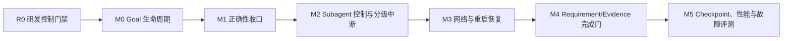

# EKO 长程任务运行时 M0-M5 实施计划

> 日期：2026-08-16  
> 状态：R0 Complete；Codex Runtime Goal 已于 2026-08-16 显式创建并处于 active  
> 设计基线：[`2026-08-14-eko-long-horizon-task-runtime-design.md`](./2026-08-14-eko-long-horizon-task-runtime-design.md)  
> 跨会话状态：[`MASTER-PLAN.md`](./MASTER-PLAN.md)

## 1. 目标与非目标

本计划把原长程运行时 M1-M5 前移入一个新的 M0：持久 Goal 生命周期。原因是
RunTurn、Subagent、恢复和证据门即使全部正确，如果研发目标或产品 Goal 仍只依赖
当前上下文，压缩或重启后仍可能发生语义漂移。

最终链路为：



本计划不引入：

- 第二个 Goal store、Goal 模型工具或平行 Plan CRUD。
- SQLite。`events.jsonl` 继续是 EKO TaskRuntime 的唯一事实权威。
- 新 TaskRun 状态。可恢复细节继续用 pause reason、blocker 和事件表达。
- 第二套 DAG validator、ready frontier、Subagent mailbox 或 executor。
- surface-local 生命周期。GUI、TUI、CLI、channel 必须调用同一 app-core service。

## 2. R0：研发任务自身先防失忆

### 2.1 Runtime Goal

正式写产品代码前，由用户显式创建 Codex Runtime Goal，objective 必须逐字使用：

```text
完整实现 EKO 长程任务运行时 M0-M5，包括 Goal 生命周期、正确性、
Subagent 控制、恢复、完成证据和性能评测。
```

2026-08-16 的规划回合按用户要求没有创建 Goal；用户随后显式要求立即实施，Runtime
Goal 已使用上述原文创建。后续恢复必须先核对其仍为当前 active Goal。

### 2.2 每次启动或上下文恢复的固定读取顺序

1. 读取本文件。
2. 读取 `docs/MASTER-PLAN.md`。
3. 分别执行 `git -C ../echo-agent status --short` 和当前仓库的
   `git status --short`。
4. 分别读取两个仓库最近提交；跨仓库依赖先核对框架 commit 是否已在目标分支。
5. 读取下文阶段账本，只从第一个未完成 gate 继续。
6. 在开始编辑前重新执行该切片的“已有能力/调用路径”搜索，防止基线已变化。

### 2.3 阶段账本规则

每个阶段必须记录：

| 字段 | 记录要求 |
|---|---|
| 状态 | `Pending`、`In progress`、`Blocked`、`Complete` |
| 权威路径 | 本阶段切换的真实主路径 |
| 提交 | 两个仓库分别记录 commit；没有改动写 `N/A` |
| 测试命令 | 逐条记录实际执行的命令和结果 |
| 失败原因 | 记录根因和修复，不使用“预先存在”跳过 |
| 剩余事项 | 明确下一阶段删除或切换目标 |

状态只能在对应验收项和所有适用提交门禁全绿后改为 `Complete`。

## 3. 动手前核对结果

2026-08-16 已完成框架和应用全仓库搜索。以下结论是实施基线，不得把已有能力
再次实现一遍：

| 领域 | 已存在且真实可达 | 确认缺口 |
|---|---|---|
| Goal | `TaskRun.goal`、Goal Contract/Recovery Capsule、有限 RunTurn、continuation deferred | 没有 `goal_revision`、`goal_sha256`、`RunGoalUpdated`、`update_run_goal`；`TaskPlan.goal` 仍是重复副本 |
| Plan | 唯一 `task_create/task_update/task_list`、框架 revision/DAG/CAS、EKO file adapter | Plan revision 没有绑定 Goal revision/hash |
| Command cell | 一个框架 `CommandCellRegistry`、字节 cursor、进程内多 waiter、artifact writer、EKO cell 事件 | timeout 不含 semaphore 排队；terminal cause/artifact 状态不完整；terminal prune/waiter drain 竞态；settlement 后 retention 不严格 |
| UTF-8 流 | raw byte output 已是 cursor 权威；`echo-execution` 与 `echo-tools` 各有一个增量 decoder | artifact path 仍对单个 pipe chunk 调 `from_utf8_lossy`；不得新增第三套 decoder |
| 主 Turn 控制 | `TurnSteerMailbox`、exact `RunTurnBinding`、`TaskContinuationRuntime` | TUI Resume 未统一携带精确 binding；cell terminal/deferred 有丢唤醒窗口 |
| Subagent | attempt-scoped `SubagentRun`、cancel/status/join handle、usage 事件 | 没有实时 message、next-attempt guidance、exact-attempt interrupt；usage 未完整纳入 TaskRun 总预算 |
| 恢复 | `BootRecovery`、recovery blocker、orphan cell interrupted、completed Subagent reuse | provider 重试没有持久退避；`auto_resume_after_restart` 尚未安全启用 |
| 完成门 | 现有 `run_completion_blockers` 已检查任务、artifact/check、active cell 和 recovery blocker | 没有稳定 Requirement 到 Evidence 关系与 Goal revision 失效规则 |
| 文件投影 | `RuntimeTaskEvent.seq` 和 seq cache 已存在；`events.jsonl` 可全量 rebuild | `rewrite_plan` 仍反复全量 fold，长程路径可能 O(n²)；没有带 hash/schema 的 checkpoint |

特别纠正三点：

1. M5 不是“新增 seq”；已有 `RuntimeTaskEvent.seq` 应直接作为 checkpoint cursor。
2. M1 不是“新增 UTF-8 decoder”；应抽取并复用已有实现，删除重复实现。
3. M0 不是新建 Goal 领域对象；`TaskRun.goal` 从现在起成为唯一目标权威。

## 4. 业界参考与取舍

本方案在架构决策前核对了以下成熟实现：

- [Codex Goal runtime](https://github.com/openai/codex/blob/53eaa297e595fc98df0f33d4c63686a7014d7c9a/codex-rs/ext/goal/src/runtime.rs)
  把持久 Goal、有限 Turn、continuation deferral 和累计预算分开；EKO 采用同样的
  生命周期分层，但继续使用 TaskRun/file store，不复制 Codex 的存储形态。
- Codex 当前 multi-agent 控制把
  [send_message](https://github.com/openai/codex/blob/9ded177ce7c1c0bd2047f902936c177612ab3434/codex-rs/core/src/tools/handlers/multi_agents_v2/send_message.rs)、
  [followup_task](https://github.com/openai/codex/blob/9ded177ce7c1c0bd2047f902936c177612ab3434/codex-rs/core/src/tools/handlers/multi_agents_v2/followup_task.rs) 和
  [interrupt_agent](https://github.com/openai/codex/blob/9ded177ce7c1c0bd2047f902936c177612ab3434/codex-rs/core/src/tools/handlers/multi_agents_v2/interrupt_agent.rs)
  分成即时投递、排队并唤醒、精确中断三条语义。EKO 保留这种分离，但目标是
  attempt-scoped `SubagentRun`，不是持久子会话。
- [Claude Code changelog](https://github.com/anthropics/claude-code/blob/be90077c6a353f292fa612d97173865a9ab21b83/CHANGELOG.md)
  显示 steering、消息排队、session resume、自动 compaction 与 Subagent 恢复是相互
  独立的控制面。EKO 因此不把这些语义压成一个 cancel flag。
- [Cursor long-running agents](https://cursor.com/blog/long-running-agents) 与
  [cloud agent lessons](https://cursor.com/blog/cloud-agent-lessons) 强调 durable execution、
  环境一致性和 harness 边界。EKO 将 workspace generation、launcher/HITL 重建和
  不可重放副作用作为 auto-resume 前置条件。
- [LangGraph persistence](https://github.com/langchain-ai/docs/blob/c26a7ab8aea6c871b0c9c9f79e0a2544d57c7d1d/src/oss/langgraph/persistence.mdx)
  将 checkpoint 视为可恢复投影。EKO 同样把 checkpoint 定义为可丢弃缓存，事件流
  仍是唯一权威。

跨系统共性是：Goal/plan 是持久 artifact，执行尝试有独立 identity；消息、排队、
中断和暂停不是同一个动作；恢复先证明边界可重放；完成依赖外部证据而不是最后一段
模型话术。本计划不新增审批状态机，也不使用线上多租户权限模型。

## 5. 分层门禁

### 5.1 通用机制：`echo-agent`

- Command cell 的全生命周期 timeout、typed terminal cause、artifact write status、
  raw bytes/incremental decoding、waiter lease/ack、严格 retention。
- attempt-scoped Subagent execution control registry，以及基于现有
  `TurnSteerMailbox` 的 safe-point message delivery。
- `send_message`、`queue_guidance`、`interrupt_subagent` 的通用身份校验与 typed
  outcome。

这些能力不依赖 EKO UI、TaskRun pause reason、文件布局或产品预算策略，属于可复用
框架原语。

### 5.2 EKO 产品策略：`echo-agent-cli`

- Goal revision/update policy、Plan 绑定、用户身份来源、完成证据失效。
- continuation wake、exact Resume、TaskRun 总预算、持久 pause。
- Subagent 控制事件、surface parity、provider backoff、boot policy、HITL owner。
- Requirement/Evidence、checkpoint 文件布局、性能门槛、故障与 soak 评测。

这些能力依赖本地个人助理、TaskRuntime 文件权威和 UI 投影，必须留在应用层。

### 5.3 薄适配边界

`echo-agent-app-core` adapter 只允许：

- 在 `TaskRun/PlanTask/SubagentRun` 与框架 identity 间无损转换。
- 注入 `run_id/task_id/plan_revision/attempt/command_id` metadata。
- 持久 EKO 事件并把框架 typed outcome 投影给 surfaces。
- 调用框架服务和 EKO policy/hook。

adapter 不得重新拥有 ready frontier、DAG loop、重试/取消算法、第二个 mailbox、
Plan validator 或 task CRUD。M5 checkpoint 先留应用层，因为它依赖 EKO 的 JSONL
布局；确认多个框架消费者需要后才考虑下沉通用原语。

## 6. 里程碑与交付顺序

逻辑验收顺序始终是 `R0 -> M0 -> M1 -> M2 -> M3 -> M4 -> M5`。代码提交顺序
按跨仓库依赖执行：

1. `echo-agent`：先交付 M1 CommandCell 原语，再交付 M2 Subagent 控制原语。
2. `echo-agent-cli`：交付 M0，再依次接入 M1、M2、M3、M4 应用策略。
3. 两仓库功能门关闭后执行 M5 checkpoint、性能、故障和 soak。

因此框架 M1/M2 commit 可以在产品 M0 gate 尚未关闭时先合并，但产品里程碑 M1
不能在应用 M0 完成前标记完成，M2 也不能在 M1 完成前标记完成。M1 未完成前禁止
启用冷启动自动续跑。

## 7. M0：Goal 生命周期与修改协议

### 7.1 权威数据模型

在 `TaskRun` 增加：

```text
goal: String              # 唯一 Goal 正文权威
goal_revision: u64        # 初始为 1，严格单调 +1
goal_sha256: String       # 对 goal 原始 UTF-8 bytes 计算 lowercase SHA-256
```

删除 `TaskPlan.goal` 和 `PlanRevision.goal` 的持久副本，改为：

```text
goal_revision: u64
goal_sha256: String
```

框架 `TaskGraphContext.goal` 是一次调用所需的通用上下文，不是第二权威。EKO adapter
加载 graph 时必须从当前 `TaskRun.goal` 派生该字段；持久 Plan 只保存绑定 revision/hash。
`EkoPlanMetadata` 同步携带 binding，round-trip 测试逐字段证明无损。

### 7.2 事件与命令

在现有 `RuntimeEventKind` 增加 `RunGoalUpdated`。事件 payload 至少包含：

```text
old_goal_revision
new_goal_revision
old_goal_sha256
new_goal_sha256
new_goal                  # 事件流必须能独立 rebuild 当前 Goal
reason
actor_source              # GUI/TUI/CLI/channel + stable local user identity
updated_at
```

唯一应用 service：

```text
update_run_goal(run_id, expected_goal_revision, new_goal, reason, actor_source)
```

没有模型工具。模型只能生成建议，只有 surfaces 上的显式用户动作能调用该 service。
`actor_source` 只用于本地审计来源，不是多用户鉴权或 permission gate。

### 7.3 原子修改协议

在同一个 per-run lock 内依次验证并 append 一次可独立 fold 的事件：

1. run 存在且 `expected_goal_revision` 命中，否则返回 typed conflict。
2. `new_goal` 非空，hash 与当前值不同；相同内容返回 typed no-change，不增 revision。
3. run 必须为 `Paused`。
4. 没有 active RunTurn、SubagentRun、command cell，也没有尚未 settle 的 claim。
5. checked increment revision；计算新 hash；append `RunGoalUpdated`。
6. 该事件的 fold 同时把 continuation 置为 deferred，reason 为
   `goal_revision_unbound`，避免“Goal 已改但 Plan 尚未对齐”的 crash 窗口。
7. 重写 projection；成功返回新 revision/hash。持久化成功后才发布 UI 事件。

第一版不支持 running hot-edit。完全无关的新目标创建新的 TaskRun，不能覆盖旧 run。

### 7.4 Plan 对齐协议

已有 Plan 时，Goal 修改后必须使用现有 `task_update(base_revision)` 提交一个新的
Plan revision：

- `base_revision` 必须是当前 Plan revision。
- task operations 必须实际审阅新 Goal 对任务、checks、artifacts 和 acceptance 的
  影响；不增加 `plan_patch`、`goal_plan_update` 或空 no-op API。
- EKO commit adapter 在 per-run lock 内再次读取 TaskRun，并把新 revision 绑定到当前
  `goal_revision/goal_sha256`；旧 Goal 的并发提交返回 conflict。
- 只有 Plan binding 与 TaskRun 完全一致、DAG 仍通过唯一框架 validator、没有 blocker
  时，现有 continuation resume 路径才可清除 deferred。

无 Plan 的 run 在首次 `task_create` 时直接绑定当前 Goal revision/hash。

### 7.5 已完成事实与证据

M0 先采用保守规则：Goal revision 改变后，旧 completed task 的执行事实可以保留，
但不能单独证明新 Goal 完成。`run_completion_blockers` 必须把旧 revision evidence
视为 stale。`task_update` 改变任务 spec 时继续复用框架已有 reset semantics。

M4 落地后，只有 artifact hash、test result、review evidence 经过明确重验且仍覆盖新
Requirement，才能把旧事实重新绑定到新 Goal revision。不能仅因 task title/id 未变
自动复用。用户确认 Skip 也必须重新确认或证明仍适用。

### 7.6 M0 测试与验收

- 初始 Goal revision/hash 可由 `events.jsonl` 全量 rebuild。
- CAS 冲突、空 Goal、same-hash、Running、active Turn/Subagent/cell 全部拒绝且零事件。
- update 事件原子产生 deferred；重启在 Plan 对齐前不会 continuation。
- Plan projection 不再持久第二份 Goal，adapter round-trip 不丢 binding。
- stale Plan revision 和 stale Goal binding 都不能清除 deferred。
- Goal 修改后旧 evidence 阻止完成；新 TaskRun 路径不覆盖旧 run。
- GUI/TUI/CLI/channel 调同一 service，并展示相同 typed result。
- 100 次 context compaction 后从 TaskRun 投影的 Goal hash 不漂移。

## 8. M1：关闭现有正确性缺口

### 8.1 框架 CommandCell 原语

1. 在接收 launch 时计算绝对 deadline；semaphore 排队、spawn、process wait 和 output
   drain 全部共享剩余时间。排队超时不得启动子进程。
2. 配置入口拒绝 `max_concurrent == 0`；不允许通过永不释放的 semaphore 把错误配置
   伪装成排队。
3. 在 `echo-core` cell contract 增加 typed terminal cause，例如 `Exit`、`Timeout`、
   `Cancelled`、`LaunchFailed`、`WaitFailed`、`OutputDrainFailed`，并保留 coarse phase。
4. 增加 artifact status，例如 `NotRequested`、`Writing`、`Complete`、`Failed`；写失败
   必须出现在 snapshot/delta，不能只写 warning。
5. raw bytes 继续是 cursor 权威。抽取现有两个 `IncrementalUtf8Decoder` 为一个共享
   框架实现，再删除重复；artifact/event text 按 stream 增量 decode，并在 EOF flush。
6. waiter 注册时取得 lease；terminal drain 被 waiter ack 或 lease drop 前不可 prune。
   prune 只选择 terminal 且无 active/unacked waiter 的 cell。
7. terminal history 始终不超过配置上限。尚未 ack 的 terminal 留在 active-drain
   集合而不是 history；registry admission slot 把 active + drain + history 记录总数限制为
   `max_concurrent + max_terminal_history`，满额 launch 在同一 deadline 内 backpressure。
   最后一个 lease ack/drop 后，先按策略腾出 history 容量再迁入，或在上限为零时直接
   移除。每次 settlement 和 lease 释放都执行收敛，不等下一次 launch。
8. 文档明确 cell 是进程内可等待对象。重启只能从 EKO 事件恢复为 interrupted，不能
   宣称重新附着原进程。

### 8.2 EKO 应用正确性

1. 把 `cell terminal -> continuation deferred -> dispatch exit` 统一为 generation/CAS
   协议；terminal 信号早到时进入 pending wake，deferred 写入后必须重检并消费一次。
2. TUI Resume 和其它 surfaces 一样由 app-core 构造精确 `RunTurnBinding`；禁止由 UI
   猜 run/turn/root message identity。
3. `SubagentRunUsage` 用稳定 source event id 幂等 fold 到 SubagentRun 和 TaskRun 的
   token/time budget。主 Turn 已包含的 child usage 必须按 source scope 去重。
4. 动态降低 token/time budget 时，在 per-run lock 中 append 一个可独立 fold 的预算更新
   事件；其 fold 同时更新配置并在已超限时生成 Paused projection。持久化成功后才取消
   active driver。任何观察者都不能看到“预算已超但仍 Running”的持久状态。
5. 所有 race test 使用 `Barrier`、`Notify` 或 test hook 精确卡住边界；删除依赖随机
   sleep 的竞态断言。真实 backoff timer 不属于测试同步手段。

### 8.3 M1 验收

- semaphore 排队时间计入同一 timeout，零并发配置被同步拒绝。
- 每个 terminal snapshot 都有 cause；artifact 失败可观测且不会伪装成功。
- 中文/emoji 跨任意 pipe chunk 边界不乱码、不 panic、cursor 不重复。
- 多 waiter drain 与 terminal prune 的确定性测试覆盖全部交错。
- retention 在无后续 launch 时也收敛到上限。
- cell/deferred 无丢唤醒；Resume identity 精确；usage 重放不重复记账。
- lowering budget 立即得到 durable pause，进程中和重启后均无 Running zombie。

M1 所有验收完成前，`auto_resume_after_restart` 必须保持关闭。

## 9. M2：Subagent 实时控制与分级中断

### 9.1 框架 API

在现有 Subagent executor 上增加 attempt-scoped execution control registry：

```text
send_message(execution_id, expected_attempt, instruction)
queue_guidance(task_id, expected_next_attempt, instruction)
interrupt_subagent(execution_id, expected_attempt)
```

- `send_message` 只向当前 exact attempt 投递，并调用该 Subagent Agent 已有的
  `TurnSteerMailbox` safe point；不得新建 mailbox。
- `queue_guidance` 只登记给明确的 next attempt，由 attempt admission 原子 claim。
- `interrupt_subagent` 只取消 exact attempt，并返回 requested/settled/previous status；
  不改变整个 TaskRun 状态。
- registry 是进程内执行控制面，不是 EKO 持久化权威。restart 后由应用事件重新判断
  guidance 是否仍可投递。

### 9.2 EKO 持久事件与 identity

事件：

```text
SubagentGuidanceQueued
SubagentGuidanceDelivered
SubagentGuidanceRejected
SubagentInterruptRequested
SubagentInterruptSettled
```

每条控制命令绑定：

```text
run_id + task_id + execution_id + plan_revision + attempt + command_id
```

`command_id` 是幂等键。应用必须先持久 queued/requested，再调用框架；typed outcome
随后持久 delivered/rejected/settled。迟到、重放、旧 Plan revision 或旧 attempt 命令
必须拒绝，绝不能转投新 attempt。

### 9.3 控制层级

| 层级 | 权威语义 |
|---|---|
| Steer RunTurn | 修正当前主 Agent Turn，沿用 foreground/continuation steering |
| Message Subagent | 在 exact Subagent attempt 的 safe point 注入 |
| Interrupt Subagent | 只终止当前 attempt |
| Pause TaskRun | 先持久 Paused，保留已完成事实，停止 Turn/Subagent |
| Cancel TaskRun | 终止 run，并停止其 command cells |
| Shutdown | 持久为 `Paused/BootRecovery`，不能伪装成用户 cancel |

app-core 提供一套 control service；GUI/TUI/CLI/channel 只做输入与渲染适配。

### 9.4 M2 验收

- safe-point message exactly once；重复 command id 幂等。
- message 与 terminal、interrupt 与 natural finish 的每种交错都用 barrier 测试。
- stale attempt/plan/run identity 全部 rejected，且新 attempt 收不到旧消息。
- queued next-attempt guidance 只能被目标 attempt claim 一次。
- Pause/Cancel/Shutdown 的 durable state、Subagent、cell 行为与表中语义一致。
- 四个 surfaces 的能力、typed error 和事件顺序对等。

## 10. M3：网络容错与冷启动恢复

### 10.1 持久 provider retry

在 `RunContinuationState` 增加一个 typed retry projection：

```text
attempt_count
next_retry_at
error_fingerprint
first_failure_at
```

retryable provider/network error 先 append 失败与 schedule 事件，再停止当前 Turn。退避使用
有上限的指数增长；jitter 由 `run_id + error_fingerprint + attempt_count` 稳定派生，确保
event replay 不重新随机。达到 retry 次数、累计时间或 token 上限时持久暂停为
`ProviderUnavailable`。

配置错误、认证错误和确定性 invalid request 不进入 transient retry。fingerprint 改变时
按明确 policy 重置或延续计数，并用测试固定行为。

### 10.2 restart admission

`auto_resume_after_restart` 只在以下条件全部成立时 admission：

- M1 已完成，run 无 recovery blocker、Goal/Plan binding 一致、预算有效。
- workspace generation 与持久记录一致。
- surface launcher、HITL dispatcher 和控制 registry 已完成重建。
- 没有不可安全重放的 tool/Subagent 边界。
- attended run 有可用 interactive owner；缺 owner 必须暂停等待，不能自动 reject HITL。

command cell 重启后继续标记 interrupted，不自动重跑。indeterminate tool/Subagent 保持
recovery blocker，由用户显式处理。

### 10.3 M3 验收

- retry schedule、attempt count 和 fingerprint 可由事件重建，重启不丢退避。
- provider 5xx/断网恢复后只启动一个新 Turn；多个 launcher 竞争只有一个 claim 胜者。
- 预算耗尽、workspace mismatch、缺 HITL owner 和 unsafe boundary 均可靠暂停。
- crash 前已完成任务/Subagent 不重复执行；command cell 副作用不盲目重放。
- Shutdown 恢复为 BootRecovery，不产生用户 Cancel 事件。

## 11. M4：Requirement 到 Evidence 的完成门

### 11.1 版本化关系

在 EKO TaskRuntime 投影中增加：

```text
GoalRequirement(goal_revision, requirement_id)
  -> PlanTask(plan_revision, task_id)
  -> SubagentRun / command cell
  -> artifact / test / semantic review evidence
```

Requirement ID 在同一 Goal revision 内稳定。Requirement 提取可以由模型辅助，但关系
落盘、hash 验证和完成判定必须是 deterministic store logic。

Evidence 至少记录 type、producer identity、goal/plan revision、artifact path/hash 或 test
command/result、reviewer、created_at。Skip 必须有用户确认的 reason/source。

### 11.2 唯一完成门

扩展并收归现有 `run_completion_blockers`，不新建第二个 completion evaluator。完成必须
同时满足：

- 每个 Requirement 已覆盖、验收，或有用户确认的 Skip。
- 必需 artifact 存在且内容 hash 与 evidence 相符。
- 必需 execution check 和语义 acceptance/review 通过。
- evidence 的 Goal revision 有效；Goal 更新后受影响 evidence 已重验。
- 没有 active RunTurn、Subagent、command cell 或 recovery blocker。
- 当前 Plan binding 与 TaskRun Goal revision/hash 一致。

完成写入仍由 TaskRuntime store 执行；不新增 `goal_complete` 模型工具，不新增状态。

### 11.3 M4 验收

- 缺 Requirement coverage、hash mismatch、failed test、stale evidence、active execution
  分别产生稳定 blocker。
- Goal 修改只失效受影响 evidence；复用必须有显式重验事件和 hash 证据。
- 用户 Skip 可审计，模型不能自行确认 Skip。
- 全量 event rebuild 与增量 projection 得到完全相同 blocker/completion 结论。
- GUI/TUI/CLI/channel 展示相同 Requirement/Evidence 状态并调用同一完成门。

## 12. M5：Checkpoint、性能与故障矩阵

### 12.1 Checkpoint

复用已有事件 `seq`，增加可丢弃 checkpoint projection：

```text
schema_version
seq
state_hash
state
```

- `events.jsonl` 是唯一权威；checkpoint 不参与事件 CAS，不可单独推进事实。
- `state_hash` 是排除 hash 字段自身后，对 schema-versioned canonical serialization
  计算的 SHA-256；禁止依赖不稳定的 map iteration order。
- 把现有 full rebuild fold 拆成唯一 `initial_state + apply_event`，全量和增量路径复用。
- 在 per-run lock 内 append event、apply event、原子写 checkpoint/projection。event append
  失败表示事实未提交；event 已 fsync 而 checkpoint/projection 写失败时返回 typed
  `CommittedProjectionDegraded`，后续读取从事件重建，调用方不得把同一 command 当新事实
  盲目重试。
- 启动时校验 schema、seq 不超出事件尾、state hash 和必要 identity。损坏、缺失或不匹配
  时忽略 checkpoint，从 events 全量 rebuild 并重写缓存。
- fold 只处理 `checkpoint.seq + 1..tail`，消除每次 rewrite 对完整事件流的 O(n) 扫描，
  从而消除长 run 的累计 O(n²) 路径。

### 12.2 性能门

建立可重复 benchmark fixture：

- 1,000 个 RunTurn。
- 10,000 条 runtime events。
- 100 次 compaction。
- full rebuild、checkpoint warm rebuild、单事件 append+fold、snapshot read 分别计时。

先保存当前 main baseline，再固定机器/编译 profile 比较。合入门：warm path 的单事件
append+fold 不随历史事件数线性增长；10k warm rebuild 相对 full rebuild 有明确数量级改善；
内存和 checkpoint 大小受控。绝对阈值在第一次稳定基准提交中写入 benchmark 文档，不能
用一次临时机器数据事后调宽。

### 12.3 故障矩阵与 soak

必须覆盖：

| 故障 | 期望 |
|---|---|
| 网络断连/provider 5xx | 持久退避，恢复后 exact-once admission |
| 进程强杀/断电模拟 | 从 event/checkpoint 恢复，不伪造完成，不重放不安全副作用 |
| 磁盘写失败/部分 checkpoint | event append 失败时 authority 不前移；event 已 durable 时报告 projection degraded 并从 authority 重建，坏 checkpoint 被丢弃 |
| HITL 挂起/owner 消失 | durable pause，恢复 owner 后显式继续 |
| Subagent/cell terminal 竞态 | 无丢消息、无跨 attempt、无 Running zombie |

先跑自动 fault injection，再依次跑 12、24、48 小时真实 soak。每次记录 commit、配置、
provider、事件数、compaction 数、恢复次数、failure fingerprint 和最终 evidence。任一短
soak 失败必须修复并从该时长重新开始，不能直接进入更长时长。

## 13. 建议提交切片

每个切片必须切换真实主路径并删除被替代逻辑：

1. Framework M1a：CommandCell deadline/config/typed terminal/artifact status。
2. Framework M1b：共享 UTF-8 decoder、waiter lease/ack、strict retention。
3. Framework M2：attempt-scoped Subagent control registry + existing mailbox wiring。
4. Application M0a：TaskRun Goal revision/hash/event/update service。
5. Application M0b：删除 Plan Goal 副本、Goal binding、surface parity。
6. Application M1：wake race、exact TUI Resume、usage budget、durable lowering pause。
7. Application M2：durable Subagent commands、control hierarchy、surface parity。
8. Application M3：persistent retry、boot admission、HITL owner recovery。
9. Application M4：Requirement/Evidence relation + 唯一 completion gate。
10. Application M5a：shared fold + checkpoint + benchmark。
11. M5b：fault matrix、12/24/48h soak 与最终报告。

跨仓库依赖始终先合并 `echo-agent`，再合并 `echo-agent-cli`。worktree 分支合并前按
`AGENTS.md` 恢复相对 path、merge main、检查 `.worktrees/` ignore，并执行所有门禁。

## 14. 验证门禁

每个 Rust 仓库提交前执行对应 `AGENTS.md` 全套：fmt、两组 clippy、workspace test、
no-default-features check。涉及 feature/Cargo/public API 时执行逐 feature 条件矩阵；涉及
GUI/Tauri 或 web frontend 时执行对应 GUI 与 Prettier/test/build 条件矩阵。

此外每个 milestone 都要运行：

- 最小相关 deterministic unit/integration tests。
- event full rebuild 与 live projection 等价测试。
- GUI/TUI/CLI/channel capability parity 测试。
- `rg` 静态审计：符合 Subagent-only 术语、无 CLI SQLite、无 Goal/Plan/task 平行 store/API、
  无 panic API、无字节级字符串截断、无竞态随机 sleep。
- `df -h .` 和两个 target 大小检查；仅达到磁盘阈值时 clean。

任何失败都必须修复后才能提交；不能以“预先存在”或“与本切片无关”跳过。

## 15. 阶段状态账本

| 阶段 | 状态 | 提交 | 已执行测试 | 失败/剩余 |
|---|---|---|---|---|
| R0 | Complete | `docs(runtime): plan M0-M5 implementation` | `git diff --check`; local-link `stat`; code-fence parity; forbidden-term scan：通过 | Runtime Goal 已显式创建；下一步 framework M1a |
| M0 | Pending | - | - | 等待 framework M1/M2 原语提交后进入应用实现 |
| M1 | Pending | - | - | framework slice 先行；产品 gate 必须在 M0 后关闭 |
| M2 | Pending | - | - | 复用 `TurnSteerMailbox`，禁止第二 mailbox |
| M3 | Pending | - | - | M1 完成前禁止 cold-start auto-resume |
| M4 | Pending | - | - | 收归现有 completion blockers，不建第二完成门 |
| M5 | Pending | - | - | seq 已存在；checkpoint 仅为可重建缓存 |

每次自动续跑或重启后仍须核对 Runtime Goal、本文、`MASTER-PLAN`、两个仓库状态和
最近提交，再从第一个未完成阶段继续。

## 16. 最终验收

- 100 次上下文压缩后 `TaskRun.goal_sha256` 不漂移。
- Goal 只能由显式用户操作修改，Plan 不持久第二份 Goal。
- 控制消息不丢失、不跨 plan revision/attempt，重复 command 幂等。
- crash/restart 不盲目重放 command cell、tool 或 Subagent 副作用。
- provider 重试、budget lowering、pause/cancel/shutdown 后没有 Running zombie。
- 每个 Requirement 有可验证 Evidence 或用户确认 Skip。
- checkpoint 损坏可从 `events.jsonl` 完整重建，warm fold 不再 O(n²)。
- GUI、TUI、CLI、channel 在 Goal、Resume、Subagent 控制、HITL、恢复和完成门上对等。
- 12/24/48 小时 soak 全部通过，所有适用提交门禁全绿。
