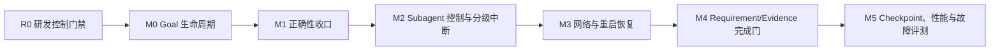

# EKO 长程任务运行时 M0-M5 实施计划

> 日期：2026-08-17
> 状态：R0/M0/M1/M2/M3/M4 Complete；M5 next；Codex Runtime Goal active
> 设计基线：[`2026-08-14-eko-long-horizon-task-runtime-design.md`](./2026-08-14-eko-long-horizon-task-runtime-design.md)  
> 跨会话状态：[`MASTER-PLAN.md`](./MASTER-PLAN.md)

## 1. 目标与非目标

本计划把原长程运行时 M1-M5 前移入一个新的 M0：持久 Goal 生命周期。原因是
RunTurn、Subagent、恢复和证据门即使全部正确，如果研发目标或产品 Goal 仍只依赖
当前上下文，压缩或重启后仍可能发生语义漂移。

最终链路为：



本计划不引入：

- 第二个 Goal store、Goal 模型工具或平行 Plan CRUD。
- SQLite。`events.jsonl` 继续是 EKO TaskRuntime 的唯一事实权威。
- 新 TaskRun 状态。可恢复细节继续用 pause reason、blocker 和事件表达。
- 第二套 DAG validator、ready frontier、Subagent mailbox 或 executor。
- surface-local 生命周期。GUI、TUI、CLI、channel 必须调用同一 app-core service。

## 2. R0：研发任务自身先防失忆

### 2.1 Runtime Goal

正式写产品代码前，由用户显式创建 Codex Runtime Goal，objective 必须逐字使用：

```text
完整实现 EKO 长程任务运行时 M0-M5，包括 Goal 生命周期、正确性、
Subagent 控制、恢复、完成证据和性能评测。
```

2026-08-16 的规划回合按用户要求没有创建 Goal；用户随后显式要求立即实施，Runtime
Goal 已使用上述原文创建。后续恢复必须先核对其仍为当前 active Goal。

### 2.2 每次启动或上下文恢复的固定读取顺序

1. 读取本文件。
2. 读取 `docs/MASTER-PLAN.md`。
3. 分别执行 `git -C ../echo-agent status --short` 和当前仓库的
   `git status --short`。
4. 分别读取两个仓库最近提交；跨仓库依赖先核对框架 commit 是否已在目标分支。
5. 读取下文阶段账本，只从第一个未完成 gate 继续。
6. 在开始编辑前重新执行该切片的“已有能力/调用路径”搜索，防止基线已变化。

### 2.3 阶段账本规则

每个阶段必须记录：

| 字段 | 记录要求 |
|---|---|
| 状态 | `Pending`、`In progress`、`Blocked`、`Complete` |
| 权威路径 | 本阶段切换的真实主路径 |
| 提交 | 两个仓库分别记录 commit；没有改动写 `N/A` |
| 测试命令 | 逐条记录实际执行的命令和结果 |
| 失败原因 | 记录根因和修复，不使用“预先存在”跳过 |
| 剩余事项 | 明确下一阶段删除或切换目标 |

状态只能在对应验收项和所有适用提交门禁全绿后改为 `Complete`。

## 3. 动手前核对结果

2026-08-16 已完成框架和应用全仓库搜索。以下结论是实施基线，不得把已有能力
再次实现一遍：

| 领域 | 已存在且真实可达 | 确认缺口 |
|---|---|---|
| Goal | `TaskRun.goal`、Goal Contract/Recovery Capsule、有限 RunTurn、continuation deferred | 没有 `goal_revision`、`goal_sha256`、`RunGoalUpdated`、`update_run_goal`；`TaskPlan.goal` 仍是重复副本 |
| Plan | 唯一 `task_create/task_update/task_list`、框架 revision/DAG/CAS、EKO file adapter | Plan revision 没有绑定 Goal revision/hash |
| Command cell | 一个框架 `CommandCellRegistry`、字节 cursor、进程内多 waiter、artifact writer、EKO cell 事件 | timeout 不含 semaphore 排队；terminal cause/artifact 状态不完整；terminal prune/waiter drain 竞态；settlement 后 retention 不严格 |
| UTF-8 流 | raw byte output 已是 cursor 权威；`echo-execution` 与 `echo-tools` 各有一个增量 decoder | artifact path 仍对单个 pipe chunk 调 `from_utf8_lossy`；不得新增第三套 decoder |
| 主 Turn 控制 | `TurnSteerMailbox`、exact `RunTurnBinding`、`TaskContinuationRuntime` | TUI Resume 未统一携带精确 binding；cell terminal/deferred 有丢唤醒窗口 |
| Subagent | attempt-scoped `SubagentRun`、cancel/status/join handle、usage 事件 | 没有实时 message、next-attempt guidance、exact-attempt interrupt；usage 未完整纳入 TaskRun 总预算 |
| 恢复 | `BootRecovery`、recovery blocker、orphan cell interrupted、completed Subagent reuse | provider 重试没有持久退避；`auto_resume_after_restart` 尚未安全启用 |
| 完成门 | 现有 `run_completion_blockers` 已检查任务、artifact/check、active cell 和 recovery blocker | 没有稳定 Requirement 到 Evidence 关系与 Goal revision 失效规则 |
| 文件投影 | `RuntimeTaskEvent.seq` 和 seq cache 已存在；`events.jsonl` 可全量 rebuild | `rewrite_plan` 仍反复全量 fold，长程路径可能 O(n²)；没有带 hash/schema 的 checkpoint |

特别纠正三点：

1. M5 不是“新增 seq”；已有 `RuntimeTaskEvent.seq` 应直接作为 checkpoint cursor。
2. M1 不是“新增 UTF-8 decoder”；应抽取并复用已有实现，删除重复实现。
3. M0 不是新建 Goal 领域对象；`TaskRun.goal` 从现在起成为唯一目标权威。

## 4. 业界参考与取舍

本方案在架构决策前核对了以下成熟实现：

- [Codex Goal runtime](https://github.com/openai/codex/blob/53eaa297e595fc98df0f33d4c63686a7014d7c9a/codex-rs/ext/goal/src/runtime.rs)
  把持久 Goal、有限 Turn、continuation deferral 和累计预算分开；EKO 采用同样的
  生命周期分层，但继续使用 TaskRun/file store，不复制 Codex 的存储形态。
- Codex 当前 multi-agent 控制把
  [send_message](https://github.com/openai/codex/blob/9ded177ce7c1c0bd2047f902936c177612ab3434/codex-rs/core/src/tools/handlers/multi_agents_v2/send_message.rs)、
  [followup_task](https://github.com/openai/codex/blob/9ded177ce7c1c0bd2047f902936c177612ab3434/codex-rs/core/src/tools/handlers/multi_agents_v2/followup_task.rs) 和
  [interrupt_agent](https://github.com/openai/codex/blob/9ded177ce7c1c0bd2047f902936c177612ab3434/codex-rs/core/src/tools/handlers/multi_agents_v2/interrupt_agent.rs)
  分成即时投递、排队并唤醒、精确中断三条语义。EKO 保留这种分离，但目标是
  attempt-scoped `SubagentRun`，不是持久子会话。
- [Claude Code changelog](https://github.com/anthropics/claude-code/blob/be90077c6a353f292fa612d97173865a9ab21b83/CHANGELOG.md)
  显示 steering、消息排队、session resume、自动 compaction 与 Subagent 恢复是相互
  独立的控制面。EKO 因此不把这些语义压成一个 cancel flag。
- [Cursor long-running agents](https://cursor.com/blog/long-running-agents) 与
  [cloud agent lessons](https://cursor.com/blog/cloud-agent-lessons) 强调 durable execution、
  环境一致性和 harness 边界。EKO 将 workspace generation、launcher/HITL 重建和
  不可重放副作用作为 auto-resume 前置条件。
- [LangGraph persistence](https://github.com/langchain-ai/docs/blob/c26a7ab8aea6c871b0c9c9f79e0a2544d57c7d1d/src/oss/langgraph/persistence.mdx)
  将 checkpoint 视为可恢复投影。EKO 同样把 checkpoint 定义为可丢弃缓存，事件流
  仍是唯一权威。

跨系统共性是：Goal/plan 是持久 artifact，执行尝试有独立 identity；消息、排队、
中断和暂停不是同一个动作；恢复先证明边界可重放；完成依赖外部证据而不是最后一段
模型话术。本计划不新增审批状态机，也不使用线上多租户权限模型。

## 5. 分层门禁

### 5.1 通用机制：`echo-agent`

- Command cell 的全生命周期 timeout、typed terminal cause、artifact write status、
  raw bytes/incremental decoding、waiter lease/ack、严格 retention。
- attempt-scoped Subagent execution control registry，以及基于现有
  `TurnSteerMailbox` 的 safe-point message delivery。
- `send_message`、`queue_guidance`、`interrupt_subagent` 的通用身份校验与 typed
  outcome。

这些能力不依赖 EKO UI、TaskRun pause reason、文件布局或产品预算策略，属于可复用
框架原语。

### 5.2 EKO 产品策略：`echo-agent-cli`

- Goal revision/update policy、Plan 绑定、用户身份来源、完成证据失效。
- continuation wake、exact Resume、TaskRun 总预算、持久 pause。
- Subagent 控制事件、surface parity、provider backoff、boot policy、HITL owner。
- Requirement/Evidence、checkpoint 文件布局、性能门槛、故障与 soak 评测。

这些能力依赖本地个人助理、TaskRuntime 文件权威和 UI 投影，必须留在应用层。

### 5.3 薄适配边界

`echo-agent-app-core` adapter 只允许：

- 在 `TaskRun/PlanTask/SubagentRun` 与框架 identity 间无损转换。
- 注入 `run_id/task_id/plan_revision/attempt/command_id` metadata。
- 持久 EKO 事件并把框架 typed outcome 投影给 surfaces。
- 调用框架服务和 EKO policy/hook。

adapter 不得重新拥有 ready frontier、DAG loop、重试/取消算法、第二个 mailbox、
Plan validator 或 task CRUD。M5 checkpoint 先留应用层，因为它依赖 EKO 的 JSONL
布局；确认多个框架消费者需要后才考虑下沉通用原语。

## 6. 里程碑与交付顺序

逻辑验收顺序始终是 `R0 -> M0 -> M1 -> M2 -> M3 -> M4 -> M5`。代码提交顺序
按跨仓库依赖执行：

1. `echo-agent`：先交付 M1 CommandCell 原语，再交付 M2 Subagent 控制原语。
2. `echo-agent-cli`：交付 M0，再依次接入 M1、M2、M3、M4 应用策略。
3. 两仓库功能门关闭后执行 M5 checkpoint、性能、故障和 soak。

因此框架 M1/M2 commit 可以在产品 M0 gate 尚未关闭时先合并，但产品里程碑 M1
不能在应用 M0 完成前标记完成，M2 也不能在 M1 完成前标记完成。M1 未完成前禁止
启用冷启动自动续跑。

## 7. M0：Goal 生命周期与修改协议

### 7.1 权威数据模型

在 `TaskRun` 增加：

```text
goal: String              # 唯一 Goal 正文权威
goal_revision: u64        # 初始为 1，严格单调 +1
goal_sha256: String       # 对 goal 原始 UTF-8 bytes 计算 lowercase SHA-256
```

删除 `TaskPlan.goal` 和 `PlanRevision.goal` 的持久副本，改为：

```text
goal_revision: u64
goal_sha256: String
```

框架 `TaskGraphContext.goal` 是一次调用所需的通用上下文，不是第二权威。EKO adapter
加载 graph 时必须从当前 `TaskRun.goal` 派生该字段；持久 Plan 只保存绑定 revision/hash。
`EkoPlanMetadata` 同步携带 binding，round-trip 测试逐字段证明无损。

### 7.2 事件与命令

在现有 `RuntimeEventKind` 增加 `RunGoalUpdated`。事件 payload 至少包含：

```text
old_goal_revision
new_goal_revision
old_goal_sha256
new_goal_sha256
new_goal                  # 事件流必须能独立 rebuild 当前 Goal
reason
actor_source              # GUI/TUI/CLI/channel + stable local user identity
updated_at
```

唯一应用 service：

```text
update_run_goal(run_id, expected_goal_revision, new_goal, reason, actor_source)
```

没有模型工具。模型只能生成建议，只有 surfaces 上的显式用户动作能调用该 service。
`actor_source` 只用于本地审计来源，不是多用户鉴权或 permission gate。

### 7.3 原子修改协议

在同一个 per-run lock 内依次验证并 append 一次可独立 fold 的事件：

1. run 存在且 `expected_goal_revision` 命中，否则返回 typed conflict。
2. `new_goal` 非空，hash 与当前值不同；相同内容返回 typed no-change，不增 revision。
3. run 必须为 `Paused`。
4. 没有 active RunTurn、SubagentRun、command cell，也没有尚未 settle 的 claim。
5. checked increment revision；计算新 hash；append `RunGoalUpdated`。
6. 该事件的 fold 同时把 continuation 置为 deferred，reason 为
   `goal_revision_unbound`，避免“Goal 已改但 Plan 尚未对齐”的 crash 窗口。
7. 重写 projection；成功返回新 revision/hash。持久化成功后才发布 UI 事件。

第一版不支持 running hot-edit。完全无关的新目标创建新的 TaskRun，不能覆盖旧 run。

### 7.4 Plan 对齐协议

已有 Plan 时，Goal 修改后必须使用现有 `task_update(base_revision)` 提交一个新的
Plan revision：

- `base_revision` 必须是当前 Plan revision。
- task operations 必须实际审阅新 Goal 对任务、checks、artifacts 和 acceptance 的
  影响；不增加 `plan_patch`、`goal_plan_update` 或空 no-op API。
- EKO commit adapter 在 per-run lock 内再次读取 TaskRun，并把新 revision 绑定到当前
  `goal_revision/goal_sha256`；旧 Goal 的并发提交返回 conflict。
- 只有 Plan binding 与 TaskRun 完全一致、DAG 仍通过唯一框架 validator、没有 blocker
  时，现有 continuation resume 路径才可清除 deferred。

无 Plan 的 run 在首次 `task_create` 时直接绑定当前 Goal revision/hash。

### 7.5 已完成事实与证据

M0 先采用保守规则：Goal revision 改变后，旧 completed task 的执行事实可以保留，
但不能单独证明新 Goal 完成。`run_completion_blockers` 必须把旧 revision evidence
视为 stale。`task_update` 改变任务 spec 时继续复用框架已有 reset semantics。

M4 落地后，只有 artifact hash、test result、review evidence 经过明确重验且仍覆盖新
Requirement，才能把旧事实重新绑定到新 Goal revision。不能仅因 task title/id 未变
自动复用。用户确认 Skip 也必须重新确认或证明仍适用。

### 7.6 M0 测试与验收

- 初始 Goal revision/hash 可由 `events.jsonl` 全量 rebuild。
- CAS 冲突、空 Goal、same-hash、Running、active Turn/Subagent/cell 全部拒绝且零事件。
- update 事件原子产生 deferred；重启在 Plan 对齐前不会 continuation。
- Plan projection 不再持久第二份 Goal，adapter round-trip 不丢 binding。
- stale Plan revision 和 stale Goal binding 都不能清除 deferred。
- Goal 修改后旧 evidence 阻止完成；新 TaskRun 路径不覆盖旧 run。
- GUI/TUI/CLI/channel 调同一 service，并展示相同 typed result。
- 100 次 context compaction 后从 TaskRun 投影的 Goal hash 不漂移。

## 8. M1：关闭现有正确性缺口

### 8.1 框架 CommandCell 原语

1. 在接收 launch 时计算绝对 deadline；semaphore 排队、spawn、process wait 和 output
   drain 全部共享剩余时间。排队超时不得启动子进程。
2. 配置入口拒绝 `max_concurrent == 0`；不允许通过永不释放的 semaphore 把错误配置
   伪装成排队。
3. 在 `echo-core` cell contract 增加 typed terminal cause，例如 `Exit`、`Timeout`、
   `Cancelled`、`LaunchFailed`、`WaitFailed`、`OutputDrainFailed`，并保留 coarse phase。
4. 增加 artifact status，例如 `NotRequested`、`Writing`、`Complete`、`Failed`；写失败
   必须出现在 snapshot/delta，不能只写 warning。
5. raw bytes 继续是 cursor 权威。抽取现有两个 `IncrementalUtf8Decoder` 为一个共享
   框架实现，再删除重复；artifact/event text 按 stream 增量 decode，并在 EOF flush。
6. waiter 注册时取得 lease；terminal drain 被 waiter ack 或 lease drop 前不可 prune。
   prune 只选择 terminal 且无 active/unacked waiter 的 cell。
7. terminal history 始终不超过配置上限。尚未 ack 的 terminal 留在 active-drain
   集合而不是 history；registry admission slot 把 active + drain + history 记录总数限制为
   `max_concurrent + max_terminal_history`，满额 launch 在同一 deadline 内 backpressure。
   最后一个 lease ack/drop 后，先按策略腾出 history 容量再迁入，或在上限为零时直接
   移除。每次 settlement 和 lease 释放都执行收敛，不等下一次 launch。
8. 文档明确 cell 是进程内可等待对象。重启只能从 EKO 事件恢复为 interrupted，不能
   宣称重新附着原进程。

### 8.2 EKO 应用正确性

1. 把 `cell terminal -> continuation deferred -> dispatch exit` 统一为 generation/CAS
   协议；terminal 信号早到时进入 pending wake，deferred 写入后必须重检并消费一次。
2. TUI Resume 和其它 surfaces 一样由 app-core 构造精确 `RunTurnBinding`；禁止由 UI
   猜 run/turn/root message identity。
3. `SubagentRunUsage` 用稳定 source event id 幂等 fold 到 SubagentRun 和 TaskRun 的
   token/time budget。主 Turn 已包含的 child usage 必须按 source scope 去重。
4. 动态降低 token/time budget 时，在 per-run lock 中 append 一个可独立 fold 的预算更新
   事件；其 fold 同时更新配置并在已超限时生成 Paused projection。持久化成功后才取消
   active driver。任何观察者都不能看到“预算已超但仍 Running”的持久状态。
5. 所有 race test 使用 `Barrier`、`Notify` 或 test hook 精确卡住边界；删除依赖随机
   sleep 的竞态断言。真实 backoff timer 不属于测试同步手段。

### 8.3 M1 验收

- semaphore 排队时间计入同一 timeout，零并发配置被同步拒绝。
- 每个 terminal snapshot 都有 cause；artifact 失败可观测且不会伪装成功。
- 中文/emoji 跨任意 pipe chunk 边界不乱码、不 panic、cursor 不重复。
- 多 waiter drain 与 terminal prune 的确定性测试覆盖全部交错。
- retention 在无后续 launch 时也收敛到上限。
- cell/deferred 无丢唤醒；Resume identity 精确；usage 重放不重复记账。
- lowering budget 立即得到 durable pause，进程中和重启后均无 Running zombie。

M1 所有验收完成前，`auto_resume_after_restart` 必须保持关闭。

## 9. M2：Subagent 实时控制与分级中断

### 9.1 框架 API

在现有 Subagent executor 上增加 attempt-scoped execution control registry：

```text
send_message(execution_id, expected_attempt, instruction)
queue_guidance(task_id, expected_next_attempt, instruction)
interrupt_subagent(execution_id, expected_attempt)
```

- `send_message` 只向当前 exact attempt 投递，并调用该 Subagent Agent 已有的
  `TurnSteerMailbox` safe point；不得新建 mailbox。
- `queue_guidance` 只登记给明确的 next attempt，由 attempt admission 原子 claim。
- `interrupt_subagent` 只取消 exact attempt，并返回 requested/settled/previous status；
  不改变整个 TaskRun 状态。
- registry 是进程内执行控制面，不是 EKO 持久化权威。restart 后由应用事件重新判断
  guidance 是否仍可投递。

### 9.2 EKO 持久事件与 identity

事件：

```text
SubagentGuidanceQueued
SubagentGuidanceDelivered
SubagentGuidanceRejected
SubagentInterruptRequested
SubagentInterruptSettled
```

每条控制命令绑定：

```text
run_id + task_id + execution_id + plan_revision + attempt + command_id
```

`command_id` 是幂等键。应用必须先持久 queued/requested，再调用框架；typed outcome
随后持久 delivered/rejected/settled。迟到、重放、旧 Plan revision 或旧 attempt 命令
必须拒绝，绝不能转投新 attempt。

### 9.3 控制层级

| 层级 | 权威语义 |
|---|---|
| Steer RunTurn | 修正当前主 Agent Turn，沿用 foreground/continuation steering |
| Message Subagent | 在 exact Subagent attempt 的 safe point 注入 |
| Interrupt Subagent | 只终止当前 attempt |
| Pause TaskRun | 先持久 Paused，保留已完成事实，停止 Turn/Subagent |
| Cancel TaskRun | 终止 run，并停止其 command cells |
| Shutdown | 持久为 `Paused/BootRecovery`，不能伪装成用户 cancel |

app-core 提供一套 control service；GUI/TUI/CLI/channel 只做输入与渲染适配。

### 9.4 M2 验收

- safe-point message exactly once；重复 command id 幂等。
- message 与 terminal、interrupt 与 natural finish 的每种交错都用 barrier 测试。
- stale attempt/plan/run identity 全部 rejected，且新 attempt 收不到旧消息。
- queued next-attempt guidance 只能被目标 attempt claim 一次。
- Pause/Cancel/Shutdown 的 durable state、Subagent、cell 行为与表中语义一致。
- 四个 surfaces 的能力、typed error 和事件顺序对等。

## 10. M3：网络容错与冷启动恢复

### 10.1 持久 provider retry

在 `RunContinuationState` 增加一个 typed retry projection：

```text
attempt_count
next_retry_at
error_fingerprint
first_failure_at
```

retryable provider/network error 先 append 失败与 schedule 事件，再停止当前 Turn。退避使用
有上限的指数增长；jitter 由 `run_id + error_fingerprint + attempt_count` 稳定派生，确保
event replay 不重新随机。达到 retry 次数、累计时间或 token 上限时持久暂停为
`ProviderUnavailable`。

配置错误、认证错误和确定性 invalid request 不进入 transient retry。fingerprint 改变时
按明确 policy 重置或延续计数，并用测试固定行为。

### 10.2 restart admission

`auto_resume_after_restart` 只在以下条件全部成立时 admission：

- M1 已完成，run 无 recovery blocker、Goal/Plan binding 一致、预算有效。
- workspace generation 与持久记录一致。
- surface launcher、HITL dispatcher 和控制 registry 已完成重建。
- 没有不可安全重放的 tool/Subagent 边界。
- attended run 有可用 interactive owner；缺 owner 必须暂停等待，不能自动 reject HITL。

command cell 重启后继续标记 interrupted，不自动重跑。indeterminate tool/Subagent 保持
recovery blocker，由用户显式处理。

### 10.3 M3 验收

- retry schedule、attempt count 和 fingerprint 可由事件重建，重启不丢退避。
- provider 5xx/断网恢复后只启动一个新 Turn；多个 launcher 竞争只有一个 claim 胜者。
- 预算耗尽、workspace mismatch、缺 HITL owner 和 unsafe boundary 均可靠暂停。
- crash 前已完成任务/Subagent 不重复执行；command cell 副作用不盲目重放。
- Shutdown 恢复为 BootRecovery，不产生用户 Cancel 事件。

## 11. M4：Requirement 到 Evidence 的完成门

### 11.1 版本化关系

在 EKO TaskRuntime 投影中增加：

```text
GoalRequirement(goal_revision, requirement_id)
  -> PlanTask(plan_revision, task_id)
  -> SubagentRun / command cell
  -> artifact / test / semantic review evidence
```

Requirement ID 在同一 Goal revision 内稳定。Requirement 提取可以由模型辅助，但关系
落盘、hash 验证和完成判定必须是 deterministic store logic。

Evidence 至少记录 type、producer identity、goal/plan revision、artifact path/hash 或 test
command/result、reviewer、created_at。Skip 必须有用户确认的 reason/source。

### 11.2 唯一完成门

扩展并收归现有 `run_completion_blockers`，不新建第二个 completion evaluator。完成必须
同时满足：

- 每个 Requirement 已覆盖、验收，或有用户确认的 Skip。
- 必需 artifact 存在且内容 hash 与 evidence 相符。
- 必需 execution check 和语义 acceptance/review 通过。
- evidence 的 Goal revision 有效；Goal 更新后受影响 evidence 已重验。
- 没有 active RunTurn、Subagent、command cell 或 recovery blocker。
- 当前 Plan binding 与 TaskRun Goal revision/hash 一致。

完成写入仍由 TaskRuntime store 执行；不新增 `goal_complete` 模型工具，不新增状态。

### 11.3 M4 验收

- 缺 Requirement coverage、hash mismatch、failed test、stale evidence、active execution
  分别产生稳定 blocker。
- Goal 修改只失效受影响 evidence；复用必须有显式重验事件和 hash 证据。
- 用户 Skip 可审计，模型不能自行确认 Skip。
- 全量 event rebuild 与增量 projection 得到完全相同 blocker/completion 结论。
- GUI/TUI/CLI/channel 展示相同 Requirement/Evidence 状态并调用同一完成门。

## 12. M5：Checkpoint、性能与故障矩阵

### 12.1 Checkpoint

复用已有事件 `seq`，增加可丢弃 checkpoint projection：

```text
schema_version
seq
state_hash
state
```

- `events.jsonl` 是唯一权威；checkpoint 不参与事件 CAS，不可单独推进事实。
- `state_hash` 是排除 hash 字段自身后，对 schema-versioned canonical serialization
  计算的 SHA-256；禁止依赖不稳定的 map iteration order。
- 把现有 full rebuild fold 拆成唯一 `initial_state + apply_event`，全量和增量路径复用。
- 在 per-run lock 内 append event、apply event、原子写 checkpoint/projection。event append
  失败表示事实未提交；event 已 fsync 而 checkpoint/projection 写失败时返回 typed
  `CommittedProjectionDegraded`，后续读取从事件重建，调用方不得把同一 command 当新事实
  盲目重试。
- 启动时校验 schema、seq 不超出事件尾、state hash 和必要 identity。损坏、缺失或不匹配
  时忽略 checkpoint，从 events 全量 rebuild 并重写缓存。
- fold 只处理 `checkpoint.seq + 1..tail`，消除每次 rewrite 对完整事件流的 O(n) 扫描，
  从而消除长 run 的累计 O(n²) 路径。

### 12.2 性能门

建立可重复 benchmark fixture：

- 1,000 个 RunTurn。
- 10,000 条 runtime events。
- 100 次 compaction。
- full rebuild、checkpoint warm rebuild、单事件 append+fold、snapshot read 分别计时。

先保存当前 main baseline，再固定机器/编译 profile 比较。合入门：warm path 的单事件
append+fold 不随历史事件数线性增长；10k warm rebuild 相对 full rebuild 有明确数量级改善；
内存和 checkpoint 大小受控。绝对阈值在第一次稳定基准提交中写入 benchmark 文档，不能
用一次临时机器数据事后调宽。

### 12.3 故障矩阵与 soak

必须覆盖：

| 故障 | 期望 |
|---|---|
| 网络断连/provider 5xx | 持久退避，恢复后 exact-once admission |
| 进程强杀/断电模拟 | 从 event/checkpoint 恢复，不伪造完成，不重放不安全副作用 |
| 磁盘写失败/部分 checkpoint | event append 失败时 authority 不前移；event 已 durable 时报告 projection degraded 并从 authority 重建，坏 checkpoint 被丢弃 |
| HITL 挂起/owner 消失 | durable pause，恢复 owner 后显式继续 |
| Subagent/cell terminal 竞态 | 无丢消息、无跨 attempt、无 Running zombie |

先跑自动 fault injection，再依次跑 12、24、48 小时真实 soak。每次记录 commit、配置、
provider、事件数、compaction 数、恢复次数、failure fingerprint 和最终 evidence。任一短
soak 失败必须修复并从该时长重新开始，不能直接进入更长时长。

## 13. 建议提交切片

每个切片必须切换真实主路径并删除被替代逻辑：

1. Framework M1a：CommandCell deadline/config/typed terminal/artifact status。
2. Framework M1b：共享 UTF-8 decoder、waiter lease/ack、strict retention。
3. Framework M2：attempt-scoped Subagent control registry + existing mailbox wiring。
4. Application M0a：TaskRun Goal revision/hash/event/update service。
5. Application M0b：删除 Plan Goal 副本、Goal binding、surface parity。
6. Application M1：wake race、exact TUI Resume、usage budget、durable lowering pause。
7. Application M2：durable Subagent commands、control hierarchy、surface parity。
8. Application M3：persistent retry、boot admission、HITL owner recovery。
9. Application M4：Requirement/Evidence relation + 唯一 completion gate。
10. Application M5a：shared fold + checkpoint + benchmark。
11. M5b：fault matrix、12/24/48h soak 与最终报告。

跨仓库依赖始终先合并 `echo-agent`，再合并 `echo-agent-cli`。worktree 分支合并前按
`AGENTS.md` 恢复相对 path、merge main、检查 `.worktrees/` ignore，并执行所有门禁。

## 14. 验证门禁

每个 Rust 仓库提交前执行对应 `AGENTS.md` 全套：fmt、两组 clippy、workspace test、
no-default-features check。涉及 feature/Cargo/public API 时执行逐 feature 条件矩阵；涉及
GUI/Tauri 或 web frontend 时执行对应 GUI 与 Prettier/test/build 条件矩阵。

此外每个 milestone 都要运行：

- 最小相关 deterministic unit/integration tests。
- event full rebuild 与 live projection 等价测试。
- GUI/TUI/CLI/channel capability parity 测试。
- `rg` 静态审计：符合 Subagent-only 术语、无 CLI SQLite、无 Goal/Plan/task 平行 store/API、
  无 panic API、无字节级字符串截断、无竞态随机 sleep。
- `df -h .` 和两个 target 大小检查；仅达到磁盘阈值时 clean。

任何失败都必须修复后才能提交；不能以“预先存在”或“与本切片无关”跳过。

## 15. 阶段状态账本

| 阶段 | 状态 | 提交 | 已执行测试 | 失败/剩余 |
|---|---|---|---|---|
| R0 | Complete | app `62168ba` | `git diff --check`; local-link `stat`; code-fence parity; forbidden-term scan：通过 | Runtime Goal 已显式创建；研发控制门持续生效 |
| M0 | Complete | app `de09946` | Goal/CAS/quiescence/rebind 定向测试；workspace fmt、两组 clippy、all-features test、no-default；GUI check/test；frontend Prettier/test/build；浏览器 desktop/390px：全绿 | 已切换唯一 Goal 权威和四 surface 主路径；后续 M1 已完成 |
| M1 | Complete | framework `cd4fccf`；app `9d59a0b` | Framework CommandCell 定向 30 项、完整门禁与 11 个逐 feature check；application 聚焦竞态/预算/TUI 测试、fmt、两组 clippy、workspace all-features test、no-default：全绿 | Framework 与 application 主路径均已切换；cold-start auto-resume 的 M1 前置门已关闭，但功能仍须在 M3 安全 admission 完成后才启用 |
| M2 | Complete | framework `6d7d0cf`；app `f4771f3` | Framework Subagent 定向 122 项及 control/executor 7 项、完整门禁与 11 个逐 feature check；application exact control 5 项、层级回归、完整 Rust/GUI/frontend 门禁：全绿 | exact-attempt message/guidance/interrupt 已复用 `TurnSteerMailbox`；应用 `events.jsonl` 持久 command identity/result，四 surface 共用同一 service。M3 前不得绕过安全 admission 开启 cold-start auto-resume |
| M3 | Complete | app `aa92178` | provider retry、boot admission、orphan recovery 聚焦回归；完整 Rust/GUI/frontend 门禁：全绿 | provider retry schedule/deadline/fingerprint 已进入唯一事件 fold；cold-start 仅对满足 typed admission 的 `Paused/BootRecovery` unattended run 自动恢复；M4 已收归 completion blocker 路径 |
| M4 | Complete | app `54d8bc4` | requirement/evidence、Goal revalidation、artifact rehash、direct Plan、四 surface 聚焦回归；完整 Rust/GUI/frontend 门禁：全绿 | 完成权威仍在 TaskRuntime store；无第二状态/store/tool。M5 须增加可丢弃 checkpoint 缓存、基准和故障/soak 矩阵 |
| M5 | Pending | - | - | seq 已存在；checkpoint 仅为可重建缓存 |

每次自动续跑或重启后仍须核对 Runtime Goal、本文、`MASTER-PLAN`、两个仓库状态和
最近提交，再从第一个未完成阶段继续。

### 15.1 M0 完成记录

权威路径已切换到 `TaskRun.goal + goal_revision + goal_sha256`。`RunGoalUpdated` 是唯一
修改事件，`update_run_goal` 在 per-run lock 下要求显式本地用户来源、精确 CAS、
`Paused`、无 live driver/RunTurn/Subagent/cell，并原子保持 continuation deferred。
`TaskPlan`/`PlanRevision` 不再持久 Goal 正文，只保存当前 Goal revision/hash；旧 binding
不能 Resume，必须通过既有 `task_update(base_revision)` 提交新 Plan revision。GUI、TUI、
CLI、channel 都调用同一 app-core service，模型没有 Goal 修改工具。

提交：application `de09946`。框架无 M0 改动。

最终验证命令：

- `cargo fmt --all` 与 `cargo fmt --all -- --check`
- `cargo clippy --workspace --all-targets --all-features --locked -- -D warnings`
- `cargo clippy --workspace --lib --bins --all-features --locked -- -D clippy::unwrap_used -D clippy::expect_used -D clippy::panic -D clippy::unreachable`
- `cargo test --workspace --all-features --locked`：app-core 878 passed、2 ignored；runtime e2e 5 passed；CLI/TUI/Tauri 148 passed；零失败
- `cargo check -p echo-agent-app-core --no-default-features --locked`
- `cargo check --no-default-features --features gui --bin echo-agent-tauri`
- `cargo test --no-default-features --features gui`：88 passed；零失败
- `npx prettier --check "src/**/*.{ts,tsx}"`
- `npm test`：32 files、143 tests passed
- `npm run build`
- in-app browser：desktop 与 390x844 工作区空态无重叠；无 Rust backend 的 Vite QA
  只能显示 runtime 空态，Paused Goal 表单行为由 store/component contract 测试覆盖

失败与修复：首次 app-core 全量测试发现 3 个旧 fixture 在 Resume 前未创建 Plan，已补
最小 Goal-bound Plan；首次前端 build 发现 3 个 fixture 缺少新增字段，已补齐；首次
Prettier check 发现 3 个本次文件格式不一致，已格式化并重验。提交前语义复核发现
`Paused` 已持久但 live driver 未 settle 的短窗口，补充拒绝条件及确定性测试后重新跑完
全部适用门禁。原剩余事项已由下节 application M1 完成记录关闭；cold-start
auto-resume 继续等待 M3 的安全 admission。

### 15.2 M1 完成记录

Framework `cd4fccf` 已交付通用 CommandCell deadline、typed terminal/artifact 状态、共享
增量 UTF-8 decoder、waiter lease/ack 与严格 retention。Application `9d59a0b` 把 cell
active 检查与 continuation deferred 写入收归同一个 per-run lock，TUI Resume 携带精确
`run_id + new turn_id + root_message_id` binding，PlanTask Subagent usage 以稳定 source event
id 幂等计入 TaskRun token/time budget，并从同一事件流投影 `SubagentRun.usage`。动态降低
预算与 provider/Subagent usage 边界都可在一个事件 fold 中同时得到 durable Paused 状态，
持久成功后才取消 live driver。调度竞态测试改用 `Barrier`/`Notify`，不再依赖随机 sleep。

提交：framework `cd4fccf`；application `9d59a0b`。

Application 最终验证命令：

- `cargo fmt --all` 与 `cargo fmt --all -- --check`
- `cargo clippy --workspace --all-targets --all-features --locked -- -D warnings`
- `cargo clippy --workspace --lib --bins --all-features --locked -- -D clippy::unwrap_used -D clippy::expect_used -D clippy::panic -D clippy::unreachable`
- `cargo test --workspace --all-features --locked`：app-core 881 passed、2 ignored；runtime
  e2e 5 passed；CLI library 139 passed；CLI main 10 passed；零失败
- `cargo check -p echo-agent-app-core --no-default-features --locked`
- 聚焦回归：cell terminal/deferred、budget lowering、Subagent usage/projection、取消保留
  completed facts、revision safe point、in-flight 防重复派发、TUI exact Resume binding：全绿
- `df -h .` 与 target 大小检查：约 73 GiB 可用、app target 约 1.2 GiB，不清理缓存

失败与修复：首次将取消竞态测试切换到通知屏障时，错误地等待了 wave 结束后才会写入的
Todo terminal 状态；改为等待 dispatcher 精确返回计数后再取消。首次全 workspace 测试
发现 `main_agent_task_streams_tool_events_to_subagent_trace` 直接调用内部执行函数而未建立
生产路径必有的 TaskRun/Plan/SubagentAssigned 前置；补齐真实夹具后聚焦和全量重验通过。
ts-rs 测试生成的非语义格式改写已用项目 Prettier 恢复，未进入提交。

下一切片为 application M2：把 framework `6d7d0cf` 的 exact-attempt message、next-attempt
guidance 和 interrupt 接入 TaskRuntime 持久事件、幂等 command identity、控制层级与四 surface。

### 15.5 Application M2 实现前门禁（2026-08-17）

全仓库按 API 名、identity 字段、事件、执行调用点和 surface 命令重新搜索后的结论：

- 通用机制继续由 `echo-agent` 唯一拥有：`SubagentExecutor::{send_message,
  queue_guidance,interrupt_subagent}`、`SubagentAttemptIdentity`、attempt registry 和既有
  `TurnSteerMailbox` 已在 `6d7d0cf` 真实可达；应用不得复制 mailbox/registry。
- EKO 产品策略由 `echo-agent-app-core` 唯一拥有：`TaskRuntimeStore` 的 `events.jsonl` 是
  command identity、plan revision、attempt、actor source、幂等结果与控制层级的事实权威。
- 薄适配点是 `tasks/task_runtime/executor.rs`：当前 read-only/writer 主路径仍调用非 attempt
  delegation API；M2 必须切换到框架 attempt API，并把实际 `SubagentExecutor` 作为短生命周期
  控制目标注册到同一 store。adapter 不拥有 safe-point、取消算法或第二套重试循环。
- future guidance 先持久化，精确 attempt 被派发时再一次性送入框架 queue；live message 和
  interrupt 只解析当前 `SubagentAssigned` 投影并调用已注册的 exact executor。迟到的 plan、
  attempt、execution id 或重复 command id 在持久层判定，不得投递到新 attempt。
- GUI/TUI/CLI/channel 已共享 `TaskRuntimeStore`，但尚没有 Subagent 控制入口。四个 surface
  只增加薄命令适配，统一调用 app-core service；`Pause`/`Cancel` 继续调用既有 run control，
  `Shutdown` 继续走既有 BootRecovery settlement，不另建控制状态机。

重复性结论：仓库中没有 `SubagentGuidanceQueued/Delivered/Rejected` 或
`SubagentInterruptRequested/Settled` 事件，也没有 EKO durable Subagent control service；可新增
这些应用概念。框架 API、主 Turn steer、run pause/cancel、Task DAG 与 plan validator 均已存在，
必须复用，禁止平行实现。

### 15.6 M2 完成记录

Framework `6d7d0cf` 的 attempt registry、`TurnSteerMailbox` safe-point 注入与 exact interrupt
保持唯一实时控制权威。Application `f4771f3` 新增共享 `SubagentControlService`，在
`events.jsonl` 中先持久化完整的 `run_id`、`task_id`、`execution_id`、`plan_revision`、
`attempt` 和 `command_id`，再调用 framework executor；重复 command 幂等返回既有结果，迟到或身份不匹配
的 message/interrupt 持久化 typed rejection，不能命中新 attempt。future guidance 精确绑定
下一 attempt，只在 dispatcher admission 前转交一次。执行器 adapter 仅注册进程内 exact route
并切换到 attempt-scoped delegation API，不拥有第二套 mailbox、scheduler、retry loop 或 DAG。

控制层级保持原有权威：RunTurn steer 继续走 foreground owner；Subagent message/interrupt 只影响
目标 attempt；Pause 保留 completed facts；Cancel 继续停止 run-owned command cells；Shutdown 继续
持久化 `Paused/BootRecovery`。GUI、TUI、CLI 和 channel 均调用同一 app-core service；GUI 的
Subagent detail 使用带 tooltip 的 message/follow-up/interrupt 图标，并从 durable projection
取得 plan revision 与 attempt。

提交：framework `6d7d0cf`；application `f4771f3`。

Application 最终验证命令：

- `cargo fmt --all` 与 `cargo fmt --all -- --check`
- `cargo clippy --workspace --all-targets --all-features --locked -- -D warnings`
- `cargo clippy --workspace --lib --bins --all-features --locked -- -D clippy::unwrap_used -D clippy::expect_used -D clippy::panic -D clippy::unreachable`
- `cargo test --workspace --all-features --locked`：app-core 891 passed、2 ignored；runtime
  e2e 5 passed；CLI/TUI/Tauri library 141 passed；CLI main 10 passed；零失败
- `cargo check -p echo-agent-app-core --no-default-features --locked`
- `cargo check --no-default-features --features gui --bin echo-agent-tauri`
- `cargo test --no-default-features --features gui`：90 passed；零失败
- 聚焦回归：exact control 5 项、BootRecovery 保留完成事实、Pause 可恢复、Cancel 停止
  run-owned cell、CLI/TUI exact identity parser：全绿
- `npx prettier --check "src/**/*.{ts,tsx}"`
- `npm test`：32 files、145 tests passed
- `npm run build`：2143 modules transformed

失败与修复：首次 strict gate 的 clippy 在创建 `target/debug/deps` 临时文件时，发现共享
`target` 被外部并发清理而失败；确认无 Cargo 进程和源代码变化后，从空缓存重跑两组 clippy、
workspace test、no-default 和 GUI 矩阵并全部通过。ts-rs 全量测试重写的生成文件格式已用项目
Prettier 恢复并重验，仅保留新增类型与语义字段。验证后磁盘可用空间一度低于 50 GiB；共享
环境随后清理 app target，可用空间恢复到约 72 GiB。下一切片为 application M3；安全 restart
admission 完成前 `auto_resume_after_restart` 继续保持禁用。

### 15.7 Application M3 实现与完成记录（2026-08-17）

恢复时已重新核对 active Runtime Goal、本文、`MASTER-PLAN.md`、两仓 `git status` 和最近
提交；两仓均干净，M0-M2 的框架与应用提交都在当前分支。

全仓库按 retry 类型、事件、continuation fold、boot recovery、launcher、HITL、workspace
identity、budget 和真实后台启动路径搜索后的分层结论如下：

- 通用机制继续由 `echo-agent` 唯一拥有：`AgentFailure` 已提供 category、terminal kind、
  retryable、code 和 HTTP status；provider 单次调用已有短时 retry；取消 token、Subagent
  attempt identity 与 command-cell interrupted terminal 也均真实可达。M3 不修改框架，不在
  应用复制 LLM transport retry 或另建通用 retry crate。
- EKO 产品策略由 `echo-agent-cli` 唯一拥有：跨有限 RunTurn 的退避、TaskRun token/time
  上限、`events.jsonl` retry projection、workspace identity、attended owner、recovery blocker
  和 cold-start admission 都依赖 EKO TaskRuntime，必须留在 app-core。
- 薄适配边界是 `chat_driver::finalize_run_turn`：它把框架 typed `AgentFailure` 转为一个
  不含 provider message/secret 的稳定 fingerprint，再调用 store 原子 schedule；
  `TaskContinuationRuntime` 只消费 event-folded `next_retry_at` 并等待，不拥有第二套计数。
- `TaskService::resume_pending` 是当前唯一真实 cold-start background launcher。普通 Pending
  任务仍按原路径启动；只有 `Paused/BootRecovery` 才进入新的 typed admission，并且必须是
  Unattended、显式开启 auto-resume、Goal/Plan binding 一致、workspace 一致、预算有效、无
  active RunTurn/Subagent/cell/recovery blocker。Attended run 缺 interactive owner 时保持 Paused，
  绝不以拒绝 HITL 的方式继续。

重复性审计确认：`RunContinuationState` 尚无 provider retry projection，事件集中没有 retry
schedule，`finalize_run_turn` 对 retryable LLM failure 立即暂停，continuation admission 仍使用
进程内 `consecutive_failures + sleep`，后台恢复仍通过 Note 文本猜测是否 BootRecovery。
这些是待替换的唯一旧路径；现有 `recover_incomplete` 已正确关闭 orphan RunTurn/cell、保留
完成事实并为不可重放 tool/Subagent 建 blocker，必须复用而不能平行实现。

关键恢复决策补充核对了官方实现：

- [AWS SDK retry behavior](https://docs.aws.amazon.com/sdkref/latest/guide/feature-retry-behavior.html)
  采用错误分类、最大尝试数、指数退避与 jitter，并用 retry quota 限制持续失败；EKO 对应为
  typed provider-only retry、稳定 jitter 和 TaskRun attempts/token/time 三重上限。
- [Temporal Retry Policies](https://docs.temporal.io/encyclopedia/retry-policies) 把 initial
  interval、coefficient、maximum interval/attempts 和 non-retryable errors 声明为可恢复策略，
  同时依赖 durable history 确定性 replay；EKO 把 schedule 参数直接写入事件，rebuild 不重抽
  随机数。
- [LangGraph persistence](https://docs.langchain.com/oss/python/langgraph/persistence) 把 durable
  checkpointer 作为 fault tolerance/HITL 基础，内存 checkpointer 不能跨重启；EKO 因此只从
  `events.jsonl` 重建 retry/admission 事实，进程内 launcher 仅是可重建执行资源。

本阶段 policy 固定为：同一 Run 的连续 provider failures 统一递增 attempt，fingerprint
记录最新 typed error identity，不能因 503/timeout 交替而重置上限；稳定 full-jitter 由
`run_id + fingerprint + attempt` 派生并把实际
`next_retry_at` 落盘；到达最大 attempt 或既有 token/time budget 时原子持久化
`Paused/ProviderUnavailable`。认证、配置、invalid request 和非 LLM retryable failure 不进入
provider retry。

实现结果：`RuntimeEventKind::RunProviderRetryScheduled` 和 `ProviderRetryState` 已成为
`events.jsonl` fold 的持久事实；continuation 只等待已落盘 deadline，成功 Turn 或用户显式 Resume
重置连续失败。第五次 provider failure 或 token/time budget 耗尽会在同一 store 操作中进入
`Paused/ProviderUnavailable`。后台 launcher 通过 typed boot admission 检查 workspace generation、
Goal/Plan binding、budget、active RunTurn/Subagent/cell、recovery blocker、launcher 和 attended
owner；并发 launcher 只有一个恢复赢家。启动恢复会关闭 orphan Subagent attempt；不可安全重放的
边界继续生成 blocker，command cell 仍只标记 interrupted。TaskRun 创建改为 staged publish，失败时
仅允许回滚尚无 PlanRevisionCommitted 的 run，避免留下半创建事实。

提交：application `aa92178`。该提交同时适配 framework `356866c` 的 typed AgentEvent、fallible
constructor/state-store API，并让 GUI/TUI/CLI/channel 都消费同一个 typed tool terminal contract；
没有增加 surface-local 恢复路径。

最终验证命令：

- `cargo fmt --all` 与 `cargo fmt --all -- --check`
- `cargo clippy --workspace --all-targets --all-features --locked --offline -- -D warnings`
- `cargo clippy --workspace --lib --bins --all-features --locked --offline -- -D clippy::unwrap_used -D clippy::expect_used -D clippy::panic -D clippy::unreachable`
- `cargo test --workspace --all-features --locked --offline`：app-core 906 passed、2 ignored；runtime
  state e2e 5 passed；CLI/TUI/Tauri library 141 passed；CLI main 10 passed；零失败
- `cargo check -p echo-agent-app-core --no-default-features --locked --offline`
- `cargo check --no-default-features --features gui --bin echo-agent-tauri --locked --offline`
- `cargo test --no-default-features --features gui --locked --offline`：90 passed；零失败
- 聚焦回归覆盖：跨 fingerprint retry 计数、持久 deadline、success/user-resume reset、第五次失败、
  token exhaustion、typed stream setup failure、non-LLM failure、全部 boot blocker、并发 boot winner、
  replay-safe/unsafe orphan Subagent、staged rollback 与已发布 Plan 保护
- `npx prettier --check "src/**/*.{ts,tsx}"`
- `npm test`：32 files、145 tests passed
- `npm run build`：2143 modules transformed

失败与修复：第一次全 workspace 测试暴露 framework 新 builder 对 `max_turns = 0` 的严格校验、
state-store 默认覆盖 caller 注入、旧 tool wire contract 和 fault-injection 测试顺序问题；均修复后
全量重跑通过。第一次最终 Clippy 因任务专用 target 的外部清理留下缺失 rmeta；恢复标准
`CACHEDIR.TAG` 后由 Cargo 安全清理，并在仓库 target 从空缓存重跑全部门禁。期间共享 Cargo
进程通过目录锁串行等待，没有终止或覆盖其工作。最终磁盘可用空间低于 50 GiB，全部验证结束后
按规则执行 `cargo clean`，回收 20.2 GiB。

### 15.8 Application M4 实现前门禁（2026-08-17）

恢复后已再次核对 active Runtime Goal、本文、`MASTER-PLAN.md`、两仓 `git status` 和最近提交。
全仓库按 GoalRequirement、evidence、artifact hash、review、skip、completion blocker、TaskPlan
revision、surface read path 和真实 executor 完成路径搜索后的分层结论如下：

- 通用机制继续由 `echo-agent` 唯一拥有：revisioned `TaskSpec`/DAG、task execution fact、
  artifact/check 声明和 metadata 扩展已经真实可达。Requirement/Evidence 是否足以宣告 EKO Goal
  完成是产品策略，不能下沉为框架状态机或第二套 task validator。
- EKO 产品策略由 `echo-agent-app-core` 唯一拥有：每个 current PlanTask 确定性派生一个稳定
  `GoalRequirement`，并用 requirement content hash、Goal revision 和 Plan revision 约束 evidence；
  artifact 必须重新读取并校验 SHA-256，required check 与 semantic review 必须有可追溯事实，Skip
  只能由显式用户 surface 写入。所有事实继续进入同一 `events.jsonl`，不引入 SQLite。
- 薄适配边界是 executor、GUI/TUI/CLI/channel：executor 只请求 store 的同一 typed completion
  report；四个 surface 只展示 report 并调用 user-only Skip service，不拥有本地完成判断或
  `goal_complete` 工具。
- Goal 更新先使旧 Goal revision evidence 失效；新 plan 通过既有 `task_update(base_revision)`
  绑定新 Goal revision。只有 requirement stable ID 与 content hash 均未变化的非 Skip evidence，
  才能由 plan commit 产生显式 revalidation fact。完全无关 Goal 继续创建新 TaskRun。

重复性审计确认：现有唯一语义校验函数是 executor 私有 `run_completion_blockers`，它调用
`assess_task_execution` 检查 summary、声明的 artifact/check、active cell 和 recovery blocker；
store 的 `complete_run_if_quiescent` 另有一份较弱的 task/cell 检查。现有
`Note(summary_persisted)`、`SubagentReleased`、`ReviewPassed/NeedsFix/Blocked`、
`ArtifactProduced` 和 `BackgroundCellFinished` 已是 evidence source facts，必须复用。仓库中没有
`GoalRequirement`、versioned Requirement/Evidence report、user-confirmed requirement Skip 或
Goal-change revalidation，可在应用层新增。M4 会删除 executor 私有完成算法，并让 store 的原子
完成路径和所有读侧共用同一 report，禁止长期保留双实现。

关键完成门决策补充核对了成熟官方实现：

- [OpenAI Agents SDK Human-in-the-loop](https://openai.github.io/openai-agents-python/human_in_the_loop/)
  将审批绑定到精确 tool-call identity 并持久化在 resumable state；未解决项继续暂停。EKO 对应为
  Skip 绑定精确 run/Goal/requirement identity、reason 和本地用户来源，模型没有写入口。
- [GitHub artifact attestations](https://github.com/github/docs/blob/main/content/actions/concepts/security/artifact-attestations.md)
  将 artifact 与 source/build identity 关联，并强调 attestation 仍需验证；EKO 不把记录过的 hash
  当成存在性证明，而是在完成门重新读取文件并比较 SHA-256。
- [SLSA build provenance v1.2](https://slsa.dev/spec/v1.2/build-provenance) 使用 subject digest、
  builder identity 和 external parameters 建立可验证来源；EKO evidence 同样保留 source event、
  producer、Goal/Plan revision 与 digest。
- [Temporal Workflow Definition](https://docs.temporal.io/workflow-definition) 要求 history replay
  确定且变更可版本化；EKO 的 report 只 fold 已持久事件和当前 artifact bytes，不依赖内存顺序或
  随机重算。

### 15.9 Application M4 完成记录（2026-08-17）

提交 `54d8bc4` 已将 Requirement/Evidence 完成门收归现有 TaskRuntime store。每个 current
PlanTask 确定性派生带 stable ID、Goal revision 和 content hash 的 `GoalRequirement`；task、
Subagent、command cell、artifact、check、review 与显式用户 Skip 事实折叠为版本化 evidence。
artifact 在验收时重新读取并校验 SHA-256，Goal 更新使旧 evidence 失效，只有 stable ID 与
content hash 均未变化的事实可在新 Plan revision 中显式 revalidate。

executor 和 store 不再各自拥有完成算法：正常执行、quiescent completion 与 GUI/TUI/CLI/channel
读侧全部调用同一个原子 completion report。直接回答但未调用 `task_execute` 的 AllowDirect
路径会先通过既有 `task_create` 语义物化一个单任务 Summary Plan，再把 FinalAnswer 作为结构化
evidence 进入相同门；RequirePlan 仍以 `NoPlan` blocker 暂停。没有新增 `goal_complete` 工具、
TaskRun 状态、TaskPlan store 或并行 validator。

验证结果：

- `cargo fmt --all` 与 `cargo fmt --all -- --check`
- 两组 workspace all-features Clippy（含 unwrap/expect/panic/unreachable deny）
- `cargo test --workspace --all-features --locked --offline`：app-core 916 passed、2 opt-in
  ignored；runtime e2e 5 passed；CLI/TUI/Tauri lib 142 passed；CLI main 10 passed
- `cargo check -p echo-agent-app-core --no-default-features --locked --offline`
- GUI check 与 GUI test：91 passed
- frontend Prettier、`npm test`：32 files/146 tests、`npm run build`：2143 modules
- requirement/evidence、Goal revalidation、TUI/CLI/channel parser、GUI store 聚焦回归与
  `git diff --check`：全绿

第一次 Clippy 发现 evidence helper 参数过多，已收敛为 `EvidencePayload`。第一次完整测试发现
四个旧 direct/cron 用例绕过 Plan；生产路径改为物化单任务 Plan 后完整重跑全绿。共享仓库
`target` 两次被外部过程删除，因此最终门禁在任务专用临时 target 中完成；验证后先回收 7.3 GiB
incremental，再删除完整 40 GiB 临时 target，可用空间恢复到 58 GiB，未清理仍可复用的框架缓存。

### 15.10 Application M5a 实现前门禁（2026-08-17）

恢复后已核对 active Runtime Goal、本文、`MASTER-PLAN.md`、两仓状态和最近提交。官方搜索
服务本次返回 HTTP 404，因此没有用未核验的新资料代替架构依据；继续复用本文已持久化并在
R0 审核过的 [LangGraph persistence](https://github.com/langchain-ai/docs/blob/c26a7ab8aea6c871b0c9c9f79e0a2544d57c7d1d/src/oss/langgraph/persistence.mdx)
checkpoint-as-projection 模式，以及
[Temporal Workflow Definition](https://docs.temporal.io/workflow-definition) 的确定性、
版本化 history replay 约束。EKO 的取舍保持不变：snapshot/checkpoint 只加速 replay，不能成为
可独立推进事实的第二权威。

全仓库按 checkpoint、seq、fold/rebuild、events.jsonl、projection、compaction、benchmark、
fault injection、disk failure 和 soak 搜索后的分层与重复性结论如下：

- 通用框架不改：`echo-agent` 不知道 EKO 的 JSONL 布局、run-state/plan shadow 或产品故障矩阵。
  checkpoint、基准和 soak 全部属于 `echo-agent-cli/echo-agent-app-core` 应用策略。
- 已存在且真实可达：`RuntimeTaskEvent.seq`、per-run seq cache、torn-tail repair、fsync append、
  unique-temp atomic projection write、`rebuild_plan_from_events`、100 turn/compaction replay 回归、
  provider retry/boot/HITL/recovery fault tests。不得新增第二个事件格式、TaskRun state 或 store。
- 唯一缺口：`event_rebuild.rs` 把初始化、逐事件 fold 和最终 projection 写在一个全量函数中；
  `FileTaskShadow::rewrite_plan` 每次重新读取并折叠全部 history，形成累计 O(n²)。现有 seq cache
  只优化 append sequence，不优化 projection fold。
- 唯一 fold 将拆成可序列化的 `initial_state + apply_event + snapshot`。checkpoint state 除 run、
  plan、task、cell、continuation 外，必须保存 started/finished turn、usage 和 compaction 的去重集合，
  否则 checkpoint 后到达的重复 source event 会被二次计费。
- checkpoint 至少保存 `schema_version + seq + state_hash + state`，并增加只用于定位 suffix 的
  `event_byte_offset`。warm path 从该 offset 读取 `seq + 1..tail`；schema、hash、run identity、
  offset、seq 连续性任一失败即丢弃缓存并从 `events.jsonl` 完整重建。hash 对递归排序后的 canonical
  JSON 计算，不能依赖 map iteration order。
- 写入顺序保持 event fsync 在前，projection/checkpoint 原子写在后。后者失败必须返回 typed
  `CommittedProjectionDegraded(seq, detail)`，明确告诉调用方 authority 已前移，不能把同一外部
  command 当新事实重试；下一次读取/刷新从 event authority 修复缓存。
- `FileTaskStore::get_run/get_plan` 应直接读取对应 snapshot，不再为了不需要 event metadata 的
  查询扫描完整 JSONL。需要 todo display metadata、evidence 或审计的 API 仍显式读取事件，避免
  用 checkpoint 隐藏 authority。

M5a 将先切换这一条真实 `rewrite_plan` 主路径并补损坏/部分 checkpoint、durable-event + projection
failure、full/warm 等价和 1k RunTurn/10k event/100 compaction 基准；M5b 再汇总既有与新增故障
测试并运行 12/24/48 小时 soak。

### 15.11 Application M5a 完成记录（2026-08-17）

提交 `3e409d0` 已完成 checkpoint 与增量 fold。`events.jsonl` 仍是唯一权威；compact
`checkpoint.json` 只保存 schema、run/seq/offset、canonical state hash 和唯一 `EventFoldState`。
同一 fold state 保留 turn/usage/compaction 去重集合，warm refresh 只解析 checkpoint 后的连续
suffix。schema/hash/run identity/offset/seq 任一不匹配即丢弃 checkpoint 并完整重建。snapshot 读
会先验证 durable event tail；事件 fsync 后、projection replacement 前发生强杀时，首次读取会从
事件权威修复，而非返回旧状态。event 已提交但 projection 写失败返回 typed
`CommittedProjectionDegraded`，不伪装成可安全重试的 append 失败。

固定 release fixture 包含 1,000 RunTurn、10,000 event 和 100 compaction。五个最终样本的 full
read/parse/fold median/worst 为 7.847/8.082 ms，warm checkpoint read/fold 为 0.794/0.890 ms，
append + suffix fold + fsync projection 为 24.240/28.576 ms，经 checkpoint tail 验证的
`get_run` 为 0.916/1.005 ms。中位加速 9.88x，所有样本超过 9x；固定抗抖动回归门为 5x。
checkpoint 为 36,416 bytes，约占 3.68 MB event log 的 0.99%。完整原始样本和门槛记录在
`docs/2026-08-17-eko-long-horizon-runtime-m5-evaluation.md`。

验证结果：

- `cargo fmt --all` 与 `cargo fmt --all -- --check`
- 两组 workspace all-features Clippy（含 unwrap/expect/panic/unreachable deny）
- `cargo test --workspace --all-features --locked --offline`：app-core 926 passed、1 M5
  benchmark ignored；runtime e2e 5 passed；CLI/TUI/Tauri lib 142 passed；CLI main 10 passed
- `cargo check -p echo-agent-app-core --no-default-features --locked --offline`
- release benchmark 最终二进制连续五次通过；Goal hash 100 compaction 回归通过
- `git diff --check`、Cargo worktree/绝对路径、Worker/CLI SQLite 静态审计全绿

失败与修正：第一版 benchmark 把 full projection fsync 与无写盘的 warm fold 比较，产生无效的
37.4x；改为两侧都测 `read + parse + fold` 后诚实暴露 10x 门不稳定，最终固定 5x 抗抖动门并
保留四个绝对门槛。Clippy 首轮发现测试 closure 的显式 `drop`，静态审计又发现热路径普通整数
加法和新增 `expect_err`，均在最终门禁前修正。全量 Rust 测试生成的 TypeScript 由项目 Prettier
归一化后无 diff。验证后因可用空间低于 50 GiB，`cargo clean` 回收 42.3 GiB，可用空间恢复到
59 GiB。

M5 仍未完成。剩余 M5b：执行并记录 provider/network、process kill/power loss、disk write、
HITL suspended、Subagent/cell race 和 Goal drift 的 canonical fault matrix；实现可提交、可恢复、
有结构化 ledger 的真实 soak harness，并按顺序完成 12/24/48 小时运行。M1 已完成，因此该阶段
可以验证冷启动自动续跑，但不得绕过 blocker、预算、workspace generation、launcher/HITL owner 门。

## 16. 最终验收

- 100 次上下文压缩后 `TaskRun.goal_sha256` 不漂移。
- Goal 只能由显式用户操作修改，Plan 不持久第二份 Goal。
- 控制消息不丢失、不跨 plan revision/attempt，重复 command 幂等。
- crash/restart 不盲目重放 command cell、tool 或 Subagent 副作用。
- provider 重试、budget lowering、pause/cancel/shutdown 后没有 Running zombie。
- 每个 Requirement 有可验证 Evidence 或用户确认 Skip。
- checkpoint 损坏可从 `events.jsonl` 完整重建，warm fold 不再 O(n²)。
- GUI、TUI、CLI、channel 在 Goal、Resume、Subagent 控制、HITL、恢复和完成门上对等。
- 12/24/48 小时 soak 全部通过，所有适用提交门禁全绿。
