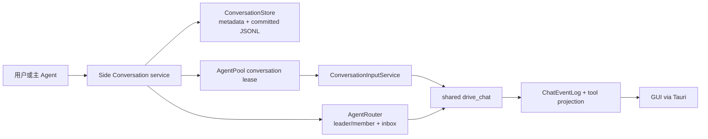

# 问题与目标

EKO 的主对话承担长期目标、任务编排和用户持续交互。用户在处理主任务时，经常需要临时探索一个相关但不应污染主上下文的方向，例如验证替代方案、补查资料、草拟测试或讨论局部实现。当前 GUI 只有“编辑/重新生成时复制历史前缀”的会话分支，无法在主对话旁形成可持续运行、单独打开、追加消息并由主 Agent 通信的侧栏会话。

目标是在 EKO GUI 中提供 Side Conversation：用户从主对话快速创建一个携带上下文快照的支线，它以 Subagent 身份独立运行，主对话保持可用；用户可随时从左侧任务树打开支线继续交互，主 Agent也可通过既有 Agent 路由向支线收发内部消息。Side Conversation 是依赖 GUI 侧栏和并行视图才成立的界面编排能力，不为 TUI、CLI/JSONL 或 channel 新增专用入口或协议。

本设计必须保持一套会话运行时和一套文件权威，不引入 SQLite、新表、第二套消息存储、第三套聊天运行时或迁移兼容层。

# 当前事实与设计纠偏

本设计基于 `echo-agent` `0878a676` 与 `echo-agent-cli` `87eba93c` 的最新 `main`。当前代码事实如下：

- framework `ConversationStore` 定义 `Conversation`、`ConversationMeta`、`StoredMessage` 与会话 CRUD；EKO 使用 `FileConversationStore`，manifest 与 committed message generation/JSONL 是持久化权威。
- `AgentPool` 已按 `(workspace, conversation)` 提供独立 Agent，`send_chat_message`、`ConversationInputService`、`ForegroundTurnControl` 和 `ChatEventLog` 已支持并发多会话、持久输入、精确取消与事件恢复。
- `AgentRouter` 已提供 Conversation 地址、持久 inbox、主从组关系和双向消息；`AgentControlService` 已支持 `agent_spawn`、`agent_resume`、`agent_group` 等模型侧能力。
- GUI `branch_conversation` 当前复制选定用户 turn 之前的 committed transcript，服务于编辑/重新生成，并立即切换到新会话；TUI `/fork` 是已有的普通会话分叉。两者都不建立 Side Conversation 关系，但各自语义独立且继续保留。
- 最新 `main` 中没有名为 `ConversationDomainData` 的 Rust/TypeScript 类型，也没有包含 parent edge 的消息 DAG；`StoredMessage` 是按 ID 排序的线性 transcript。设计不得把不存在的类型或 DAG 写成已实现事实，也不得仅为匹配旧方案命名而再造一套领域模型。

因此，本设计把用户确认的“复用 ConversationDomainData、message DAG”收敛为可验证的实际约束：复用现有 Conversation domain、committed transcript 和文件日志；上下文继承使用不可变快照复制，父子关系复用 `AgentRouter` 的 `AgentGroup` 权威。未来若 framework 单独引入通用消息 DAG，可在不改变 Side Conversation 外部语义的前提下替换快照实现，但本 Outcome 不依赖该假设。

# 目标行为

## 创建与上下文

- 只有主对话可创建 Side Conversation；Side Conversation 内不显示继续创建支线的入口，模型侧也不能从 Side Conversation 再派生 Side Conversation。
- 创建入口至少包含一个显式 prompt。模型默认继承主对话当前有效模型，用户可在创建时选择其它已配置模型，并可在支线 header 中继续修改后续 turn 使用的模型。
- 创建时捕获主对话“最近一次已提交”的 canonical transcript 快照。快照包含系统恢复所需的 user、assistant、tool 与附件引用，不复制源会话专属的 UI execution ID、TaskRun 绑定或临时 live delta。
- 若主对话有进行中的 turn，创建不读取未提交的流式增量；创建回执和 UI 明确标示快照截止点，避免用户误以为支线看到了仍在生成的内容。
- 快照一经创建即与主对话独立。主对话后续消息不会自动同步到支线，支线输出也不会自动写回主 transcript。
- Side Conversation 创建成功后立即通过完整 GUI chat driver 投递首个 prompt。初始 prompt 随 AgentGroup metadata 持久化，仅用于首轮尚未进入 durable ConversationInput 时重试；create/retry 回执携带稳定 message identity 和初始 prompt，使慢首轮在 canonical transcript 落盘前也能立即投影到选中时间线。同步投递失败时，支线保留为可见的“未启动/可重试”状态，不伪装成成功，也不删除用户已经创建的支线。重试沿用稳定 input/message identity，active 或 terminal 首轮返回既有状态，已入队消息不会重复执行。

## 独立运行与交互

- 每个 Side Conversation 使用自己的 conversation ID、AgentPool lease、上下文窗口、输入队列、前台 turn 和取消令牌；它不占用或取消主对话的 foreground turn。
- 用户可以在主对话继续输入，也可以从左侧任务树打开任一支线。打开支线后，中心区使用完整 Agent 对话表面，展示继承的上下文、用户消息、思考/工具过程、最终回答、HITL 与错误状态。
- 支线的用户输入复用普通 conversation ingress。忙碌时追加消息进入该支线自己的 durable frontier；取消只针对回执中标识的支线 active turn。
- 支线模型变更只影响该支线后续 turn，不反向修改主对话或其它支线。若所选模型被移除，支线显示可恢复的配置错误并要求重新选择，不静默切到任意模型。
- 支线可以重命名、删除和继续对话。删除支线不删除主对话、不改写主 transcript；主对话删除时，必须先给出将级联删除其支线的明确范围并走现有防数据丢失确认。

## 主 Agent 与支线通信

- 主 Agent 与 Side Conversation 通过既有 `AgentRouter` Conversation 地址和 durable inbox 双向收发消息，不把通信包装成用户 transcript，也不新建 mailbox。
- 主 Agent 发往支线的消息在支线中作为来源明确的内部指令呈现；用户可查看其内容和投递状态。
- 支线发回主 Agent 的内部消息默认不插入主对话时间线，以免制造噪音；左侧支线条目或主对话 header 只显示有界的未读/需关注状态。用户显式打开支线后可查看完整内容。
- Side Conversation 的最终回答不会因为 turn 完成而自动回传主对话。需要主 Agent 消费时，由主 Agent/支线显式调用既有消息能力，或由用户执行显式“发送给主对话”动作；两者都生成可追踪投递回执。

## GUI 交互与 surface 边界

- GUI 在主对话 header 提供紧凑的“新建支线”图标按钮；按钮有 tooltip 与可访问名称，不用永久说明文案占用对话空间。支线 header 以有界状态显示 committed 快照消息数或“首轮待重试”。
- 左侧导航保持“任务/Workspace -> 主对话 -> Side Conversation”层级。支线以缩进条目显示标题、运行/等待/失败/未读状态；同一主对话的多个支线互为同级，不创建标签页。
- 选中支线时中心区复用主 Agent 的时间线与 composer 视觉语言，但以 typed adapter 保留支线身份、模型选择、取消地址和内部消息来源。
- 支线状态列表刷新与 transcript load 使用独立 generation；轮询不得取消正在打开的会话。当前可见支线收到新 committed 内容时，GUI 在本地清零未读并通过 typed conversation update 推进持久 viewed marker。
- Side Conversation 只通过 GUI/Tauri 暴露；TUI、CLI/JSONL 与 channel 不注册 Side Conversation 创建、列表、打开或管理命令，也不增加相关 wire DTO。它们继续使用已有普通 conversation、Subagent 与 `/fork` 行为。
- 现有 GUI `branch_conversation` 继续服务编辑/重新生成，TUI `/fork` 继续服务普通会话分叉。两者不发布 Side Conversation parent relation，因用户意图和展示模型不同，不与 Side Conversation 共用入口或冒充同一产品语义。

# 范围与非目标

范围内：

- 主对话创建一个或多个一级 Side Conversation；
- committed 上下文快照、独立多 turn 对话、模型继承/选择、精确取消；
- 主 Agent 与支线的隐藏内部消息；
- 左侧任务树与完整支线对话表面；
- GUI/Tauri 的 Side Conversation 创建、导航与管理；
- 文件持久化、恢复、删除、失败回执、文档和验证。

明确不做：

- Side Conversation 创建嵌套 Side Conversation；
- 支线完成后自动总结或自动写回主 transcript；
- 为 Side Conversation 创建新的 TaskRun、PlanTask graph、调度器或聊天状态机；
- SQLite、关系型表、schema migration、双写或兼容适配层；
- 跨 Workspace 创建支线、自动 worktree 隔离或自动合并代码；这些可作为以后独立 Outcome 评估；
- 修改 `echo-agent` 的通用 ConversationStore 或 Subagent 公共 API，除非实现期发现无法由现有通用原语表达且重新完成分层裁决。
- 为 TUI、CLI/JSONL 或 channel 增加 Side Conversation 专用命令、帮助文本、事件或 wire contract。

# 系统边界与分层

## 通用机制

`echo-agent` 继续拥有 ConversationStore trait、FileConversationStore、Agent/Subagent 基础运行、消息与事件原语。Side Conversation 不要求 framework 理解 EKO 的左侧任务树、主对话隐藏 inbox、模型选择控件或产品父子关系，因此本设计不新增 framework 类型、字段、store 或状态机。

## EKO 产品策略

`echo-agent-cli` app-core 拥有 Side Conversation 的创建资格、父子关系、一级深度、模型偏好、内部消息可见性和删除范围。父子关系复用现有 `AgentGroup`：主 conversation 是 leader，Side Conversation 是带保留 `subagent_role=side-conversation` 的唯一 member；每条支线对应一个稳定 group。普通协作组不能被 GUI 误投影为支线，Side group 也不进入通用 Agent 组列表或通用 update/delete 路径。

Side Conversation 的 runtime 仍是现有 conversation-scoped AgentPool + `drive_chat` 路径。它是相对主 Agent 的一级、可寻址 Subagent 产品角色，但不是 `TaskRun -> PlanTask -> SubagentRun` 中的 formal PlanTask attempt；不得把两者状态、取消或持久化混为一谈。

模型覆盖和支线展示元数据扩展在既有 application-owned group/member JSON 权威中，直接采用当前开发阶段格式，不双写旧字段、不创建迁移层。所有 Side metadata 字段更新必须在既有 groups 文件锁内基于最新记录原子 mutate；禁止读取旧 group 后整条替换，以免 model、launch error、title 和 viewed 并发丢失。ConversationStore 仍只保存通用 conversation 和 transcript。

## 适配边界

Tauri 是 Side Conversation 唯一 surface adapter，只调用 app-core Side Conversation service，并负责参数/wire DTO 转换、workspace metadata 注入和 GUI 事件投影；不得自行复制 transcript、维护父子集合、决定嵌套规则、分配第二套状态或直接操作文件。TUI、CLI/JSONL 与 channel 不依赖或调用该 service。

前端 Zustand 仅持有当前列表、选中项、未读和 in-flight 请求的可重建投影。父子关系、模型覆盖、运行态和消息投递状态都来自 app-core/现有日志，不以浏览器内存为权威。

# 核心结构与数据流

Side Conversation 使用两类既有权威组合，而不是新建聚合 store：

1. ConversationStore/FileConversationStore：Side Conversation 自身 metadata 与 committed transcript。
2. AgentRouter AgentGroup/inbox：主对话 leader、Side Conversation member、模型/展示元数据和双向内部消息。

稳定地址是 `(workspace_id, conversation_id)`；父子关系以 group leader/member 表达。运行中 turn 继续使用 `(workspace_id, conversation_id, root_turn_id, active_turn_id)` 精确寻址；TaskRun/SubagentRun identity 不参与 Side Conversation 的普通 turn 取消。

创建的数据流：

- service 在 parent/child identity guard 内验证源 conversation 是主对话且目标深度为一级；guard ownership 随 launch preparation 保持到首个 GUI foreground lease 注册完成；
- 从 ConversationStore 读取源 conversation 和 committed transcript，并记录稳定截止点；
- 创建新 conversation，复制清理后的 transcript 快照，加入主 conversation 的 Side Conversation group；
- Tauri 为新 conversation 恢复包含当前 system prompt 的 AgentPool context，按选定模型准备首轮，通过既有 GUI conversation ingress 投递 prompt；
- 返回包含 child address、snapshot boundary 和投递阶段的 typed receipt。

恢复的数据流：

- ConversationStore 恢复 transcript，AgentRouter 恢复 group 与 inbox，列表服务按 leader/member 投影父子树；
- 打开支线时按 child conversation ID 恢复 Agent 和 ChatEventLog；首轮 user message 在 snapshot boundary 之后按持久 initial prompt 重建稳定 GUI message identity，快速完成或响应丢失重试不会重复显示；无法解析的 group member 显示为可清理的 degraded relation，不把其消息附到其它 conversation；
- 未完成输入和 active turn 使用现有 durable frontier/foreground reconciliation，不创建 Side Conversation 专属恢复状态机。

# API 边界

Side Conversation 不新增一组 `side_conversation_*` 平行 CRUD。对 Tauri/GUI 暴露的能力收敛在以下 conversation 语义上，并由 typed request/receipt 携带可选 parent、snapshot、model 与 source 信息：

| 语义能力 | 当前可复用入口 | Side Conversation 约束 |
| --- | --- | --- |
| `conversation_create` | `save_conversation`、`branch_conversation`、`agent_spawn` 的底层能力 | 可选 parent、prompt、model；原子建立 child transcript 与 group relation |
| `conversation_list` | `list_conversations`、`AgentRouter::list_groups` | 返回主/支线层级与有界状态，不混入普通协作组 |
| `conversation_get_messages` | `get_conversation`、`ConversationStore::get_messages` | 返回 committed transcript，并保留内部消息来源投影 |
| `conversation_send_message` | `send_chat_message`、`ConversationInputService`、`AgentRouter` | 区分用户 turn 与 Agent 内部消息，复用既有回执 |
| `conversation_delete` | `delete_conversation`、ConversationDeletionService | child-only 删除或主对话显式级联，不留悬空 member/inbox |
| `conversation_cancel` | `cancel_chat`、ForegroundTurnControl | 必须带 exact child turn identity，不波及 parent |
| `conversation_update` | `update_conversation` 与 group/member metadata | 更新模型、展示元数据或 viewed marker，不替换 transcript |
| `conversation_rename` | `update_conversation(title)` | 只改 title，父子 identity 不变 |

表中的名称是 app-core 语义面，不要求再注册一套同名 wire alias。实现只扩展 Tauri conversation 命令；TUI、CLI/JSONL 与 channel 不接入。不得为了“兼容”同时维护新旧 service、复制器或父子索引。

# 与 Claude Code 的比较和取舍

Claude Code 官方文档把 Fork 描述为一种继承创建时完整会话的 Subagent：它继承 system prompt、工具、模型和全部历史，工具调用留在支线，最终结果返回主会话；运行中可打开 transcript、发送 follow-up 和停止。Fork 默认后台运行，可选 worktree 隔离，且不能再创建 Fork。参考：[Claude Code Subagents - Fork the current conversation](https://code.claude.com/docs/en/sub-agents#fork-the-current-conversation)。这证明终端能够承载 forked Subagent，但不要求 EKO 把一个以侧栏树和并行视图为核心的 GUI affordance复制成命令协议。

EKO 采纳：

- 以一级 Subagent 表达支线；
- 从相同上下文起点并行工作；
- 支线 transcript 可见、可追加消息、可停止；
- 禁止 Fork/Side Conversation 继续嵌套；
- 主上下文不承载支线工具噪音。

EKO 有意不同：

- Side Conversation 是长期可寻址的普通 conversation entity，用户可从左侧任务树反复打开，而不是只在运行面板中临时观察一个 dispatch；
- 只继承 committed transcript 快照，不承诺复制未提交的流式增量；
- 不自动把最终结果送回主 transcript，内部通信走隐藏 inbox，回传必须显式发生；
- 默认不创建 worktree，不把本地代码隔离绑定为聊天功能前提；
- 不增加权限模式门控。一级深度限制是产品拓扑，不是本地安全策略。
- 不在 TUI、CLI/JSONL 或 channel 暴露 Side Conversation；这些 surface 的普通会话与 Subagent 能力不受影响。

# 异常与边界场景

- 源 conversation 不存在、已删除或不是主对话：创建失败且不产生 child/group 半成品。
- 快照读取或写入失败：不发布可见 child relation；若 conversation 已创建，使用现有删除服务回滚并报告 cleanup debt。
- 首轮 prompt 投递失败：保留已提交 child，显示失败与重试，不重复创建另一 child。
- 主对话正在流式生成：快照固定在 committed boundary，UI 告知截止点；主 turn 不被取消。
- 同一创建请求重试：使用 request identity/idempotency 避免重复支线和重复首轮输入。
- 首轮在 create 返回前已经完成或 create 响应丢失：恢复投影从 relation 的 snapshot boundary、initial prompt 和 group ID 重建同一 message identity，前端只补不存在的稳定 identity，不按显示文本盲目追加。
- relation 已提交但首轮尚未 admission 时并发删除：parent/child identity guard 保持到 GUI foreground lease 建立；删除只能在 turn 可被精确取消后继续，不得让 input 重建无 relation conversation。
- 支线忙时继续发送：进入该 child 的 durable frontier；用户取消只取消指定 active turn，未发送队列按现有输入服务管理。
- 模型不可用：不静默继承其它模型；保留支线与消息，要求重新选择后重试。
- 主/支线内部消息投递失败：展示 receipt phase，可安全重试；不将“已持久化”误报为“已处理”。
- 应用重启：父子树、模型覆盖、未读状态、committed transcript 与可恢复输入从文件权威重建；运行中断按现有 foreground/chat event 规则收敛。
- 删除 child 时 active turn 尚未 settle：在 identity guard 内先取消并等待，再复用 ConversationDeletionService 删除 transcript、group member、router target/inbox；父级联 receipt 必须聚合 child 的 `cleanup_pending`。
- 删除主对话时仍有支线：先展示级联范围并要求用户确认，随后按有界顺序删除 child；任何失败保留可诊断的剩余集合。
- group relation 存在但 child transcript 缺失：列表标记 degraded，不把 member 挂到同名或当前 conversation；提供显式清理。
- workspace 切换：所有查询和事件必须带 workspace ID，禁止只凭 conversation ID 复用前端状态。

# 关键取舍

## 复用 Conversation，而不是新增 SideConversationStore

Side Conversation 的长期内容就是 conversation transcript。新增 store 会与 ConversationStore、ChatEventLog 和 AgentRouter 争夺权威，并迫使 GUI 补第二套恢复逻辑。组合既有 conversation + group relation 可以表达目标且保持单一运行路径。

## 复制 committed 快照，而不是假设消息 DAG

当前 FileConversationStore 是 append-oriented JSONL，`StoredMessage` 没有 parent edge。复制清理后的 committed transcript 是当前最小且可验证的正确实现；它牺牲磁盘去重，换取清晰隔离和无需 framework schema 变更。设计不把未来 DAG 当作前置条件。

## AgentRouter inbox，而不是主 transcript 自动回写

内部消息本来就有独立持久 inbox 和投递回执。复用它既满足主 Agent 双向通信，也避免把内部协调文本伪装成用户/assistant 历史。

## App-core 单一服务，而不是前端自建状态权威

Side Conversation 虽然只由 GUI 使用，仍涉及快照、删除、恢复和 Agent 通信，不能由 Zustand 或 Tauri handler 自行拥有。app-core service 统一这些语义，Tauri 只做薄适配；其它 surface 不接入，也不改变它们已有的普通 fork 行为。

# 复用与实现约束

- 优先复用 framework `ConversationStore`、`FileConversationStore`、`Conversation`/`StoredMessage`、消息 project/restore；不新增 framework store 或 SQLite feature。
- 优先复用 app-core `AgentPool`、`ConversationInputService`、`ForegroundTurnControl`、`ChatEventLog`、`ToolExecutionRepository`、`ConversationDeletionService`、`AgentRouter`/`AgentGroup` 和 `AgentControlService`。
- 复用 GUI `ChatPanel` 中的时间线/composer 展示原语，但不要复制其全局 active-conversation 副作用；支线身份必须通过 typed address 注入。
- 复用左侧 `LeftSidebar` 的 Workspace/Conversation 树、现有 icon library、紧凑尺寸和键盘行为；不创建嵌套 card、永久标签栏或第二个导航 authority。
- 模型选择只使用已安装 provider/model registry 和现有 Agent 配置能力，不增加模型依赖或静默 fallback。
- 所有文本截断必须 UTF-8 安全；所有新 Rust 路径遵守无 `unwrap`/`expect`/panic/潜在越界索引约束。
- `Side Conversation`、`side conversation` 是产品功能名；执行角色始终统一使用 `Subagent` 术语。
- 实现前必须再次搜索 `echo-agent` 与 `echo-agent-cli` 的实际调用链，区分定义、注册和运行可达；adapter 不得拥有复制器、父子 store、队列、取消状态机或第二套 reducer。
- 架构落地时在 `docs/en/adr/` 与 `docs/zh/adr/` 记录同一决策，并同步正式产品文档；examples 与 website 经检查若不涉及该产品 UI/公共 API，应在交付说明中明确不适用。

# 验收标准

1. 用户能从主对话的显式入口创建 Side Conversation，填写 prompt，默认继承当前模型并可改选已配置模型。
2. 创建返回的支线包含主对话最近 committed transcript 的可见上下文快照；主/支线后续消息互不自动同步。
3. 主对话与多个支线可并发运行；任一支线的发送、队列和取消均按 exact conversation/turn identity 隔离，不影响其它对话；relation create 到首轮 foreground admission 之间不存在删除窗口。
4. 左侧导航稳定呈现 Workspace -> 主对话 -> Side Conversation 层级；状态轮询不取消 transcript load，当前可见支线完成后不产生伪未读；并发 model/launch error/title/viewed 更新不互相覆盖；重启、切换 Workspace 和重新打开后父子关系不丢失、不串线。
5. 打开支线可查看完整 Agent 时间线并继续多 turn 对话；模型修改只影响该支线后续 turn。
6. 主 Agent 与支线可通过既有 AgentRouter 双向发送消息并获得 typed receipt；内部消息默认不插入主 transcript，支线最终回答不自动回写。
7. Side Conversation 不能创建嵌套 Side Conversation；GUI 隐藏创建入口，Tauri 只转发 typed request，app-core admission 在创建副作用前拒绝支线 parent。child 的普通 Task、Subagent 与工具能力不因此被禁用。
8. 支线可重命名、更新、取消和删除；删除 child 不改变 parent，删除 parent 时明确展示并执行支线级联范围，失败返回可恢复 cleanup 状态。
9. Side Conversation 只由 GUI/Tauri 暴露；仓库搜索与测试证明 TUI、CLI/JSONL、channel 没有 Side Conversation 专用命令、事件、帮助文本或 wire contract，且原有普通 `/fork` 行为保持不变。
10. 没有新增 SQLite 依赖、关系表、SideConversationStore、第二 mailbox、第二 chat event log、第二 Agent executor 或并行 fork 状态机。
11. 现有 GUI 编辑/重新生成分支与 TUI `/fork` 不发布 Side Conversation 父子关系；它们作为不同用户意图的既有行为继续保留，并由回归测试证明未被 Side Conversation 改写。
12. Rust focused tests覆盖快照截止、幂等创建、一级限制、投递失败、首轮 identity 恢复、metadata 并发 mutation、精确取消、删除级联和重启恢复；前端测试覆盖入口、快速完成/响应丢失去重、树投影、模型选择、状态/未读、workspace 隔离和无重叠布局；所有适用仓库门禁通过。
13. 正式 ADR、产品文档与 GUI 帮助/契约同步；非 GUI surface 无 Side Conversation 文案，examples 与 website 的适用性检查有明确结论。
