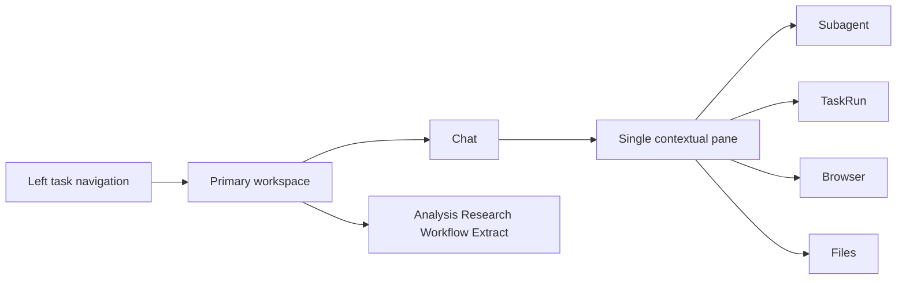

## Approach

在现有 React、Zustand、Tailwind 和 Tauri API adapter 上完成纯前端收敛。主区域增加独立工作台选择，右侧将原工作台 tab 与 Subagent 选择合并为一个 discriminated contextual target。主 Agent 与 Subagent 只共享面板、时间线和 composer 的展示原语，发送行为继续注入现有 normal turn、exact-attempt message、next-attempt followup 和 interrupt handler。当前事件数据不足的 thinking/token 历史不在本 Plan 伪造，后续由 framework envelope 与 EKO projection 交付补齐。

## Global Constraints

- 仅修改 `web-frontend/src/**` 与当前主题 Plan 文件；禁止修改 `echo-agent/**`、`echo-agent-app-core/**`、`src/tauri/**` 和 generated contract。
- EKO 只展示主 Agent 到一层 Subagent；不得新增嵌套 Subagent UI、导航或前端状态。
- 删除六个常驻 tab 时必须同步迁移所有 slash command 和显式入口，不得损失 TaskRun、分析、研究、浏览器、文件、工作流或结构化提取能力。
- 右栏只有一个 contextual target authority；不得保留 `activeTab` 与独立 `selectedSubagent` 两套可能冲突的状态。
- 不新增路由、状态管理、UI 或图标依赖；复用 React、Zustand、Tailwind 和 lucide-react。
- 使用平面中性色、细分隔线、紧凑标题栏和稳定 composer；不新增装饰性渐变、超大圆角、重阴影或卡片嵌套。
- 保持现有 typed `message`、`followup`、`interrupt` 调用和 TaskRuntime/Subagent/tool 状态权威；前端不得乐观伪造送达、执行或终态。
- `SDK-Docs-Impact`: none，本 Plan 不改 framework SDK 或 generated contract；`SDK-Skill-Impact`: none，不改 Skill 合约。

## Files

- Modify: `web-frontend/src/App.tsx` — 组合主工作台与上下文分栏，并在 scope 切换时清理失效视图。
- Create: `web-frontend/src/components/layout/PrimaryWorkspace.tsx` — 承载 chat、分析、研究、工作流和结构化提取的独立主视图。
- Create: `web-frontend/src/components/layout/ContextPane.tsx` — 渲染 TaskRun、Subagent、浏览器或文件中的唯一右栏目标。
- Delete: `web-frontend/src/components/layout/RightWorkspace.tsx` — 删除六 tab 工作台容器。
- Create: `web-frontend/src/stores/workspaceViewStore.ts` — 主工作台视图选择。
- Create: `web-frontend/src/stores/contextPaneStore.ts` — 单一 discriminated contextual target 与宽度状态。
- Delete: `web-frontend/src/stores/rightWorkspaceStore.ts` — 删除 `activeTab` 状态权威。
- Delete: `web-frontend/src/stores/subagentDetailStore.ts` — 将 Subagent 选择并入 contextual target。
- Modify: `web-frontend/src/lib/slashCommands.ts` — 将原入口分别路由到主工作台或上下文分栏。
- Delete: `web-frontend/src/components/automation/AutomationPanel.tsx` — 删除误导性的自动化包装层，直接呈现工作流或结构化提取。
- Create: `web-frontend/src/components/chat/AgentPane.tsx` — 主/子 Agent 共用的 header、timeline、footer 面板骨架。
- Create: `web-frontend/src/components/chat/AgentComposerFrame.tsx` — 主/子 Agent 共用的紧凑输入表面。
- Modify: `web-frontend/src/components/chat/ChatPanel.tsx` — 使用共享 AgentPane 并路由 slash command。
- Modify: `web-frontend/src/components/chat/ChatInput.tsx` — 复用 composer frame 并移除装饰性输入 chrome。
- Modify: `web-frontend/src/components/chat/SubagentStreamBlock.tsx` — 点击后直接选择唯一 contextual Subagent target。
- Modify: `web-frontend/src/components/task/SubagentDetailView.tsx` — 使用共享 pane/composer，按状态路由 typed 控制并删除返回式检查器布局。
- Modify: `web-frontend/src/components/subagent/SubagentOutcomeView.tsx` — 去重相同 terminal error、summary 和 remaining work。
- Modify: `web-frontend/src/components/layout/AppLayout.tsx` — 稳定三栏最小宽度与移动覆盖层。
- Modify: `web-frontend/src/components/layout/LeftSidebar.tsx` — 收敛为紧凑平面任务/会话导航。
- Modify: `web-frontend/src/index.css` — 清理 Agent shell 的渐变、阴影和过度装饰。
- Create: `web-frontend/src/stores/contextPaneStore.test.ts` — 覆盖唯一右栏目标、宽度与 scope 清理。
- Create: `web-frontend/src/stores/workspaceViewStore.test.ts` — 覆盖独立主工作台切换。
- Delete: `web-frontend/src/stores/rightWorkspaceStore.test.ts` — 删除旧六 tab 状态测试。
- Create: `web-frontend/src/components/layout/ContextPane.test.tsx` — 覆盖单目标渲染与关闭语义。
- Modify: `web-frontend/src/components/chat/SubagentStreamBlock.test.tsx` — 覆盖直接选择 Subagent target。
- Modify: `web-frontend/src/components/task/SubagentDetailView.test.tsx` — 覆盖共享 composer 的 message/followup/interrupt 状态。
- Delete: `web-frontend/src/components/automation/AutomationPanel.test.tsx` — 删除旧自动化包装层测试。
- Modify: `web-frontend/src/lib/slashCommands.test.ts` — 验证所有能力入口保留且目标类型正确。

## Reuse

- `web-frontend/src/components/layout/AppLayout.tsx:27` — 现有 flex shell 与移动左栏覆盖层，继续作为三栏几何基础。
- `web-frontend/src/components/layout/RightWorkspace.tsx:69` — `rightWorkspaceWidthForViewport` 的中心最小宽度思想，迁入 contextual pane store。
- `web-frontend/src/components/chat/MessageBubble.tsx:352` — 已有 thinking/tool/Subagent/final 的单时间线表达，继续作为主 Agent 内容来源。
- `web-frontend/src/components/task/SubagentDetailView.tsx:106` — 现有 typed message/followup/interrupt handler，保持 API 与 exact-attempt 语义。
- `web-frontend/src/components/browser/BrowserPanel.tsx` — 现有浏览器能力原样作为 contextual content。
- `web-frontend/src/components/file-browser/FileBrowser.tsx` — 现有文件树、编辑和 diff 原样作为 contextual content。
- `web-frontend/src/components/analysis/AnalysisPanel.tsx`、`web-frontend/src/components/papers/PaperPanel.tsx`、`web-frontend/src/components/workflow/WorkflowPanel.tsx`、`web-frontend/src/components/extract/ExtractPanel.tsx` — 现有工作台组件直接迁入主视图，不复制功能。
- 浏览器原生 flex/grid、ResizeObserver/viewport 事件和 CSS overflow 足以完成布局；无需新依赖。

## Todos

### unify-navigation-authority

requirements:
- § Contextual workspaces
- § Contextual tool flow
- § Context view stack, not another product state machine
- § Acceptance criteria

interfaces:
- consumes: 现有 RightWorkspace open actions、Subagent selection、slash command targets 和各工作台 React 组件
- produces: workspace primary-view selector、单一 contextual target store、PrimaryWorkspace 与 ContextPane

steps:

1. 用主工作台 selector 承载 chat、analysis、research、workflow 和 extract，并把 slash command 映射到对应主视图。
   verify: 每个既有 slash command 都有唯一目标且原能力组件仍可到达。
   expected: 删除六 tab 后分析、研究、工作流和结构化提取仍可从输入命令进入，并可返回主 Agent 会话。

2. 用一个 discriminated contextual target 合并 TaskRun、Subagent、browser、files 与 closed 状态，删除旧 `activeTab` 和独立 Subagent selection。
   verify: 任意时刻 store 只能表达一个右栏目标，切换目标不会残留另一个选中状态。
   expected: 点击 Subagent、任务状态、浏览器或文件只替换右栏正文，不显示六个常驻 tab 或错误选中下划线。

3. 在 workspace/conversation scope 变化时关闭不属于新 scope 的 contextual target，并保持关闭时中栏扩展。
   verify: scope 切换后旧 Subagent 或文件上下文不会继续显示。
   expected: 右栏状态不跨工作区漂移，主对话始终可用。

### share-agent-conversation-primitives

requirements:
- § Shared Agent conversation surface
- § Input semantics
- § Failure presentation
- § Edge and failure scenarios
- § One presentation language, distinct typed commands

interfaces:
- consumes: ChatPanel、ChatInput、SubagentDetailView、SubagentRunState、tool owner projection 和现有 taskRuntimeApi 控制函数
- produces: AgentPane、AgentComposerFrame、统一 Subagent 会话式分栏与去重终态展示

steps:

1. 抽取主/子 Agent 共用的平面 pane 和 composer frame，将主 ChatPanel 与 SubagentDetailView 接入，但保留各自数据 adapter。
   verify: 两个视图共享相同结构和输入表面，不把主会话 store 或分支逻辑复制给 Subagent。
   expected: 主 Agent 与 Subagent 看起来属于同一产品界面，仍只有各自一个状态权威。

2. 将 Subagent 输入改为内联 composer：运行态发送 exact-attempt message，结算态发送 next-attempt followup，interrupt 保留为 header icon action。
   verify: handler 根据 authoritative run status 选择现有 API，失败 receipt 不显示为成功。
   expected: 用户无需 prompt 弹窗即可在右栏输入；消息、后续任务与中断保持当前 typed 语义。

3. 规范化 terminal 展示，完全相同的 error、summary、output 和 remaining work 只呈现一次。
   verify: 相同失败文本不会同时出现在正文与未完成列表，独立 evidence/artifact 仍保留。
   expected: 截图中的重复 Max iterations 错误收敛为一个清晰终态。

### apply-clean-responsive-shell

requirements:
- § Visual and spatial language
- § Mobile viewport
- § Narrow desktop viewport
- § Codex-inspired structure, EKO-owned interaction
- § Acceptance criteria

interfaces:
- consumes: AppLayout、LeftSidebar、AgentPane、AgentComposerFrame、现有 CSS tokens 和 lucide icons
- produces: Codex 参考的紧凑三栏 shell、响应式覆盖层和导航/视口回归测试

steps:

1. 收敛左导航、主会话与上下文 pane 的尺寸、分隔、滚动和 header/footer 几何，移除 Agent 页面不必要的渐变、重阴影、超大圆角与嵌套卡片。
   verify: 宽桌面与紧凑桌面中 center/right 各自达到最小可读宽度，header 和 composer 不随动态内容跳动。
   expected: 页面呈现清爽连续的三栏工作面，右栏关闭后主会话自然扩展。

2. 完成移动覆盖层、键盘焦点、icon accessible name 和无重叠回归。
   verify: 移动视口一次只显示主面、左导航或右上下文，关闭动作和输入控件可由键盘访问。
   expected: 最长状态/错误文本和 composer 控件不覆盖、裁切或横向溢出。

3. 更新导航、Subagent 控制、终态去重和响应式测试，并完成桌面/移动截图验收。
   verify: 测试覆盖所有 contextual target、主工作台入口、message/followup 路由和旧六 tab 缺失。
   expected: 自动化测试与截图共同证明功能保留、信息架构收敛和 Codex 风格视觉目标。

## Diagram

## Decisions

- 本 Plan 是可独立交付的纯前端结果；缺少新 framework delta 时诚实显示现有工具与终态，不添加临时 wire contract。
- 工作流和结构化提取使用明确名称，不再由“自动化”总标签包装；定时任务仍留在现有设置入口。
- ContextPane 不为 Subagent 建 tab；新的 Subagent 选择直接替换当前目标。
- 后续 framework event envelope 和 EKO Tauri integration 使用独立 Plan，不修改本 Plan 的前端状态权威。
