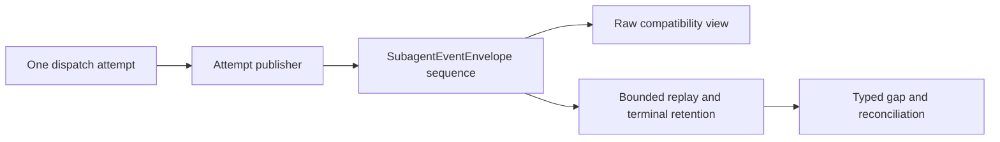

## Approach

先在 echo-core 把 EventEnvelope 的身份校验、稳定 event id、content hash、时间戳与顺序构造提取为 payload-neutral 内核，同时保持 AgentEvent 默认 API 和 wire 兼容。随后由 SubagentExecutor 在一次外层 dispatch attempt 开始时创建唯一 publisher，DispatchStarted、隔离、thinking/token、usage、tool 与 terminal 全部从同一 publisher 发出；内部 hook retry 不重置 stream 或 sequence。SubagentEventBus 保留 raw 订阅作为兼容投影，并新增权威 envelope 订阅与有界 replay/gap/terminal reconciliation。

## Global Constraints

- 只实现 framework 通用事件机制；禁止加入 workspace、GUI、TaskRuntime store 或 EKO 产品字段。
- 保留现有 SubagentEvent raw emit/subscribe；raw 事件只能从同一 authoritative publisher 派生。
- 一次外层 dispatch attempt 只有一个 stream_id 和单调 sequence；内部 retry 和执行模式不得创建第二套顺序。
- 无损关联 SubagentAttemptIdentity/SubagentLineage；不得解析 execution-id 字符串重建 task、attempt 或 parent。
- tool terminal 精确关联 tool start；Lagged、replay 起点过旧和 delta 丢失返回 typed gap。
- retention 有界；terminal full output/outcome 可 reconciliation；关键边界不得静默丢失。
- 不新增依赖，不引入 worker 术语，不使用 panic/unwrap/expect 或 UTF-8 字节截断。
- SDK-Docs-Impact: required；SDK-Skill-Impact: none；示例必须编译并同步 echo-website 文档投影。

## Files

- Modify: `../echo-agent/echo-core/src/agent/event_envelope.rs` — 提取 payload-neutral envelope 内核。
- Modify: `../echo-agent/echo-core/src/agent/mod.rs` — 导出通用 envelope 原语。
- Modify: `../echo-agent/src/agent/subagent/events.rs` — 增加 Subagent envelope、publisher、gap 与 replay/terminal retention。
- Modify: `../echo-agent/src/agent/subagent/executor.rs` — 完整 lifecycle 切到单一 attempt publisher。
- Modify: `../echo-agent/src/agent/subagent/mod.rs` — 导出 Subagent event transport API。
- Modify: `../echo-agent/src/agent/mod.rs` — 保持 Agent facade 导出一致。
- Modify: `../echo-agent/src/lib.rs` — 暴露稳定 crate-root API。
- Create: `../echo-agent/docs/adr/0030-versioned-subagent-event-envelope.md` — 记录 envelope 与恢复决策。
- Modify: `../echo-agent/docs/en/06-subagent.md` — 文档化 identity/order/lag/replay/terminal 语义。
- Modify: `../echo-agent/docs/zh/06-subagent.md` — 同步中文文档。
- Modify: `../echo-agent/echo-agent-learning/examples/demo50_subagent_communication.rs` — 使用 envelope API。
- Modify: `../echo-website/src/docs/content/echo-agent/en/06-subagent.md` — 同步官网英文文档。
- Modify: `../echo-website/src/docs/content/echo-agent/zh/06-subagent.md` — 同步官网中文文档。
- Create: `../echo-website/src/docs/content/echo-agent/en/adr/0030-versioned-subagent-event-envelope.md` — 同步官网英文 ADR。
- Create: `../echo-website/src/docs/content/echo-agent/zh/adr/0030-versioned-subagent-event-envelope.md` — 同步官网中文 ADR。
- Modify: `../echo-website/src/docs/framework-adrs.generated.ts` — 登记 framework ADR。
- Modify: `../echo-website/public/llms-full.txt` — 同步公开索引。

## Reuse

- `../echo-agent/echo-core/src/agent/event_envelope.rs` 已有 validated IDs、stable id/hash、timestamp、tool parent、resume-after 与 trajectory validation。
- `../echo-agent/echo-core/src/tools/mod.rs` 的 ExternalRunContext/SubagentLineage 已有 execution、run、task、attempt、plan revision、agent path 与 parent execution identity。
- `../echo-agent/src/agent/subagent/events.rs` 的 event bus 和 raw listener 保留为兼容视图。
- `../echo-agent/src/agent/subagent/executor.rs` 已将执行模式收敛到 execute_agent_streaming 和外层 terminal settlement。
- `../echo-website/scripts/sync-docs.mjs` 是现有 framework 文档同步工具。

## Todos

### generalize-event-envelope-kernel

requirements:
- § Framework
- § Framework envelope, EKO projection
- § Reuse and implementation constraints
- § Acceptance criteria

interfaces:
- consumes: EventIdentity、EventEnvelope、stable id/hash、envelope_event_stream 与 trajectory validation
- produces: payload-neutral envelope 构造和校验，同时保持 EventEnvelope AgentEvent API

steps:
1. 提取可承载 SubagentEvent 的通用 identity/hash/timestamp/sequence slot 内核，并保持现有 AgentEvent 序列化字段。
   verify: 现有 envelope 测试及通用 payload round-trip、tamper、zero-sequence 测试通过。
   expected: 新 Subagent envelope 复用同一算法，现有 AgentEvent consumer 无需迁移。
2. 将通用 identity/gap 校验与 AgentEvent 专属 tool/terminal validator 分层。
   verify: 通用校验识别 identity 漂移、非连续序号、重复 event id 和 hash 篡改，原 tool/terminal 测试保持通过。
   expected: 通用规则不依赖 AgentEvent variant，也不削弱原轨迹校验。

### publish-attempt-scoped-subagent-envelopes

requirements:
- § Framework
- § Live Subagent flow
- § Edge and failure scenarios
- § Framework envelope, EKO projection
- § Acceptance criteria

interfaces:
- consumes: 通用 envelope 内核、SubagentEventBus、SubagentExecutor lifecycle、SubagentAttemptIdentity 与 SubagentLineage
- produces: SubagentEventEnvelope、attempt publisher、envelope subscription、typed gap/replay 和 terminal reconciliation

steps:
1. 在外层 dispatch attempt 创建完整 identity 和唯一 publisher，让所有 lifecycle class 从该 publisher 发出。
   verify: Sync/Fork、内部 retry、取消和失败测试证明每个 execution 的 sequence 从 1 连续增长且 stream 不重置。
   expected: started、isolation、thinking/token、usage、tool 和 terminal 携带同一完整 identity。
2. 为 tool start/result 建立 parent link，并从 lineage 无损携带 task、attempt、plan revision、agent path 和 parent execution。
   verify: 并发 attempt 与嵌套 framework consumer 测试证明不串流，tool terminal 精确关联 tool start，lineage 往返无丢字段。
   expected: 同 agent 名和 task retry 仍按 exact execution 隔离。
3. 增加有界 replay/gap/terminal retention，并保留 raw listener/receiver 兼容投影。
   verify: 小容量 delta burst 触发 typed gap；replay 返回关键边界和 terminal；旧 raw 订阅收到相同 payload。
   expected: lag 不再静默，terminal reconciliation 不依赖偶然的后续事件，内存受限。

### document-and-compile-public-contract

requirements:
- § Industry references
- § Reuse and implementation constraints
- § Acceptance criteria
- § Impact assessment

interfaces:
- consumes: 已验证的 envelope API、lag/replay/terminal 保证与 demo50
- produces: framework ADR、中英文公共文档、可编译示例和官网同步投影

steps:
1. 文档化 raw compatibility、authoritative envelope、retention、gap/replay 和 terminal reconciliation。
   verify: ADR 与中英文文档引用真实 public symbol，官网 docs sync 无漂移。
   expected: framework consumer 无需依赖 EKO 即可正确恢复事件。
2. 更新 demo50 并通过现有 example contract 与 cargo check。
   verify: cargo check -p echo-agent-learning --example demo50_subagent_communication --features subagent --locked 通过。
   expected: 示例只使用公开 API 并演示 gap-safe 消费。
3. 运行 framework 完整门禁、公共 API feature 矩阵与官网受影响验证。
   verify: echo-agent fmt、两套 clippy、all-feature tests、no-default/逐 feature check 和 echo-website docs/verify 通过。
   expected: framework、示例和官网对同一合同无漂移。

## Diagram

## Decisions

- raw SubagentEvent API 保留为兼容视图；EKO 后续只消费 authoritative envelope。
- EKO enrichment、durable projection 和 reducer 留给依赖此 outcome 的 Plan 03。
- admission 全模式 lease 偏差属于独立 outcome；本 Plan 不用 admission 全局时序推断事件顺序。
