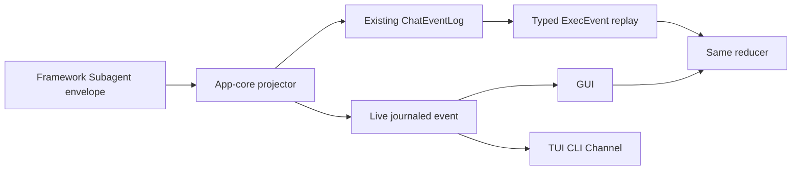

## Approach

复用 framework 已交付的 SubagentEventEnvelope 和 EKO 现有 ChatEventLog/ChatDriverEvent::Execution，不创建 Subagent chat store、第二套 reducer 或新调度器。app-core 新增薄投影服务：验证 framework envelope，按完整 invocation/transport identity 解析 TaskRun 或普通 foreground turn 地址，构造携带原始事件元数据的 typed ExecEvent，写入现有 ChatEventLog，并把 journaled envelope交给 surface。Tauri 仅发布 journaled event 与二级 tool summary；TUI/CLI/channel 共享同一转换合同。Web 端以生成类型让 live 与 replay 进入同一 reducer。

## Global Constraints

- framework 通用机制保持在 echo-agent；workspace、TaskRun、GUI 地址和产品恢复策略只在 echo-agent-cli app-core。
- 复用 ChatEventLog、TaskRuntimeStore、ForegroundTurnControl、ExecEvent 与 ToolExecutionProjector；禁止新增 store、DAG、状态机、usage 序号或字符串身份解析。
- framework 的 stream_id、event_id、content_hash、sequence、timestamp、parent_event_id 与 invocation identity 无损保留。
- formal TaskRun 按 typed run/task/attempt/revision 关联；ordinary turn 使用 exact foreground address；冲突或缺失 fail closed。
- live/replay 使用同一 serialized ExecEvent 和 ingest；sequence gap 必须显式，不得伪造 transient 内容。
- 不新增依赖，不引入 worker 术语，不使用 panic/unwrap/expect 或 UTF-8 字节截断。
- SDK-Docs-Impact: none；SDK-Skill-Impact: none；EKO 产品 ADR/架构文档 required；Website-Impact: none，官网不承载 EKO runtime 内部合同或本应用界面。

## Files

- Modify: `../echo-agent/echo-core/src/agent/event_envelope.rs` — 让权威 envelope 可被应用层无损分发。
- Modify: `../echo-agent/echo-core/src/agent/mod.rs` — 导出可克隆 envelope 合同。
- Modify: `../echo-agent/src/agent/subagent/events.rs` — 提供 retained/active stream 发现、活跃地址锚点与 gap replay。
- Modify: `../echo-agent/docs/en/06-subagent.md` — 记录 framework 恢复 API。
- Modify: `../echo-agent/docs/zh/06-subagent.md` — 同步中文 framework 恢复 API。
- Modify: `../echo-agent/echo-agent-learning/examples/demo50_subagent_communication.rs` — 编译覆盖 retained/active stream API。
- Modify: `echo-agent-app-core/src/infra/factory.rs` — 共享 bus、唯一 app-core projector、现有 journal/tool 投影与生命周期装配。
- Modify: `echo-agent-app-core/src/agent_pool/admission.rs` — 共享 bus、唯一 app-core projector、现有 journal/tool 投影与生命周期装配。
- Modify: `echo-agent-app-core/src/agent_pool/pool.rs` — 共享 bus、唯一 app-core projector、现有 journal/tool 投影与生命周期装配。
- Modify: `echo-agent-app-core/src/agent_pool/tests.rs` — 共享 bus、唯一 app-core projector、现有 journal/tool 投影与生命周期装配。
- Create: `echo-agent-app-core/src/subagent_event_projection.rs` — 共享 bus、唯一 app-core projector、现有 journal/tool 投影与生命周期装配。
- Modify: `echo-agent-app-core/src/tasks/task_runtime/executor/limits.rs` — 共享 bus、唯一 app-core projector、现有 journal/tool 投影与生命周期装配。
- Modify: `echo-agent-app-core/src/tasks/task_runtime/executor/run.rs` — 删除 task_execute 内对同一 Agent 写锁的运行时重入。
- Modify: `echo-agent-app-core/src/tasks/task_runtime/executor/unattended.rs` — 共享 bus、唯一 app-core projector、现有 journal/tool 投影与生命周期装配。
- Modify: `echo-agent-app-core/src/tasks/task_runtime/register.rs` — 在 post-hoc task tool 注册期安装共享 Subagent admission。
- Modify: `echo-agent-app-core/src/tasks/task_runtime/types.rs` — 共享 bus、唯一 app-core projector、现有 journal/tool 投影与生命周期装配。
- Modify: `echo-agent-app-core/src/chat_event_log/event.rs` — 共享 bus、唯一 app-core projector、现有 journal/tool 投影与生命周期装配。
- Modify: `echo-agent-app-core/src/chat_event_log/journal.rs` — 共享 bus、唯一 app-core projector、现有 journal/tool 投影与生命周期装配。
- Modify: `echo-agent-app-core/src/chat_event_log/projection.rs` — 保持 execution event 的持久化校验与投影一致。
- Modify: `echo-agent-app-core/src/chat_event_log/tests.rs` — 共享 bus、唯一 app-core projector、现有 journal/tool 投影与生命周期装配。
- Modify: `echo-agent-app-core/src/workspace/runtime.rs` — 共享 bus、唯一 app-core projector、现有 journal/tool 投影与生命周期装配。
- Modify: `echo-agent-app-core/src/runtime.rs` — 共享 bus、唯一 app-core projector、现有 journal/tool 投影与生命周期装配。
- Modify: `echo-agent-app-core/src/api/mod.rs` — 共享 bus、唯一 app-core projector、现有 journal/tool 投影与生命周期装配。
- Modify: `echo-agent-app-core/src/lib.rs` — 共享 bus、唯一 app-core projector、现有 journal/tool 投影与生命周期装配。
- Modify: `echo-agent-app-core/src/chat_driver.rs` — 删除 raw 旁路并让 GUI/TUI 消费 committed typed event。
- Modify: `src/tauri/mod.rs` — 删除 raw 旁路并让 GUI/TUI 消费 committed typed event。
- Modify: `src/tauri/state.rs` — 删除 raw 旁路并让 GUI/TUI 消费 committed typed event。
- Modify: `src/tauri/desktop.rs` — 删除 raw 旁路并让 GUI/TUI 消费 committed typed event。
- Modify: `src/tauri/commands/chat.rs` — 删除 raw 旁路并让 GUI/TUI 消费 committed typed event。
- Modify: `src/tauri/commands/task_runtime.rs` — 删除 raw 旁路并让 GUI/TUI 消费 committed typed event。
- Modify: `src/tui/events.rs` — 删除 raw 旁路并让 GUI/TUI 消费 committed typed event。
- Modify: `src/tui/mod.rs` — TUI 使用 typed execution 投影状态。
- Modify: `src/cli/channels.rs` — channel 按 durable conversation cursor 重放 lifecycle 与 execution。
- Modify: `src/cli/modes.rs` — 所有 CLI 模式注入共享投影服务。
- Modify: `src/cli/repl.rs` — REPL 消费可恢复的 committed 后台终态。
- Modify: `src/main.rs` — 应用生命周期装配共享投影服务。
- Modify: `tests/jsonl_subprocess.rs` — 适配 boxed generated ExecEvent 并验证 JSONL 合同。
- Create: `web-frontend/src/generated/ExecEvent.ts` — 生成 Rust wire contract，并让 live/replay 使用同一 reducer 与时间线。
- Create: `web-frontend/src/generated/ExecEventScope.ts` — 生成 Rust wire contract，并让 live/replay 使用同一 reducer 与时间线。
- Create: `web-frontend/src/generated/SubagentEventMetadata.ts` — 生成 Rust wire contract，并让 live/replay 使用同一 reducer 与时间线。
- Modify: `web-frontend/src/generated/RuntimeEventKind.ts` — 生成 Rust wire contract，并让 live/replay 使用同一 reducer 与时间线。
- Modify: `web-frontend/src/generated/index.ts` — 生成 Rust wire contract，并让 live/replay 使用同一 reducer 与时间线。
- Modify: `web-frontend/src/types/api.ts` — 生成 Rust wire contract，并让 live/replay 使用同一 reducer 与时间线。
- Modify: `web-frontend/src/hooks/chatEventHandler.ts` — 生成 Rust wire contract，并让 live/replay 使用同一 reducer 与时间线。
- Modify: `web-frontend/src/hooks/chatEventHandler.contract.test.ts` — 生成 Rust wire contract，并让 live/replay 使用同一 reducer 与时间线。
- Modify: `web-frontend/src/hooks/chatEventSequencer.ts` — 对 continuation execution 与 root terminal 保持有序投影。
- Modify: `web-frontend/src/hooks/chatEventSequencer.test.ts` — 覆盖跨 turn continuation 顺序。
- Modify: `web-frontend/src/hooks/useTauriChat.ts` — 生成 Rust wire contract，并让 live/replay 使用同一 reducer 与时间线。
- Modify: `web-frontend/src/hooks/useTauriChat.test.tsx` — 生成 Rust wire contract，并让 live/replay 使用同一 reducer 与时间线。
- Modify: `web-frontend/src/stores/subagentRunStore.ts` — 生成 Rust wire contract，并让 live/replay 使用同一 reducer 与时间线。
- Modify: `web-frontend/src/stores/subagentRunStore.test.ts` — 生成 Rust wire contract，并让 live/replay 使用同一 reducer 与时间线。
- Modify: `web-frontend/src/components/task/SubagentDetailView.tsx` — 生成 Rust wire contract，并让 live/replay 使用同一 reducer 与时间线。
- Modify: `web-frontend/src/components/task/SubagentDetailView.test.tsx` — 覆盖完整输出去重与失败部分输出保留。
- Create: `docs/en/adr/0040-app-core-subagent-event-projection.md` — 记录 EKO event projection 架构决策。
- Create: `docs/zh/adr/0040-app-core-subagent-event-projection.md` — 同步中文架构决策。
- Modify: `docs/en/architecture/runtime.md` — 记录 runtime 装配、恢复与 surface 消费边界。
- Modify: `docs/zh/architecture/runtime.md` — 同步中文 runtime 架构。
- Modify: `docs/doc-parity-manifest.json` — 注册双语 ADR 对等关系。

## Reuse

- `SubagentEventEnvelope/SubagentEventReplay/SubagentEventGap` 是 framework 顺序、gap 与 terminal reconciliation 权威。
- `ChatEventLog` 和 `ChatDriverEvent::Execution` 是 EKO durable stream 与跨 surface 产品事件。
- `TaskRuntimeStore` 和 `ForegroundTurnControl` 分别提供 formal 与 ordinary 地址权威。
- `ToolExecutionProjector` 保持 tool owner/detail 投影；`subagentRunStore` 继续作为唯一前端 attempt projection。

## Todos

### project-framework-envelope-in-app-core

requirements:
- § Framework envelope, EKO projection
- § Live Subagent flow
- § Reload flow
- § Edge and failure scenarios
- § Acceptance criteria

interfaces:
- consumes: SubagentEventEnvelope、TaskRuntimeStore、ForegroundTurnControl、ChatEventLog、ToolExecutionProjector
- produces: validated projection address、typed ExecEvent、journaled ChatEventEnvelope、typed gap

steps:
1. 扩展 ExecEvent 为 ts-rs 类型并加入完整 framework envelope 与 attempt identity。
   verify: serde/TS round-trip 覆盖必需字段，未知或冲突身份被拒绝。
   expected: EKO 不再从 execution-id 或到达顺序重建 framework 事实。
2. 实现 app-core projector，无损映射全部 displayable SubagentEvent variant 并解析 formal/ordinary 地址。
   verify: started/isolation/thinking/token/usage/tool/uplink/terminal 测试和地址 fail-closed 测试通过。
   expected: 单一服务输出所有 surface 可消费的 ExecEvent。
3. 写入现有 ChatEventLog；lag 时以 framework replay/gap/terminal 对账。
   verify: live、lag、重复 event id、bounded replay 与 terminal reconciliation 测试通过。
   expected: reload 恢复 durable 边界，transient 缺口显式可见。

### converge-surface-event-bridges

requirements:
- § EKO application core and Tauri adapter
- § Live Subagent flow
- § Reload flow
- § Acceptance criteria

interfaces:
- consumes: app-core projector 的 journaled envelope/ExecEvent
- produces: GUI journaled chat event 和 TUI shared execution projection

steps:
1. 删除 Tauri raw match、usage/address map 和 task-id 字符串解析，改为 app-core projector。
   verify: Tauri 测试覆盖所有事件类和 exact address，源码无本地序号/解析。
   expected: Tauri 只做 IPC 发布。
2. TUI 切到 shared ExecEvent projection，CLI/channel 保持 ChatDriverEvent 合同；后台 committed fallback 支持晚绑定与 lag replay，channel 在下一会话响应中按 durable cursor 恢复。
   verify: TUI/GUI 对同一 envelope 得到等价事件且无重复持久化；committed replay 按 event id 幂等，channel 可重放后台 execution。
   expected: surface 差异只在渲染层。

### bind-generated-contract-and-replay

requirements:
- § Web frontend
- § Live Subagent flow
- § Reload flow
- § Edge and failure scenarios
- § Acceptance criteria

interfaces:
- consumes: generated ExecEvent、chat://event、ChatEventReplay execution payload
- produces: one frontend ingest path and complete Subagent timeline

steps:
1. 生成并导入 ExecEvent/ExecEventScope，删除手写身份合同。
   verify: TS contract test 与 Rust serde fixture 一致。
   expected: Rust 字段变化受前端编译约束。
2. live/replay 调用同一 ingest，按 event_id/sequence 幂等并保存 thinking/token/tool/usage/terminal/gap。
   verify: live/replay 等价、duplicate、out-of-order、gap 和 retry isolation 测试通过。
   expected: reload 诚实恢复历史且不伪造 transient range。

### document-product-projection-contract

requirements:
- § System boundaries
- § Key decisions and trade-offs
- § Impact assessment
- § Acceptance criteria

interfaces:
- consumes: final app-core/Tauri/frontend implementation and evidence
- produces: EKO ADR and task-runtime architecture update

steps:
1. 记录单一投影权威、地址、持久化、gap/replay/terminal 与 surface 分层。
   verify: 文档 API 和路径与实现一致。
   expected: 后续 surface 不重引 raw event 旁路。
2. 运行 focused、GUI、前端和 echo-agent-cli 完整门禁。
   verify: fmt、clippy、tests、no-default、GUI check/test、prettier/test/build 全部通过。
   expected: 后端服务和前端集成可独立交付。

## Diagram

## Decisions

- app-core 是 EKO 产品投影唯一权威；Tauri 不解析 framework 事件。
- ChatEventLog 继续持久化 ordinary turn；formal TaskRun 仍由 TaskRuntimeStore 持有运行权威。
- transient delta 可因 retention 缺失，但 sequence gap 和 terminal reconciliation 必须显式。
- Website-Impact 为 none：官网不承载 EKO runtime 内部合同或当前应用界面，不新增 EKO 文档树或公开索引。
